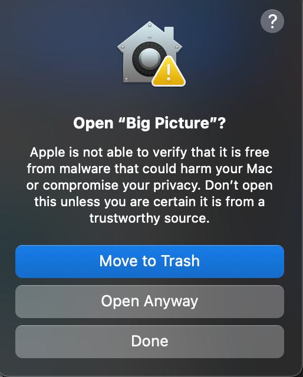

[](https://classroom.github.com/online_ide?assignment_repo_id=20539381&assignment_repo_type=AssignmentRepo)

# Team Contract
 - [Team Contract](docs/Team%20contract.pdf)

# Project details

 - [Data Flow Diagram and Explanation](docs/plan/DFD.md) — includes [DFD source on Google Drive then open via Draw.io](https://drive.google.com/file/d/10cYCpvFpWB_LUyqjNVTxVPAnlgEQ53dM/view?usp=sharing) and embedded Level 0 / Level 1 images
 - [Work Breakdown Structure](docs/plan/Work%20Breakdown%20Structure.md)
 - [System Architecture](docs/plan/System_Architecture_Diagram.md)
 - [API Documentation](docs/API_DOCUMENTATION.md)
 - [Test Report](docs/TEST_REPORT.md)

# Project-Starter
Please use the provided folder structure for your project. You are free to organize any additional internal folder structure as required by the project. 

```
.
├── docs                    # Documentation files
│   ├── contract            # Team contract
│   ├── proposal            # Project proposal 
│   ├── design              # UI mocks
│   ├── minutes             # Minutes from team meetings
│   ├── logs                # Team and individual Logs
│   └── ...          
├── src                     # Source files (alternatively `app`)
├── tests                   # Automated tests 
├── utils                   # Utility files
└── README.md
```

Please use a branching workflow, and once an item is ready, do remember to issue a PR, review, and merge it into the master branch.
Be sure to keep your docs and README.md up-to-date.

### Building and running with Docker

Prereqs: Docker Desktop (or Docker Engine + docker-compose).

When you're ready, start your application by running:
`docker compose up --build`.

**To run the docker environment in the interactive environment, please run `docker compose run --rm -it --service-ports server python -m app.main`.**

Your application will be available at http://localhost:8000.

Quick helper script:
- `scripts/setup.sh` builds and runs the app. Options:
  - `USE_COMPOSE=1 ./scripts/setup.sh` to use docker compose
  - `PLATFORM=linux/amd64 ./scripts/setup.sh` to force platform

**Note:**
- **Make sure you have the docker daemon running in the background i.e. open the Docker app installed on your machine**
- **Make sure `requirements.txt` exists (Dockerfile installs from it).**
- **Keep Dockerfile and compose files tracked in git; use `.dockerignore` to exclude files from the build context.**

In the terminal, run the following command to stop the application: `docker compose down`.

### Database Setup with Docker ###

The project includes a basic SQL database initialization process that runs automatically when the application starts in Docker. This setup ensures that your database tables and schemas are created without manual intervention.

How It Works:

  The database initialization is handled by init_db() function inside app/data/db.py.

  When you run the application (`docker compose up --build`), the FastAPI server triggers this initialization to create the required tables.

  All SQL scripts and schema definitions should be stored inside the app/data/ directory to maintain consistency.

Local Development 
  First time use : 
  From the project root (where compose.yaml lives):
    `docker compose up --build`

  If everything is correct, you should see these logs in the terminal:
   ` Database initialized at: /app/app/data/app.sqlite3`
   ` Database started`
   `Seed data inserted successfully`
    `App started`
    `INFO:     Uvicorn running on http://0.0.0.0:8000`
  
  * If you modify the database schema or add new tables:

Stop any running containers
  `docker compose down`

Remove the old SQLite DB
  `rm app/data/app.sqlite3`

Rebuild and restart the containers
  `docker compose up --build`


### Accessing the Database

  Once you build/pull the container from docker, you can access and view the database in your code by using :

  `from data.db import get_connection`
  `conn = get_connection()`
  `cursor = conn.cursor()`
  `cursor.execute("SELECT * FROM PROJECT")`
  `print(cursor.fetchall())`

  By default, the database file is created in the /app directory inside the container.

### Accessing the Database through CLI

  After composing the docker container run :
    `docker compose exec server sqlite3 app/data/app.sqlite3`

  Then run :
    `.tables`
    `SELECT * FROM <table name>;`
  You should see the seed test rows.

  Type `.exit` to leave SQLite.

### Viewing Database through SQLite-VScode Extension
   Install the extension through this link :
    `https://marketplace.visualstudio.com/items?itemName=alexcvzz.vscode-sqlite`

  Run command `>SQLite: Open Database` in the search bar and select the db file `app.sqlite3`

  You should see the database schema appear under the SQLITE EXPLORER TAB.
   

 From here you should be able to select a table and see an editor view of the given table.


### Running Tests in Docker Environment
To run all the python tests in the docker environment, run `docker compose exec server pytest`.

You might need to run this in a new terminal window after running `docker compose up --build`.

### How to Check Your Test Coverage

Test coverage shows how much of your code is actually tested by your unit tests. It helps you find parts of the code that **aren't tested yet**, so you can improve your tests and catch potential bugs.

To generate a test coverage report, run this command:

```
docker compose exec server pytest --cov=app --cov-report=html:/app/htmlcov
```

This will run your tests and create a detailed **HTML report** inside the `/app/htmlcov` folder.

To view the coverage report:

1. Open the `htmlcov/index.html` file in a web browser.
2. You’ll see a visual overview showing which lines of code are tested (highlighted in green) and which are not (highlighted in red).

### Deploying your application to the cloud

Build & run (single-image):
- Build: `docker build -t myapp .`
- Run: `docker run -p 8000:8000 --env-file .env myapp`

If your cloud uses a different CPU architecture than your development
machine (e.g., you are on a Mac M1 and your cloud provider is amd64),
you'll want to build the image for that platform, e.g.:
`docker build --platform=linux/amd64 -t myapp .`.

Then, push it to your registry, e.g. `docker push myregistry.com/myapp`.

Consult Docker's [getting started](https://docs.docker.com/go/get-started-sharing/)
docs for more detail on building and pushing.

### References
* [Docker's Python guide](https://docs.docker.com/language/python/)

## Setting Up Gemini API Key for LLM Features

To use the LLM-powered features in this project, you **must provide your own Gemini API key**.

1. **Get your Gemini API key:**
   - Visit [Google AI Studio](https://aistudio.google.com/app/apikey) and create an API key for a "default gemini project".

2. **Create a `.env` file in your project root:**
   - Copy the example below into a new file named `.env` (do **not** commit your real key to GitHub by adding the .env in the .gitignore file):

     ```
     GEMINI_API_KEY=AIzaSy...your-gemini-api-key-here...
     ```

3. **Your `.env` file should look like:**
GEMINI_API_KEY=AIzaSy...your-gemini-api-key-here...

4. **Keep your `.env` file private:**  
- Do **not** share your API key or commit it to version control.

---

**Now you can use all LLM features in the project!**


---

## 🛠️ Troubleshooting (Sumy + NLTK Integration)

### ⚠️ **1. Missing `punkt` Tokenizer**

If you see this warning:

```
  NLTK 'punkt' tokenizer not found locally.
```

It means your NLTK data folder is missing or was not cloned correctly.

**Fix:**

1. Verify the tokenizer exists at:

   ```
   app/utils/non_code_analysis/nltk_data/tokenizers/punkt
   ```
2. If missing, download manually once:

   ```bash
   python3 -c "import nltk; nltk.download('punkt', download_dir='app/utils/non_code_analysis/nltk_data')"
   ```
3. Re-run:

   ```bash
   python3 -m app.utils.non_code_analysis.non_code_analysis_utils
   ```

---

### 🧩 **2. SSL or Certificate Errors**

If you encounter an error like:

```
[nltk_data] Error loading punkt: <urlopen error [SSL: CERTIFICATE_VERIFY_FAILED]>
```

You don’t need to fix your SSL certificates — this project already runs **offline**.
Just ensure you’re using the local copy of `nltk_data` provided in the repo (as configured in the code).

---

### 🧠 **3. Import Errors for `sumy`**

If running the module throws:

```
ModuleNotFoundError: No module named 'sumy'
```

Install dependencies:

```bash
pip install requirements.txt
```

### 🖥️ Desktop application (Big Picture): how to run

The desktop app is **Electron + React (Vite)** with a **Python backend** that can run as a **PyInstaller sidecar** inside the packaged app, or as **Docker / uvicorn** during development.

#### Compatibility and system requirements

Read this once so your environment matches what the app expects.

| Topic | What you need |
| ----- | ------------- |
| **SQLite (database)** | The backend uses **SQLite** only—**no MySQL, PostgreSQL, or separate DB server**. The app creates its database file when the API first runs. With **Docker**, that file is `app/data/app.sqlite3` (see [Database Setup with Docker](#database-setup-with-docker) below). With the **packaged desktop app**, initialization happens automatically when the sidecar starts (no manual SQLite install). |
| **LaTeX (`pdflatex`) — macOS** | **Résumé and cover-letter PDF export** needs a LaTeX toolchain. Install **[BasicTeX](https://tug.org/mactex/morepackages.html)** (recommended; use the **“smallest download”** pkg on that page) or the full **[MacTeX distribution](https://tug.org/mactex/)**. After installation, `pdflatex` should live under `/Library/TeX/texbin`; the Big Picture desktop app **prepends that folder to `PATH` on macOS** when it exists, so restart the app after installing BasicTeX. |
| **LaTeX — Windows / Linux** | Install a distribution that puts **`pdflatex` on your `PATH`** (e.g. **MiKTeX** or **TeX Live** on Windows; **TeX Live** on Linux) if you use PDF export. |
| **Gemini (optional)** | AI-backed features need a **Google Gemini API key**; see [Setting Up Gemini API Key for LLM Features](#setting-up-gemini-api-key-for-llm-features). You can still use local analysis without it. |
| **Pre-built desktop installer** | **macOS only** on GitHub Releases (size limits); Windows/Linux use [the sidecar ZIP + local build](#windows-and-linux--use-the-sidecar-zip--build-the-desktop-locally) above. |

#### macOS — pre-built release (easiest)

Official **GitHub Releases** ship a **macOS `.dmg` only** so we stay under GitHub’s **2 GiB per-file** limit; full installers are large (Python ML stack + Electron).

1. Open the repo **[Releases](https://github.com/COSC-499-W2025/capstone-project-team-3/releases)** and pick the latest version.
2. Under **Assets**, try the **Big Picture** macOS installer (`.dmg`) if it is attached.
3. If there is no DMG on the release page (file too large), open **`DOWNLOAD-INSTALLERS-HERE.txt`** in the same release — it links to the **Actions** workflow run. On that run, open **Artifacts**, download **`desktop-release-macos`** (ZIP), unzip, and open the **`.dmg`** inside.
4. Install or drag the app to Applications and launch **Big Picture**. The app starts the bundled **backend sidecar** automatically.

> **PDF export:** For compiling résumé/cover-letter PDFs on a Mac, install **[BasicTeX](https://tug.org/mactex/morepackages.html)** (or MacTeX) as described in [Compatibility and system requirements](#compatibility-and-system-requirements) above.

**macOS security (Gatekeeper — “Open ‘Big Picture’?”):** The first launch may show an Apple warning that the app **could not be checked for malware**. That happens because **Gatekeeper** only “trusts” by default apps from the Mac App Store or from **registered Apple developers** who **notarize** the build. Our class/release builds are usually **ad-hoc or team-signed** for distribution on GitHub, **not** notarized for the public Mac ecosystem—so macOS still protects your Mac by asking you to confirm.

**How to open the app anyway:**

1. If the dialog has **Open Anyway**, you can click it (or **Done** and use step 2).
2. Open **System Settings** → **Privacy & Security**. Scroll down; under **Security** you should see that **“Big Picture”** was blocked from use — click **Open Anyway** and confirm when prompted.
3. Or in **Finder**, open **Applications**, **Control-click** (right-click) **Big Picture** → **Open** → click **Open** in the dialog (this often works for the first run).

Example of the system prompt:



#### Windows and Linux — use the sidecar ZIP + build the desktop locally

There is **no Windows or Linux installer attached to Releases** in our current CI (releases focus on a single **~1 GiB** macOS build). You can still run Big Picture by combining a **pre-built backend sidecar** from CI with a **local Electron build**.

**1. Prerequisites**

- **Node.js** (e.g. 20 LTS) and **npm**
- This repository cloned locally
- Optional: **Docker** if you prefer the dev flow below instead of the sidecar

**2. Download the backend sidecar (ZIP)**

1. In GitHub go to **Actions** → workflow **“Build Backend Sidecar”**.
2. Open a **successful** run (for example on the branch you use, e.g. `deployment2` / `main`).
3. Under **Artifacts**, download:
   - **Windows:** `backend-sidecar-windows` (ZIP)
   - **Linux:** `backend-sidecar-linux` (ZIP)

**3. Unzip into the folder Electron expects**

Extract the artifact so the PyInstaller output (the folder that contains the executable and `_internal/`) ends up here:

| OS | Put the extracted files here (paths from repo root) |
|----|-----------------------------------------------------|
| Windows | `desktop/resources/backend/win32/` — must include `backend-sidecar.exe` next to `_internal/` |
| Linux | `desktop/resources/backend/linux/` — must include `backend-sidecar` next to `_internal/` |

*(On macOS builds from source, the same layout uses `desktop/resources/backend/darwin/`; the release DMG already bundles **darwin** for you.)*

**4. Build and run the desktop**

From the repository root:

```bash
cd desktop
npm ci          # or: npm install
npm run build   # runs TypeScript + Vite + electron-builder
```

Install or run the generated artifact under `desktop/release/<version>/` (e.g. **NSIS** installer on Windows, **AppImage** on Linux — see `desktop/electron-builder.json5`).

**5. Alternative: development mode (API + Electron, all platforms)**

If you are not using a packaged app:

```bash
cd desktop
npm install       # First time only
npm run dev       # Vite dev server + Electron window
```

Point the UI at a running API:

- **Typical:** start the stack with **`docker compose up --build`** (API at `http://127.0.0.1:8000` — default for the desktop app in dev).
- **Or** run the sidecar executable yourself and, for Electron dev, set **`DESKTOP_BACKEND_BINARY`** to the full path of `backend-sidecar` / `backend-sidecar.exe` so the main process can spawn it.

> **Note:** For a deeper overview of the frontend stack, see `docs/frontend.md`.

---

## 🗂️ Zipped Test Files for the App

Pre-prepared zip files are provided for testing the upload and analysis features of the app without needing a real project repository.

```
tests/files/test_data/
```

They should contain sample project files across various languages and structures, and can be used for manual QA of the full upload and analysis pipeline.

**How to use them:**

**1. Start the backend**

In a terminal, from the project root:
```bash
docker compose up --build
```

In a second terminal, launch the interactive server:
```bash
docker compose run --rm -it --service-ports server python -m app.main
```

**2. Launch the desktop front-end**

In a third terminal:
```bash
cd desktop
npm install       # First time only
npm run dev
```

**3. Git Detection Config**

In order to see git detection for project analysis use one of the following usernames & emails respectively, when inputing your user preferences:

`abstractafua` |  afuaf2@gmail.com
`dabby04` | dabbyomotoso@gmail.com
`PaintedW0lf` | vanshi05@student.ubc.ca
`6s-1` |  shreya.saxena@gmail.com
`KarimKhalil33`  | karim.waleid@gmail.com
`kjassani` | jassanikarim8@gmail.com

**4. Upload a zip file**

- In the desktop app, navigate to the **Upload** page
- Select a `.zip` file from `tests/files/test_data/` and upload it

For context each test file contains the following projects ***(M2 Requirement 33 & 34)*** : 

``test_feat_34_collab_indiv.zip``  
  ``non_code_collab_proj`` collaborative non-code project
  ``code_collab_proj`` collaborative code project 
  ``non_code_indiv_proj`` individual non-code project
  ``code_indiv_proj`` individual code project 


  ``test_feat_33_past.zip` 
       ``capstone_team-3_dec_2025`` Historic github project

  ``test_feat_33_future.zip`
      ``capstone_team-3_feb_2026`` Recently updated github code project


**5. Run analysis**

Analysis can be run through the desktop app or the CLI.

In order to run the analysis with the desktop app:
- Open the desktop application and navigate to the Upload & Analysis page
- Upload any of the provided zip files
- Select an **Analysis Type** for each project (`local` or `ai`)
- Click **Run Analysis**

In order to run the analysis within the CLI:
- Go to http://localhost:8000/upload-file
- Upload any of the provided zip files and copy the resulting `upload_id`
- Paste the `upload_id` in the terminal when prompted and hit **Enter**
- User will be able to see similarity score and other metrics used to detect if a project has been previously analyzed.  
- User will be prompted to select an Analysis Type for each project (local or ai)

**Note** : Both methods follow and use the same analysis process, however in order to see feedback on whether or not a project was previously analyzed the user should refer to the CLI.

**6. View results**

Once analysis is complete, proceed through the desktop app to view:
- Project analysis and scoring
- Resume generation
- Portfolio generation