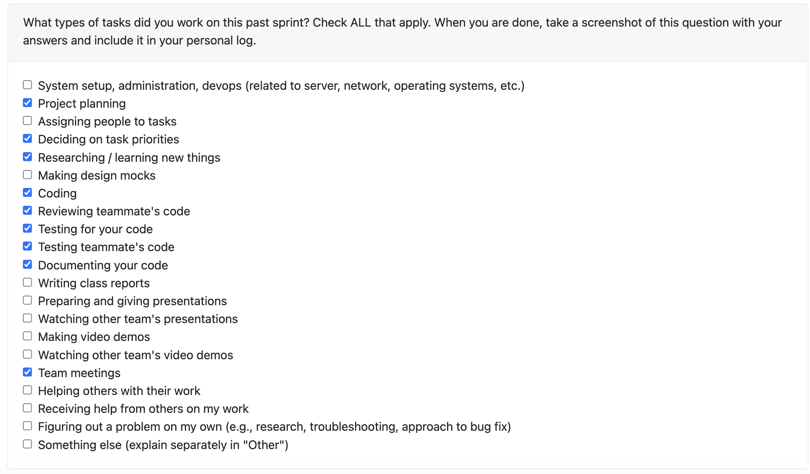

# Personal Log – Karim Jassani

---

## Entry for Nov 3, 2025 → Nov 9, 2025

### Type of Tasks Worked On

---

### Type of Tasks Worked On
- Extract readme file from git repo
- implement functionality to check is_binary 
- Documentation
- Test-driven development (pytest)
- PR documentation, issue linking, and progress tracking
- Peer review and coordination across backend modules

---

### Recap of Weekly Goals
- Analyse git repo
- Extract readme file from git repo
- Check for binary content
- ensure content in readme is readable

---

### Features Assigned to Me
- Extract reame from git repo
- Unit and integration testing for function

---

### Associated Project Board Tasks
| Task/Issue ID | Title                                               | Status      |
|---------------|-----------------------------------------------------|-------------|
| #223           | Added functionality to extract readme from git repo | Completed |

---

### Issue Descriptions for this week:

- **Extract readme([COSC-499-W2025/capstone-project-team-3#181](https://github.com/COSC-499-W2025/capstone-project-team-3/issues/223**  
Implement extract_all_readmes() to recursively find and extract all README files from a Git repository. The function should return the contents of every file starting with readme (case-insensitive) and ending with supported extensions (.md, .txt, .rst, .adoc, .markdown, .org, or none). It will skip binary files using a NUL-byte (\x00) check, cap reads to 2 MB, and decode content as UTF-8 with replacement. If multiple README-like files exist (e.g., /docs/README.txt, /api/README.md), all are returned to provide richer context for the analysis engine. 

---

### Progress Summary
- **Completed this week:**  
  - Completed important functionality to extract readme from repo, this is important because readme will be provided to analysis engine and serve as additional context
  - Researched and implemented a heuristic to check is_binary
  - esnure readme is readbale

- **In Progress this week:**  
  - Functionality to check for code vs non code file
---

### Additional Context (Optional)
- Need to discuss with prof or TA to understand what all different programming languages do we have to conduct analysis for. This is because when doing non llm analysis, this clarity is very important.
---

### Reflection

**What Went Well:**  
- Great progress on project overall.
- Managed to split up work in a quick and efficient manner allowing us to tackle different parts of the project. 

**What Could Be Improved:**  
- Completing tasks earlier during the week can help us progress faster with the project. 

---

### Plan for Next Cycle
- complete flow for git
- complete function to check is_code_file()
- continue working on non-llm analysis of code files