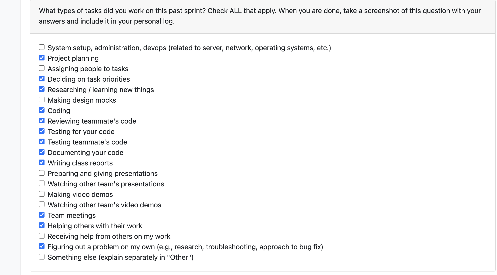

# Personal Log – Vanshika singla

---

## Entry for  Nov3, 2025 → NOV 8, 2025

### Type of Tasks Worked On

### Type of Tasks Worked On
- Worked on creating and finalizing the flow for parsing non-code files and establishing a unified process that validates and extracts data from all supported file types.

- Successfully passed all parsing tests across different file formats by mocking file content for validation:

        Text/Markdown: Created .txt and .md files with known content using Path.write_text() in a temporary directory.

        Docx: Programmatically generated .docx files using python-docx (Document, paragraphs) and saved them to a temp path.

        PDF: Built simple .pdf files with ReportLab (canvas.Canvas) using drawString() to embed extractable text.

        Error cases: Created missing-path and binary (data.bin) files to test error handling for unsupported or missing file types.

- Collaborated with the AI/Non-AI analysis subgroup, providing detailed reviews and supporting design decisions for the non-code content analysis flow.

- Implemented logic to check file directory size and validate file size before analysis; ensured that files exceeding a defined MB threshold are skipped to prevent LLM overload or pipeline failures.
---

### Recap of Weekly Goals
✅ Implement parsing and validation for non-code files — Completed
✅ Develop mock documents and test parsing reliability — Completed
✅ Add and test file size limit handling for analysis pipeline — Completed
✅ Collaborate on NLP research for non-code file analysis — In Progress

---

### Features Assigned to Me
#170: Develop and test the parsing function for non-code files
#205: Implement and execute parsing validation tests

### Extra bonus tasks i worked for the enchancement 
#219: Add and validate file size limits in the analysis pipeline
#220: Design test cases to verify file size restrictions
#186: Collaborate on research comparing LLM and non-LLM approaches for non-code file analysis

---

### Associated Project Board Tasks
| Task/Issue ID | Title                                                                   | Status     |
|---------------|-------------------------------------------------------------------------|------------|
| #207          | Mock PDF and other file types for testing | Completed  |
| #205         | Testing for parsing non code | Completed  |
| #170          | Parse function for non-code files and testing the functioning | Completed |
| #219         | File size limit for Successful analysis| Completed |
| #220        | Test cases for File size | Completed|
| #186           | Colaborating on Researching LLM/non-LLM implementation for non code file analysis. | In-Progress |

---

### Issue Descriptions
#170 – Parse Function for Non-Code Files

Implemented parsing logic for various non-code file types including PDFs, DOCX, and TXT. The function extracts metadata, normalizes text, and outputs standardized data for NLP processing. Integrated validation ensures consistent parsing results.

#205 – Testing for Parsing Non-Code Files

Developed and ran tests to confirm parsing reliability. Focused on verifying metadata extraction, handling of malformed files, and ensuring text normalization works across formats.

#207 – Mock PDF and File Type Creation

Generated mock test files for different formats to simulate real-world scenarios. This allowed controlled testing of parsing accuracy and validation against expected output structures.

#219 – File Size Limit for Successful Analysis

Added logic to enforce file size thresholds before analysis. Files exceeding the maximum size are skipped and logged, preventing failures during large-scale analysis or model overload.

#220 – Test Cases for File Size

Designed and executed tests to validate file size limit enforcement. Verified correct system behavior for both valid and oversized files across multiple formats.

#186 – Research on LLM vs Non-LLM Analysis

Worked with the research subteam to evaluate NLP approaches for non-code content. Compared LLM-based and non-LLM pipelines in terms of scalability, interpretability, and accuracy.
---

### Progress Summary
- **Completed this week:**
This week focused on stabilizing and validating the non-code parsing pipeline. I completed development of the parser for multiple file formats and validated it through mock testing with structured .txt, .docx, and .pdf files. Comprehensive test cases were designed and executed to verify parsing accuracy, error handling, and performance across edge cases.

A file size validation feature was added to the analysis pipeline, allowing the system to intelligently skip large files that could hinder processing or LLM efficiency. Collaboration with the AI/Non-AI subgroup advanced the research phase for non-code content analysis, aligning our architecture toward modular integration between parsing and NLP stages.

Overall, all assigned development tasks were completed, and research collaboration remains ongoin as it involves other team members who are still making changes to the process .

- **In Progress this week:**
  - None — the planned individual tasks for this cycle were completed

---

### Additional Context (Optional)
The main focus was on input reliability and performance optimization. Mock testing, parsing validation, and size limit enforcement helped strengthen the project’s foundation for future NLP integration and large-scale data handling.
---

### Reflection
**What Went Well:**
- Completed all parsing, testing, and validation features on schedule
- File size limit feature significantly improved pipeline reliability
- Collaborative discussions supported strong design alignment
- Testing framework made debugging efficient and repeatable
- Good time management and working on the Seperate parts 

**What Could Be Improved:**
- If feel if all the assigned tasks are finished by everyone instead of getting distacting with doing seperate tasks that are not priority would be great for smooth functioning of the tasks
---

### Plan for Next Cycle
- Integrate the parsing outputs directly into the analysis pipeline
- Conduct performance testing on large-scale document datasets
- continuing developing the combined LLM/non-LLM analysis module 
