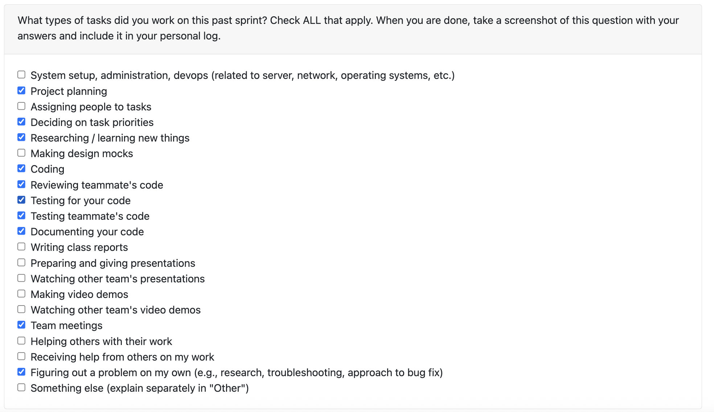

# Personal Log – Karim Jassani

---

## Entry for Week 12

### Type of Tasks Worked On

### Type of Tasks Worked On
- created criteria to evaluate project ranking
- created function to extract number of PR reviewd and merged for a given user from a given git repo
- collaborated with team to draft entire project code flow
- attended team meetings
- reviewed team velocity and planned next week which is crucial

---

### Recap of Weekly Goals
- understand github api usage
- safely create github PAT with limited required authortiy
- calculate user's metrics
- create project ranking criteria

---

### Features Assigned to Me
#301: Calculate user's PR Metrics

---

### Associated Project Board Tasks
| Task/Issue ID | Title                                                                   | Status     |
|---------------|-------------------------------------------------------------------------|------------|
| #301          | Calculate user's PR Metrics | Completed  |

---

### Issue Descriptions
#301 – Calculate user's PR Metrics

Use github API to calculate a given user's contribution metrics: PRs merged, PRs reviewed. These would be key metrics used to calculate project rank for collaborative projects.

---

### Progress Summary
- **Completed this week:**
#301 - Calculate user's PR Metrics

- **In Progress this week:**
  - Use PR metrics to calculate project rank.
  - Write and retrieve project rank from DB.
---

### Additional Context (Optional)
- This week, I made strong progress on the project by creating the criteria for our project ranking system and implementing a function to extract PR metrics (specifically the number of PRs merged and reviewed—using the GitHub API). I collaborated closely with the team to outline the full project code flow and align our development direction. I also attended team meetings, contributed to discussions around velocity, and helped plan priorities for the upcoming critical week. Overall, I successfully completed my assigned feature (#301) and supported the team’s momentum moving forward.
---

### Reflection
**What Went Well:**
- Successfully implemented the function to calculate PR metrics
- Good collaboration and discussions during team meeting
- Mostly Everyone is on the same page regarding the project

**What Could Be Improved:**
- Consider co-working to improve time for PR review

---

### Plan for Next Cycle
  - Use PR metrics to calculate project rank.
  - Write and retrieve project rank from DB.
  
