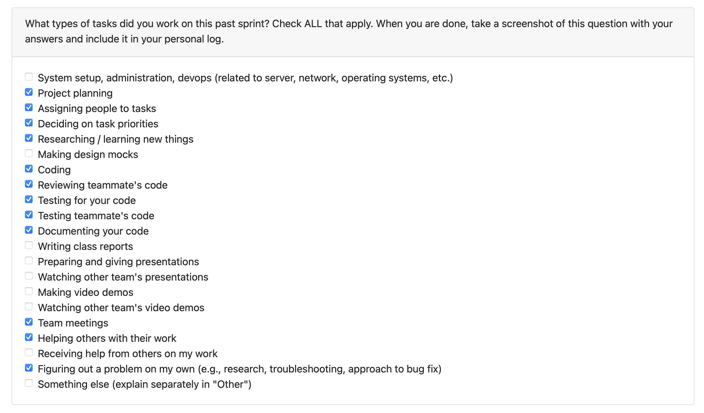

# Personal Log – Shreya Saxena

---

## Entry for Nove 16, 2025 → Nov 23, 2025

### Type of Tasks Worked On

---

### Type of Tasks Worked On
- Git metadata extraction & collaboration filtering (Pt-3)
- User identity detection and contribution verification (Pt-4)
- Final orchestration for non-code file classification with user verification (Pt-5)
- Offline NLP pipeline for document type recognition & summary generation
- Enhanced bullet point extraction using spaCy + pattern matching
- Unit testing for classification, summaries, and bullet extraction
- PR documentation, internal alignment, and multi-stage feature integration

---

### Recap of Weekly Goals
- Complete all remaining PR stages for the Non-Code File Checker (Pt-3 → Pt-5).
- Integrate user verification logic for accurate contributor classification.
- Implement offline-only NLP capabilities for document recognition and summarization.
- Improve contribution bullet extraction for readability and downstream analysis.
- Ensure all modules run reliably in Docker and pass full unit test coverage.

---

### Features Assigned to Me
### Non-Code File Checker (Pt-3 → Pt-5):
- Git metadata extraction
- Collaboration filtering
- User identity & contribution verification
- Final classification orchestrator
### Offline NLP-Based Non-Code Document Analyzer
- Document type classification
- Summary generation
- Topic extraction & keyword detection
### Bullet Extraction Module Improvements
- spaCy-based contribution bullets
- Cleaner formatting + removal of noise patterns
- Robust unit tests

---

### Associated Project Board Tasks
| Task/Issue ID | Title                                               | Status      |
|----------------|-----------------------------------------------------|-------------|
| #251            | Add git metadata collection & collaboration filtering (Pt-3)                    | ✅ Completed |
| #255            | User identity & contribution verification (Pt-4)s                      | ✅ Completed |
| #267            | Final classification orchestrator (Pt-5)                | ✅ Completed |
| #279            | Document identification via analysis                               | ✅ Completed |
| #280         | Summary generation (offline NLP)    | ✅ Completed |
| #281         | Extract technical keywords using KeyBERT                    | ✅ Completed |
| #287            | Extract key topics from content      | ✅ Completed |
| #288         | Extract important sentences using Sumy LSA summarizer	     | ✅ Completed |
| #315         | Generate bullet points (offline)	| ✅ Completed |

---

### Issue Descriptions for this week:
#251 – Git Metadata Collection & Collaboration Filtering (Pt-3)
Added commit-level metadata extraction & collaboration classification based on number of contributing authors.
#255 – User Identity & Contribution Verification (Pt-4)
Added email verification, contributor matching, and logic for classifying user vs. other-user contributions.
#267 – Final Classification Orchestrator (Pt-5)
Implemented the complete pipeline combining metadata, user verification, and classification into collaborative / non-collaborative / excluded groups.
#279 – Document Identification via Analysis
Created rule-based classifier for identifying document type (proposal, README, tutorial, API doc, etc.).
#280 – Summary Generation (Offline NLP)
Built summary generator using Sumy LSA + spaCy importance ranking + keyword weighting.
#281 – Technical Keyword Extraction Using KeyBERT
Integrated local KeyBERT model and combined keyword frequency with document-type context.
#287 – Topic Extraction From Content
Implemented topic extraction pipeline based on noun-chunk clustering and keyword grouping.
#288 – Important Sentence Extraction Using Sumy LSA Summarizer
✔ Implemented LSA summarization specifically for retrieving the highest-value sentences.
✔ Integrated into overall summary pipeline for improved structure.
✔ Added tests for proposals, API files, and descriptive documents.
#315 – Bullet Point Generation
Refactored bullet extraction pipeline using spaCy → cleaned noise → stable output for dashboard.

- **In Progress this week:**  
  - Working on implementing full non code non 3rd party analysis. 

---

### Additional Context (Optional)
- All functions verified and merged through passing tests and reviews.  

---

### Reflection

**What Went Well:**  
- Completed multiple PRs in one sprint, all passing tests and reviews.
- Strong offline NLP integration using multiple libraries.
- Bullet and important-sentence extraction are now accurate and high-quality.
= Achieved consistent formatting and stable outputs across all modules.

**What Could Be Improved:**  
- Dedicated weekly meeting time. 

---

### Plan for Next Cycle
- Work on skills extraction.
- Work with team on end-to-end pipeline integration.
---
