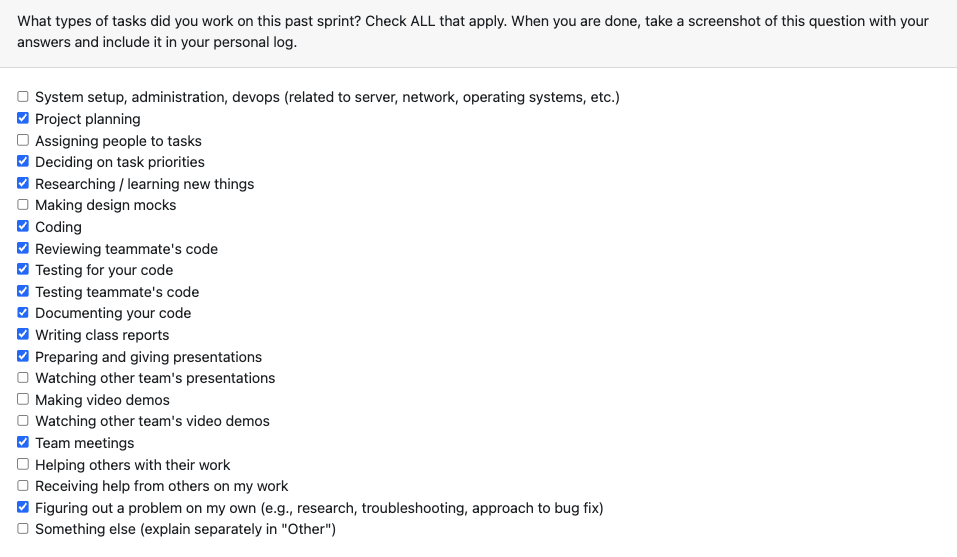

# Personal Log – Karim Jassani

---

## Entry for Nov 24, 2025 → Nov 30, 2025

### Type of Tasks Worked On

---

### Type of Tasks Worked On
-Function to check for code files in git repo
-Given code detect programming language for git repo
-Update git code parsing to provide programming languge and number of lines
-Project Ranking - deteremine project score based on user contribution
-Expanded test coverage, refactoring, and performance tuning.
-PR documentation, feature integration, and cross-module alignment.

---

### Recap of Weekly Goals
-Checking for code files in git repo
-Detect programming language for code files in git repo
-Updaate the git code parsing json output
-Implement project ranking
-implement git code parsing in main flow
-update overall applicaiton flow
-Discuss and decide cli input from user

---

### Features Assigned to Me
### Function to check is_code_file inside git repo
- from git diff patch determine it is is code or non code
### Detect programming language for git repo
- use lexer pigments to determine programing langage 
### Update extract code commit content by author
- update to now pass programming language, number of code lines
### Project Score for Ranking
- indepented pipeline for git code metrics, non git code metrics, and non code metrics 

---

## Associated Project Board Tasks
| Task/Issue ID | Title | Status | Closed By |
|--------------|--------|--------|-----------|
| #320 | Function to check is_code_file inside git repo | Closed | — |
| #339 | Language Detection for git files | Closed | — |
| #356 | Update extract code commit content by author | Closed | |
| #386 | Project Score for Project Ranking | Code-review | |

# Issue Descriptions for This Week

## **#320 – Function to check is_code_file inside git repo **
Determine from git diff patch if the commit is a code commit or non code commit

## **#339 – Language Detection for git files**
Use lexer pygments to determine the programming language for any file

## **#356 – Update extract code commit content by author**
Update the parsing funciton to now return programming langauge and number of lines 

## **#386 - Project Ranking –**
- identify relevant user contribution metrics
- normalize metrics
- decide weightage for metrics
- determine code percentage and non code percentage in a given project
- output final score
- create indepdent scoring for git code, non git code, and non code

- **In Progress this week:**  
  - Project Score for Project ranking PR has been up, waiting for review

---

### Additional Context (Optional)
- All functions verified and merged through passing tests and reviews.  

---

### Reflection

**What Went Well:**  
- Completed all assigned PRs, research tasks, and integrations for the week.   
- Strengthened architecture with consistent, extensible structures.  
- Strong collaboration alignment with analysis and backend teams.  

**What Could Be Improved:**  
- Meeting notes so members don't forget what was already discussed.

---

### Plan for Next Cycle
- Assist in final end-to-end pipeline validation.  
---
