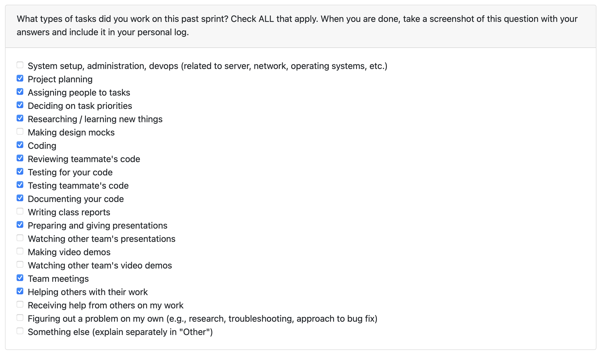

# Personal Log – Shreya Saxena

---

## Entry for Nove 24, 2025 → Nov 30, 2025

### Type of Tasks Worked On

---

### Type of Tasks Worked On
-Updating skill output to display (technical, soft skills).
-Integration of completeness score + word count into Non-AI non-code analysis.
-Ensuring consistency between Non-AI and AI analysis outputs.
-Contribution frequency + document-type frequency analytics integration in analysis pipeline.
-Integration of the non-code file checker into the main flow.
-Improvements to file classification logic (README pass-through from non code file checker).
-Enforcing zipped-file-only input validation for main flow.
-Expanded test coverage, refactoring, and performance tuning.
-PR documentation, feature integration, and cross-module alignment.

---

### Recap of Weekly Goals
-Deliver complete offline non-code analysis pipeline with completeness scoring.
-Align Non-AI analysis outputs with AI outputs for consistency.
-Deliver full skills extraction (multi-category) without 3rd-party services.
-Integrate non-code file checker into the main flow.
-Add input validation for zipped project paths.
-Finalize analytics outputs (frequency, classification, completeness).

---

### Features Assigned to Me
### Non-AI Analysis Enhancements
- Completeness scoring + word count for documents
- Output parity with AI analysis
### Analytics Pipeline Enhancements
- Contribution frequency integration
- Document-type frequency integration
- nified metadata output (counts, frequencies, per-file details)
### Non-Code File Checker Improvements
- Automatic README inclusion
- Full integration into main analysis flow
### Input Validation
- Zip-only file path acceptance
- Updated CLI and error handling
### Research & Architecture
- Offline NLP design for document type classification, summarization, keyword extraction, and skills detection

---

## Associated Project Board Tasks
| Task/Issue ID | Title | Status | Closed By |
|--------------|--------|--------|-----------|
| #245 | Research offline non-code analysis methods | Completed | — |
| #322 | Offline skills extraction | Completed | — |
| #323 | Technical skills extraction | Closed | #322 |
| #324 | Soft skills extraction | Closed | #322 |
| #325 | Domain knowledge extraction | Closed | #322 |
| #317 | Generate skill list for display | Closed | #322 |
| #328 | Allow README files through non-code checker | Completed | — |
| #333 | Produce analysis results for all files | Completed | — |
| #348 | Add completeness score & word count | Completed | Closes #349, #350 |
| #349 | Ensure Non-AI output matches AI output | Closed | #348 |
| #350 | Add completeness score for Non-AI analysis | Closed | #348 |
| #371 | Accept only zipped file paths | Completed | Closes #372 |
| #372 | Integrate non-code file checker into main flow | Closed | #371 |
| #373 | Integrate NCF checker logic deeper in analysis | Closed | #372 |
| #376 | Contribution frequency integration | in Porgress | #379 |
| #377 | Contribution frequency type integration | in Porgress | #379 |
| #378 | Document-type frequency integration | in Progress | #379 |

# Issue Descriptions for This Week

## **#372 – Integrate Non-Code File Checker Into Main Flow (Closes #373)**
Integrated the non-code file checker into the main analysis pipeline, enabling collaborative, non-collaborative, and excluded file classification across all projects.

## **#348 – Add Completeness Score + Word Count (Closes #349, #350)**
Added completeness scoring and document word count for all non-code documents; standardized Non-AI outputs to match AI analysis.

## **#371 – Accept Only Zipped File Paths (Closes #372)**
Restricted project ingestion to zipped archives only, ensuring consistency across the pipeline.

## **#322 – Offline Skills Extraction (Closes #323, #324, #325, #317)**
Implemented multi-category skills extraction (technical, soft, domain, writing, tools) entirely offline using spaCy and rule-based patterns.

## **#328 – README Pass-Through**
Allowed README files to always pass through non code file checker non-code classification to improve contextual understanding during analysis.

## **#333 – Analysis Output for All Files**
Introduced functionality to generate analysis results for every file in a project.

## **#376 – Contribution Frequency Integration**
Added per-file and aggregated user contribution frequency.

## **#377 – Contribution Frequency Type Integration**
Extended analysis output with contribution frequency metrics.

## **#378 – Document-Type Frequency Integration**
Mapped document types and added classification frequency counts.

## **#245 – Research: Offline Non-Code Analysis**
Researched rule-based NLP strategies (sentence scoring, keyword clustering, POS-driven extraction) to support offline non-code analysis.

- **In Progress this week:**  
  - Working on integrating contribution type frequency (#379) Pr is up, waiting for last approval.

---

### Additional Context (Optional)
- All functions verified and merged through passing tests and reviews.  

---

### Reflection

**What Went Well:**  
- Completed all assigned PRs, research tasks, and integrations for the week.  
- Achieved full parity between Non-AI and AI analysis output.  
- Strengthened architecture with consistent, extensible structures.  
- Strong collaboration alignment with analysis and backend teams.  

**What Could Be Improved:**  
- Meeting notes so members don't forget what was already discussed.

---

### Plan for Next Cycle
- Assist in final end-to-end pipeline validation.  
- Begin preference-based user personalization for analysis outputs.
---
