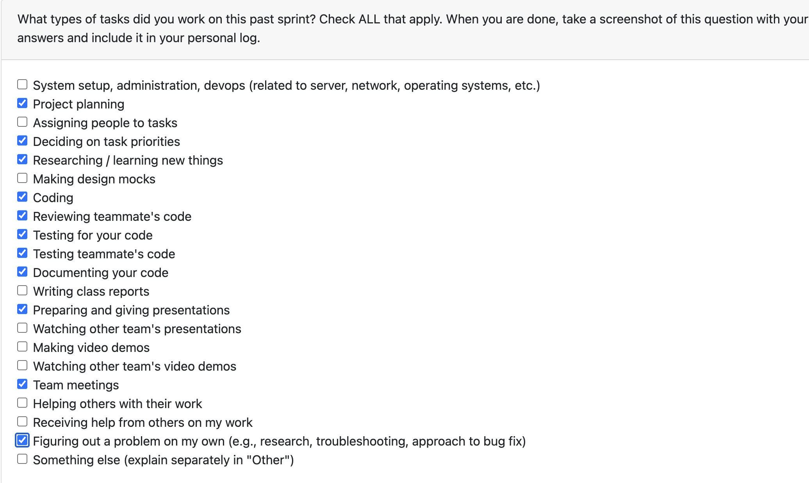

# Personal Log – Vanshika singla

---

## Entry for Week 13

### Type of Tasks Worked On

### Type of Tasks Worked On
- Designed and implemented the complete GitHub parsing pipeline with dynamic logic to handle both git-tracked and non-git files, supporting collaborative and non-collaborative parsing strategies.

- Developed file-type-specific parsing logic for PDF, DOC, README.md, regular markdown files, git design documents (collaborative), and individual git files - each requiring different extraction and attribution approaches.

- Implemented contribution frequency tracking with different calculation logic for each file type: git-tracked files use commit counts, non-git collaborative files use content attribution, and non-collaborative files default to single-author tracking.

- Created dynamic branching logic to route files through appropriate parsing pipelines based on file type (PDF/DOC vs markdown), git status (tracked vs untracked), and collaboration type (collaborative vs non-collaborative).

- Developed efficient git commit counting logic using a single git call instead of N+1 calls, significantly improving performance for repositories with many files.

- Implemented special parsing for git-tracked collaborative files that extracts individual contributions using git blame, while non-collaborative git files parse full content with commit frequency tracking.

- Separated README.md handling from other markdown files with custom parsing logic - README files are treated as non-collaborative to parse entire content for individual contribution, while other markdown files follow standard collaborative parsing.

- Created comprehensive testing suite covering all file types, git scenarios, and contribution frequency calculation methods to ensure reliability across the entire parsing pipeline.

- Updated non-code parser tests to accommodate new function signatures and contribution frequency tracking features across all file type variations.

- Also worked on the presenatation and it was a learning curve for me to present something that i did not work on - so spent some time on preparing slides for that. 
---

### Recap of Weekly Goals
✅ Implement contribution frequency tracking for non-code files — Completed
✅ Optimize git commit counting with single call approach — Completed
✅ Create comprehensive testing for git parsing — Completed
✅ Integrate parsing logic into main application — Completed
✅ Implement special parsing for git non-code files — Completed
✅ Separate README.md handling from other markdown files — Completed
✅ Update README classification for better individual analysis — Completed
✅ Update non-code parser tests for new signatures — Completed

---

### Features Assigned to Me
#351: Add Contribution Frequency Tracking for Non-Code Files
#366: Implement Efficient Git Commit Counting
#352: Comprehensive testing for the Git parsing
#368: Integrate parsing in main
#344: Special parsing for git non-code files to extract individual contribution
#342: Implement a function to separate out README.md with the other md files
#365: README as non-collaborative for non-code (bug fix)
#367: Update Non-Code Parser Tests for New Signature

---

### Associated Project Board Tasks
| Task/Issue ID | Title                                                                   | Status     |
|---------------|-------------------------------------------------------------------------|------------|
| #351          | Add Contribution Frequency Tracking for Non-Code Files | Completed  |
| #366          | Implement Efficient Git Commit Counting | Completed  |
| #352          | Comprehensive testing for the Git parsing | Completed |
| #368          | Integrate parsing in main | Completed |
| #344          | Special parsing for git non-code files to extract individual contribution | Completed |
| #342          | Implement a function to separate out README.md with the other md files | Completed |
| #365          | README as non-collaborative for non-code (bug fix) | Completed |
| #367          | Update Non-Code Parser Tests for New Signature | Completed |

---

### Issue Descriptions
#351 – Add Contribution Frequency Tracking for Non-Code Files

Implemented contribution_frequency field in parsed file data with different calculation logic for each file type. For git-tracked files, created _get_all_file_commit_counts() function that makes a single efficient git call to retrieve commit counts. For non-git files, implemented logic that defaults to 1 for non-collaborative files and uses content-based attribution for collaborative files. The challenge was designing a unified interface that handles these different calculation methods while maintaining consistency across the pipeline. This feature enables better individual contribution analysis by showing engagement levels with different files.

#366 – Implement Efficient Git Commit Counting

Optimized git commit counting by replacing N+1 git calls (one per file) with a single call to extract_non_code_content_by_author(). The function returns a dictionary mapping file paths to their commit counts, which is reused for both collaborative and non-collaborative files. This architectural change significantly improved performance for repositories with many files, reducing git operations from potentially hundreds of calls to just one.

#352 – Comprehensive Testing for the Git Parsing

Developed extensive test suite for git parsing functionality covering commit counting, author extraction, and contribution frequency tracking. Tests validate correct behavior for edge cases including files with no history, multiple authors, and various commit patterns. Ensured reliability and correctness of the git parsing logic through comprehensive unit and integration tests.

#368 – Integrate Parsing in Main

Integrated the complete GitHub parsing pipeline into the main application flow. This involved connecting the dynamic routing logic that handles different file types (PDF, DOC, markdown), git status (tracked vs untracked), and collaboration types (collaborative vs non-collaborative). Ensured that each parsing path - whether for git collaborative files using git blame, non-collaborative git files using full content parsing, or non-git files using direct extraction - properly flows into downstream analysis components. Validated that parsed data structures match expected inputs across all file type variations.

#344 – Special Parsing for Git Non-Code Files to Extract Individual Contribution

Implemented specialized parsing logic for git-tracked non-code files with different approaches for collaborative vs non-collaborative files. For collaborative git files, developed logic using git blame to extract individual author contributions line-by-line. For non-collaborative git files like README, implemented full content parsing with commit frequency tracking. The complexity was in creating dynamic logic that determines which parsing strategy to use based on file type and collaboration status, then applying the appropriate git commands and content extraction methods.

#342 – Implement a Function to Separate Out README.md with Other MD Files

Created logic to distinguish README.md files from other markdown files in the repository, implementing different parsing pipelines for each. README files are routed through non-collaborative parsing to extract full content for individual contribution, while regular markdown files follow collaborative parsing using git blame for line-by-line attribution. This separation required understanding how each file type contributes to the project and designing appropriate parsing strategies - README files contain project-level information that should be fully attributed to individuals, while other markdown files are typically collaborative documents requiring git-based attribution.

#365 – README as Non-Collaborative for Non-Code (Bug Fix)

Fixed classification logic to treat README files as non-collaborative rather than collaborative. This change allows the parser to process the entire README file for individual contribution analysis and summary generation. The bug fix improves accuracy of individual contribution tracking by ensuring README content is fully parsed and attributed correctly.

#367 – Update Non-Code Parser Tests for New Signature

Updated all non-code parser tests to accommodate new function signatures introduced by the contribution frequency tracking feature. Modified test cases to handle the new contribution_frequency field and updated assertions to validate the new data structure. Ensured all tests pass with the updated parser interface.

---

### Progress Summary
- **Completed this week:**
This week focused on designing and implementing the complete GitHub parsing  pipeline from scratch as we first was not considering this use case for non code files. The most challenging aspect was creating dynamic logic that handles multiple file types (PDF, DOC, README, regular markdown, git design documents) with different parsing strategies for each.

Developed branching logic that routes files through appropriate pipelines based on: (1) file type - PDFs/DOCs use binary extraction, markdown files use text parsing; (2) git status - tracked files use git blame/commit history, untracked files use direct content extraction; (3) collaboration type - collaborative files extract line-by-line attribution, non-collaborative files parse full content.

Implemented contribution frequency tracking with different calculation logic for each scenario: git-tracked files count commits, non-git collaborative files use content-based attribution, non-collaborative files default to single-author tracking. The hardest part was finding and implementing all this logic in very limited time while ensuring consistency across all file type variations.

Achieved significant performance improvement by refactoring git commit counting from N+1 calls to a single efficient call. This optimization handles all file types uniformly while maintaining different parsing strategies.

Completed comprehensive testing covering all file types, git scenarios, and contribution frequency methods. Fixed README classification bug by routing README files through non-collaborative parsing for full content extraction.

Integrated the entire pipeline into main application flow, ensuring all parsing paths (git collaborative, git non-collaborative, non-git PDF/DOC, non-git markdown) properly connect to downstream analysis components.

- **All tasks completed this week:**
  - All 8 assigned tickets completed and merged 

---

### Additional Context (Optional)
The main focus this week was building the complete GitHub parsing pipeline with dynamic logic to handle diverse file types and parsing scenarios. The architecture required careful design to support: PDF/DOC binary extraction, markdown text parsing, git blame for collaborative files, full content parsing for non-collaborative files, commit frequency tracking for git files, and content-based attribution for non-git files.

The most challenging aspect was implementing all this logic in very limited time while ensuring each file type flows through the correct parsing path. Each file type required different handling: PDFs need binary extraction, README needs full parsing as non-collaborative, regular markdown needs git blame for collaboration, design documents need special git tracking, and non-git files need direct extraction.

The contribution frequency calculation varies by file type: git-tracked files use commit counts from git log, non-git collaborative files use content attribution logic, and non-collaborative files default to 1. Creating a unified interface that handles these variations while maintaining consistency was complex but essential for accurate individual contribution analysis.

The single-call optimization for git commit counting represents a significant architectural improvement that benefits performance across all git-tracked file types. This feature will be used by the analysis module to generate accurate summaries and insights based on file-type-specific contribution patterns.

---

### Reflection
**What Went Well:**
- Successfully designed and implemented complete GitHub parsing pipeline with dynamic routing for multiple file types
- Created unified interface handling different parsing strategies (git blame, full content, binary extraction) across file types
- Implemented contribution frequency tracking with different calculation logic for each file type
- Completed all 8 assigned tickets this week despite the complexity and time constraints
- Performance optimization reduced git calls from N+1 to 1 across all file types
- Comprehensive testing covered all file type variations and parsing scenarios
- Successfully integrated entire pipeline into main application flow

**What Could Be Improved:**
- The hardest part was finding and implementing all the logic for different file types in very limited time - could have benefited from more time for design phase
- Better documentation of the dynamic routing logic and file-type-specific parsing strategies for future maintainers
- Could have created more modular architecture to reduce complexity of branching logic
- More proactive communication about the architectural complexity and time requirements

---

### Plan for Next Cycle
- Work on left over tasks 
- Present in the class 
- Work on milestone contract 
- Prepare for the demo 
- Intensive QA for the testing and fixing left over issues
