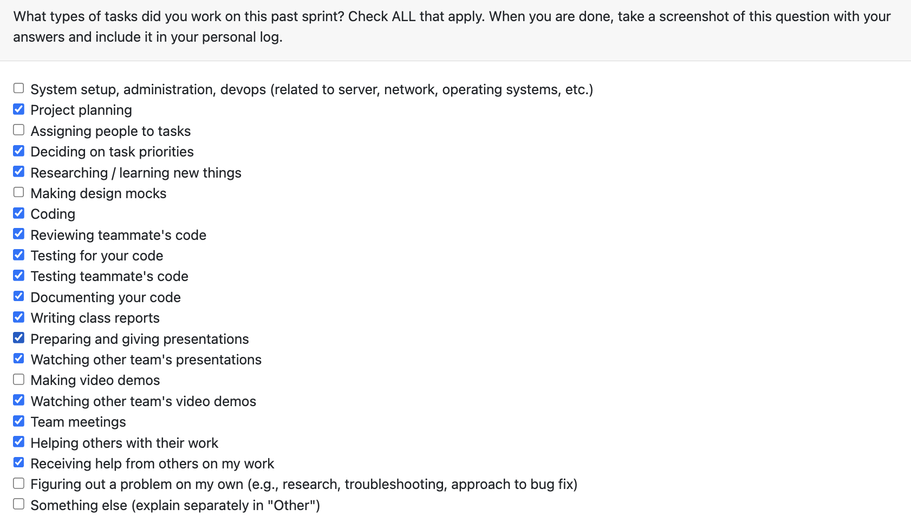

# Personal Log – Karim Jassani

---

## Entry for Dec 1 → Dec 7, 2025

### Type of Tasks Worked On

---

### Type of Tasks Worked On
- Finalised and gave the team presentation on December 1. 
- Collaborated with the team to finish the team contract.
- Integrated git code parsing in main
- Implemented testing for git code parsing
- Merge Project Ranking

---

### Features Assigned to Me
- Collaborating to finish the team contract.
- Slides for final presentation on project ranking
- integration for git code parsing
- project ranking
- peer code testing and pr review

---

### Associated Project Board Tasks
| Task/Issue ID | Title                                               | Status      |
|----------------|-----------------------------------------------------|-------------|
| #401            | Github Project - code file parsing integration in main flow                    | ✅ Completed |
| #386            | Project Score for Ranking                    | ✅ Completed |

---

### **Issue Descriptions for This Week**

---

#### **#401: Git Code Parsing**  
This PR introduces a new git_code_parsing module that extracts commit-level code history for the user’s Git email and integrates it into the main analysis flow. It updates main.py to automatically run Git-based parsing when a project is detected as a Git repo. Comprehensive tests were added to validate the parsing logic and ensure the main workflow correctly invokes Git parsing. Overall, this adds the foundation for Git-aware code analysis.

---

#### **PR #386: Project Score for Project Ranking**  
This PR adds a full scoring pipeline for evaluating project contributions across Git-based and non-Git codebases. It introduces normalized, capped metrics for code activity, documentation effort, and maintainability, along with logic to compute code/non-code contribution ratios. A final blended score (0–1) is produced based on weighted effort distribution. Comprehensive tests are included to validate normalization, saturation behavior, percentage calculations, and full integration paths.

---

**Tasks completed:**  
- Wrote Script for project presentation
- Completed project presentaiton
- Implemented parsing for git code in main
- Successfully merged project ranking

---

- **In Progress this week:**  
  - Everything is completed.

---

### Additional Context (Optional)
---

### Reflection

**What Went Well:**  
- Successfully completed git code integraiton in main
- Informed peers about upcoming 2 final exams on 8th December, completed all my pending items before hand. Team was understanding and accomodating.

**What Could Be Improved:**  

---

### Plan for Next Cycle
- Transition focus to Milestone-2

---
