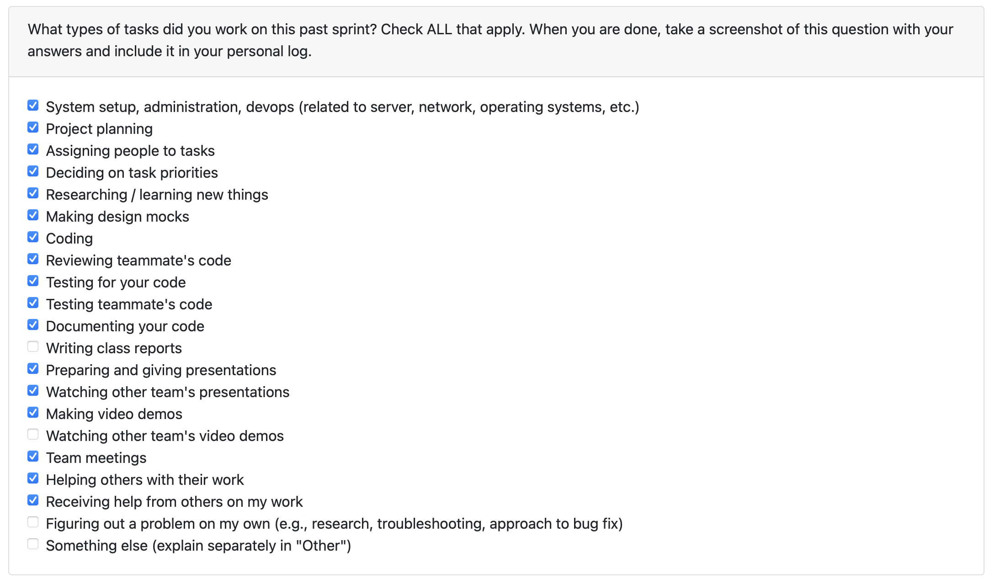

# Personal Log – Shreya Saxena

---

## Entry for Dec 1 → Dec 7, 2025

### Type of Tasks Worked On

---

### Type of Tasks Worked On
- Finalised and gave the team presentation on December 1. 
- Collaborated with the team to finish the team contract.
- Integrated non-code local analysis and AI-driven analysis into main()
- Updated non-code file checker output and end-to-end result flow
- Added portfolio metrics, bullet-point refinements, and project-name-aware outputs
- Completed final polishing tasks for demo readiness
- Contributed to final demo planning, scripting, and recording
- Implemented testing for final milestone integration
- Coordinated with team members on end-to-end pipeline validation
- Finish the project for the final demo.

---

### Features Assigned to Me
- Collaborating to finish the team contract.
- Slides for final presentation on non code analysis output for non code skills and additional metrics.
- Non-Code Local + AI Analysis Pipeline Integration
- Portfolio Metrics Generation & Bullet-Point Refinement
- Output Schema Standardization for document-type, completeness, and AI results
- Final Project Demo Preparation & Testing

---

### Associated Project Board Tasks
| Task/Issue ID | Title                                               | Status      |
|----------------|-----------------------------------------------------|-------------|
| #397            | Update non-code file checker output integrated in main                    | ✅ Completed |
| #396            | Integrate non-code local analysis flow into main                      | ✅ Completed |
| #405            | Integrate non-code AI analysis into main                | ✅ Completed |
| #404            | PR: Integrate non-code local + AI analysis into main and update checker output                               | ✅ Completed |
| #407         | PR: Add metrics to portfolio    | ✅ Completed |
| #411         | Refactor bullet points; change output to include project name                    | ✅ Completed |
| #412            | Updated output formatting for AI / non-AI results      | ✅ Completed |
| #409         | Polish / finish project for final demo	     | ✅ Completed |

---

### **Issue Descriptions for This Week**

---

#### **#396, #397, #405 (Integrated via PR #404)**  
Completed full integration of non-code analysis flows into `main()`, including both local heuristic-based analysis and AI-driven methods. Updated the non-code file checker output schema for consistency across modules and ensured compatibility with downstream portfolio generation along with testing.

---

#### **PR #404: Integrating non-code local analysis, non-code AI analysis, and updating outputs**  
Connected all non-code analysis stages into the complete end-to-end execution path. This PR resolved three major issues (#396, #397, #405) and established the final structure for incorporating non-code artifacts within the main orchestrator along with testing.

---

#### **PR #407: Add metrics to portfolio**  
Implemented portfolio metrics, improved bullet-point generation, standardized output formatting to include project names, and refined both AI and non-AI result fields.  
Closed related issues: **#411, #412, #409** along with testing.

---
#### **Final Presentation Work**
Collaborated with the team to prepare slides for the final presentation. I made slides for non code analysis for skills and additional metrics for non code pipeline. Reviewed all slides with the team.

#### **Final Demo Work** PR#409 FOR FINISHED PROJECT 
Collaborated with **Karim Khalil**, **Oluwadabira Omotoso**, and **Afua Frempong** to prepare the final project demo along with testing and the following: 

**Tasks completed:**  
- Wrote the **demo script** for my part.
- Outlined and verified all **completed project requirements** 
- Co-created the **demo video**  
- Implemented additional **tests and validation steps** to finalize the project for submission  

---

- **In Progress this week:**  
  - Everything is completed.

---

### Additional Context (Optional)
---

### Reflection

**What Went Well:**  
- Successfully integrated all major non-code analysis components into the main flow.
- Closed multiple high-impact issues across back-end processing and portfolio output.
- Collaborated effectively with teammates during demo preparation.
- Ensured final testing, polish, and schema consistency for a smooth presentation.

**What Could Be Improved:**  
- Proper and equal distribution of work amongst team members. 

---

### Plan for Next Cycle
- Transition focus to Milestone-2

---
