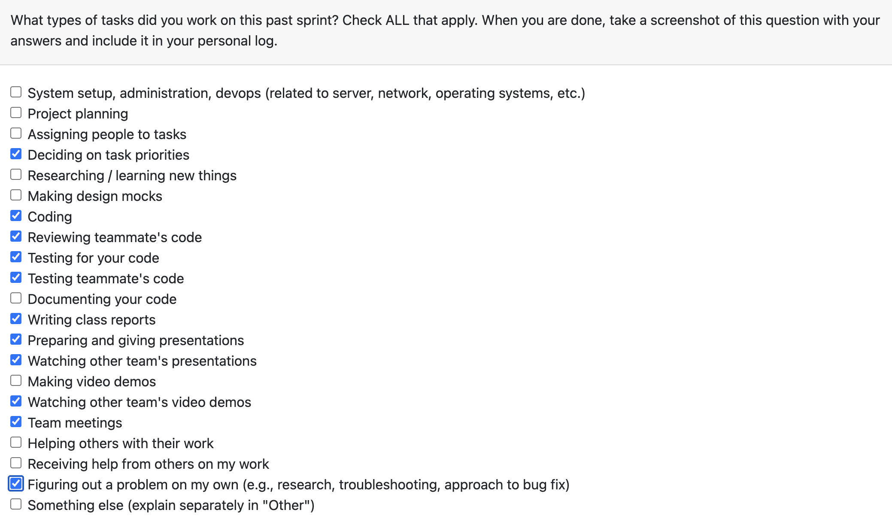

# Personal Log – Vanshika Singla

---

## Entry for Week 14

### Type of Tasks Worked On

### Type of Tasks Worked On
- Prepared and delivered final presentation for the capstone project - learning curve as I presented features I didn't directly work on, requiring extra preparation time.
- Presented in class and handled Q&A session.
- Collaborated on team contract documentation.
- Finished self-reflection assignment.
- Finished team evaluations 
- Reviewed all the left of PRs in the github
- Wrapped up all documentation-related tasks for the capstone project.
- Integrated parsing logic into main application from last sprint (#368).
- Resolved multiple testing issues and merge conflicts (#418) - significant effort required as everyone was working on main branch simultaneously.
- Performed regressive testing for parsing in main with multiple iterations to fix testing issues, as main.py required different testing approaches than usual (#419).
- Conducted manual testing for final demo - quality assurance with various test files to identify and resolve issues (#417). 
---

### Recap of Weekly Goals
✅ Prepare and deliver final presentation — Completed
✅ Complete team contract — Completed
✅ Complete self-reflection — Completed
✅ Wrap up all documentation tasks — Completed
✅ Integrate parsing in main — Completed
✅ Resolve testing issues and merge conflicts — Completed
✅ Perform regressive testing for parsing — Completed
✅ Manual testing for final demo — Completed

---

### Features Assigned to Me
#368: Integrate parsing in main
#418: Resolve testing issues for merge conflicts
#419: Regressive testing for parsing in main
#417: Manual testing for final demo - Quality assurance
non-code tasks 
- Final presentation preparation and delivery
- Team contract completion
- Self-reflection completion
- Documentation wrap-up

---

### Associated Project Board Tasks
| Task/Issue ID | Title                                                                   | Status     |
|---------------|-------------------------------------------------------------------------|------------|
| #368          | Integrate parsing in main | Completed |
| #418          | Resolve testing issues for merge conflicts | Completed |
| #419          | Regressive testing for parsing in main | Completed |
| #417          | Manual testing for final demo - Quality assurance | Completed |
| N/A           | Final presentation preparation and delivery | Completed |
| N/A           | Team contract completion | Completed |
| N/A           | Self-reflection completion | Completed |
| N/A           | Documentation wrap-up | Completed |

---

### Issue Descriptions

**Final Presentation Preparation and Delivery**

Collaborated on Preparing slides and content for the final capstone presentation. This was a significant learning curve as I presented features I didn't directly work on, requiring extra time to understand the implementation details and be ready for Q&A. Successfully delivered the presentation in class.

**Team Contract and Self-Reflection**

Completed the team contract documentation outlining team roles, responsibilities, and collaboration guidelines. Finished the self-reflection assignment analyzing personal growth and contributions throughout the capstone project.

**Documentation Wrap-up**

Finalized all remaining documentation tasks for the capstone project, ensuring all deliverables were complete and up-to-date.

#368 – Integrate Parsing in Main

Integrated the parsing logic from the previous sprint into the main application. This involved connecting the parsing pipeline with the main application flow and ensuring all components work together seamlessly. Validated that parsed data structures match expected inputs across all file type variations.

#418 – Resolve Testing Issues for Merge Conflicts

Resolved multiple merge conflicts as everyone was working on the main branch simultaneously. This required careful coordination and understanding of different team members' changes to ensure no functionality was lost during conflict resolution.

#419 – Regressive Testing for Parsing in Main

Performed multiple iterations of regressive testing for the parsing functionality integrated into main.py. The challenge was that main.py required different testing approaches than usual module testing. Fixed various issues discovered during testing to ensure stability.

#417 – Manual Testing for Final Demo - Quality Assurance

Conducted  manual testing with 2 different test files after all features were merged. Tested different file types, edge cases, and user workflows to identify and resolve issues before the final demo. Ensured quality assurance across the entire application.

---

### Progress Summary
- **Completed this week:**
This week focused on wrapping up the capstone project with presentation delivery, documentation completion, and extensive testing. 

---

### Additional Context (Optional)
Very grateful for Adam, the wonderful TA, and the Professor, who supported us throughout the project and helped us by providing good comments and criticism throughout the project to keep us on track.

### Reflection
**What Went Well:**
- Since I had two exams this Monday, I worked ahead (in Week 13) to finish many of the assigned responsibilities from both this week and last week so I didn't have to spend the majority of my time on the project this week.
- Grateful for a wonderful team and their cooperation with everything this week.

**What Could Be Improved:**
- While filling out the self-reflection, I was able to jot down some key learning values, hoping to use them in next sprints. 

---

### Plan for Next Cycle
- END OF THE CYCLE THIS TERM 
- Start working on next phase of project when term begins 
