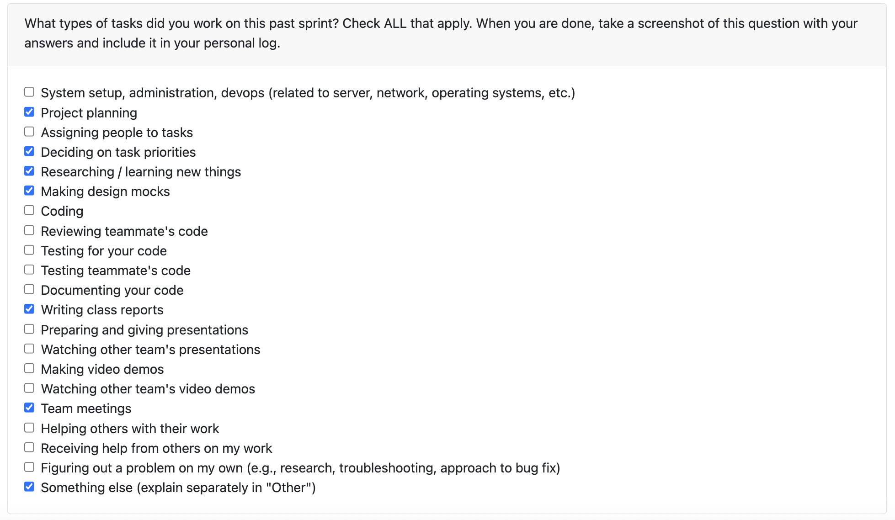

# Personal Log – Karim Jassani

---

## Entry for Sept 22, 2025 → Sept 28, 2025

### Type of Tasks Worked On

---

### Recap of Weekly Goals

- Complete the project proposal describing the goals, scope, planned features, and deliverables
- Designed the system architecture diagram to illustrate the main components and how they interact
- Decide on the tech stack for the project based on the system’s needs
- Break down the system into use case scenarios and create a use case UML diagram
- Plan the tests by outlining test cases to check that each requirement works correctly

---

### Features Assigned to Me (from Project Proposal and System Architecture)

- Outline project scope and usage scenario
- Outline unique proposed solution
- assist with drafting and refining system architecture diagram

---

### Associated Project Board Tasks
| Task/Issue ID | Title                      | Status     |
|---------------|----------------------------|------------|
| #N/A          | System Architecture Design | Completed  |
| #N/A          | Project Proposal           | Completed  |

---

### Progress Summary
- **Completed this week:**  
  - Outlined project scope and usage scenario for proposal
  - Outlined proposed solution features for proposal
  - Participated in proposal review and finalization
  - Contributed to design of system architecture diagram
  - Collaborated on mapping requirement to test cases  
- **In Progress this week:**  
  - N/A  

---

### Additional Context (Optional)
- No blockers — smooth collaboration across all meetings.  

---

### Reflection
**What Went Well:**
* Designing the system architecture went smoothly since we had proactive discussions about the project requirements early on, which helped align everyone’s understanding. 
* Adopting a TDD mindset and thinking about test cases early helped us uncover edge cases and be more thorough in our proposal.
* Everyone was accommodating of each other’s schedules, and we collectively dedicated over 6 hours to working on the assignment, which ensured steady progress. 

**What Could Be Improved:**
* Our collaboration was very helpful for aligning on ideas, but it took more time than expected. In future weeks, we should divide tasks more efficiently so that we can maintain collaboration while speeding up overall progress.
---