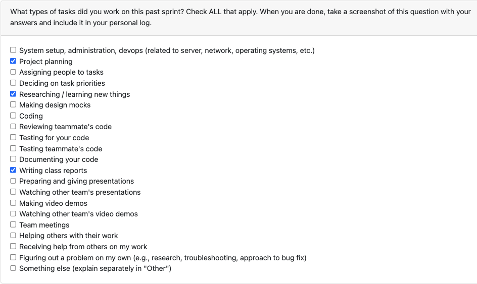

# Personal Log – Karim Jassani

---

## Entry for Sept 29, 2025 → Oct 5, 2025

### Type of Tasks Worked On

---

### Recap of Weekly Goals
- Learnt and researched the purpose and structure of Data Flow Diagrams
- Created a level 0 DFD to represent the context of high level interactions in our system
- Created a level 1 DFD to show major processes and their interactions 

---

### Features Assigned to Me
- Level 0 and Level 1 DFD creation and documentation

---

### Associated Project Board Tasks
| Task/Issue ID | Title       | Status     |
|---------------|-------------|------------|
| #N/A          | Level 0 DFD | Completed  |
| #N/A          | Level 1 DFD | Completed  |

---

### Progress Summary
- **Completed this week:**  
  - Refreshed my understanding of DFD concepts  
  - Contributed to the design and documentation of Level 0 DFD
  - Contributed to the design and documentation of Level 1 DFD
- **In Progress this week:**  
  - N/A  

---

### Additional Context (Optional)
- Discussing the data flow diagram with other teams was useful to get a broader understanding of how other teams are interpreting the applicaiton

---

### Reflection
**What Went Well:**
* Everyone brought in their ideas which made the discussion insightful and the process more efficient
* Learning from last week, we utilized our time in class better and were more efficient
* Group chemistry is good which makes discussions easier and more insightful

**What Could Be Improved:**
* DFD is supposed to be worked on as a whole, hence, it was difficult to divide the task. This is somehthing we can keep in mind for future weeks.

---

### Plan for Next Cycle
* Review base project requirements and make adjustments to requirements when necessary
* Finalise assigned tasks and set up project board
* Research more on our chosen tech stack and algorithms that will contribute to project development
