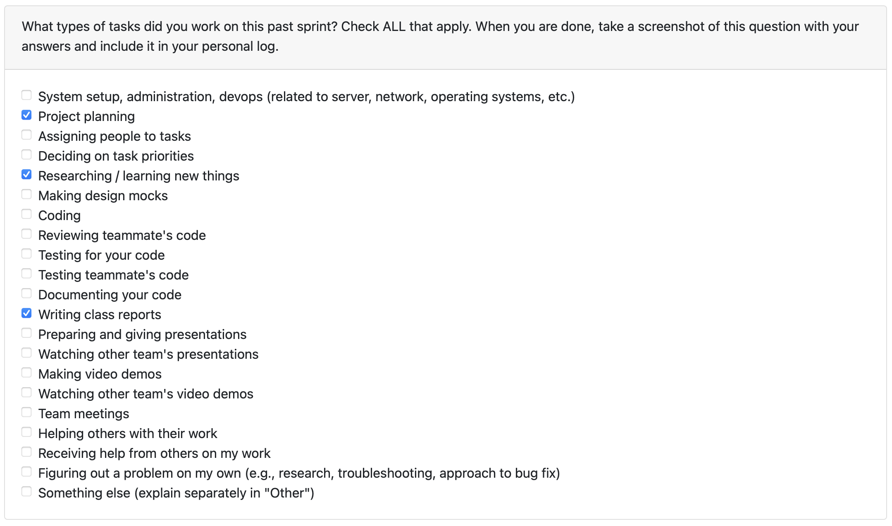

# Personal Log – Shreya Saxena

---

## Entry for Sept 29, 2025 → Oct 5, 2025

### Type of Tasks Worked On

---

### Recap of Weekly Goals
- Learnt and researched the purpose and structure of Data Flow Diagrams
- Created a level 0 DFD to represent the context of high level interactions in our system
- Created a level 1 DFD to show major processes and their interactions 

---

### Features Assigned to Me
- Level 0 and Level 1 DFD creation and documentation

---

### Associated Project Board Tasks
| Task/Issue ID | Title       | Status     |
|---------------|-------------|------------|
| #N/A          | Level 0 DFD | Completed  |
| #N/A          | Level 1 DFD | Completed  |

---

### Progress Summary
- **Completed this week:**  
  - Refreshed my understanding of DFD concepts  
  - Contributed to the design and documentation of Level 0 DFD
  - Contributed to the design and documentation of Level 1 DFD
- **In Progress this week:**  
  - N/A  

---

### Additional Context (Optional)
- Multiple feedback recieved from professor improved my understanding on the DFD and helped our team refine the level 1 diagram  

---

### Reflection
**What Went Well:**
* Everyone developed a solid understanding of DFD concepts, which made the design process more efficient
* Collaboration during the DFD creation process was productive, and we were able to agree on the main system processes and data flows

**What Could Be Improved:**
* Clearer communication would have reduced the amount of back and forth, at times, misunderstandings slowed progress and caused rework
* Establishing roles or ownership over specific parts of the DFD earlier on might have helped streamline the task
---

### Plan for Next Cycle
* Review base project requirements and make adjustments to requirements when necessary
* Finalise assigned tasks and set up project board
* Research more on our chosen tech stack and algorithms that will contribute to project development
