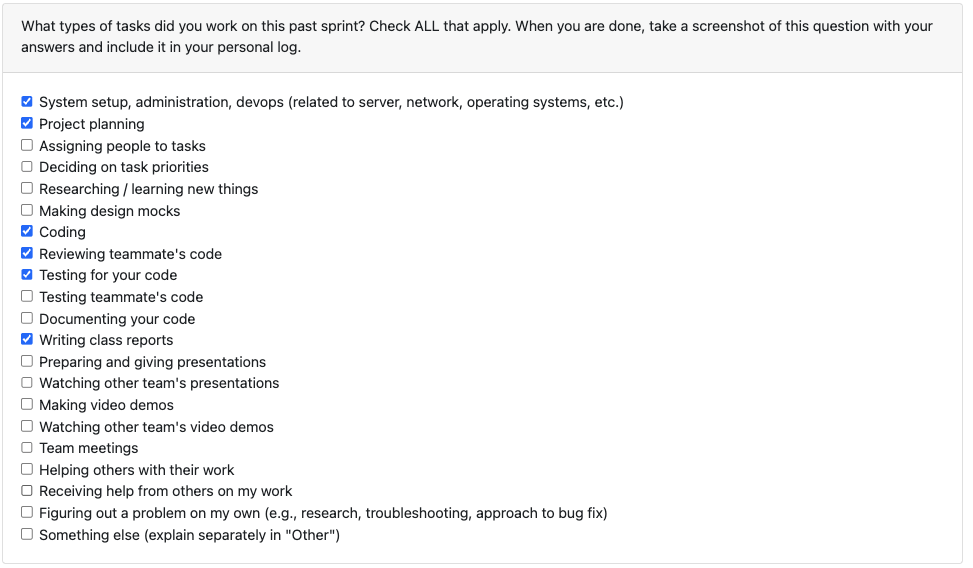

# Personal Log – Karim

---

## Entry for Oct 6, 2025 → Oct 12, 2025

### Type of Tasks Worked On

---

### Recap of Weekly Goals
- Helped in refining all project diagrams (DFD, UML, and System Architecture) and documentation based on Milestone 1 requirements.
- Managed dependecies by creating requirements.txt
- Implemented backend function to check if file is a zip file

---

### Features Assigned to Me
- System Architecture Diagram update and documentation  
- Check if file is a zip file 
- Manage dependecies with requirements file

---

### Associated Project Board Tasks
| Task/Issue ID | Title                                    | Status     |
|----------------|------------------------------------------|-------------|
| 41           | System Architecture Diagram Update and explanation     | Completed  |
| 37           | Manage Python Dependecies with rquirements.txt      | Completed  |
| 22           | Add function to check if file is zip file| In Progress  |

---

### Progress Summary
- **Completed this week:**  
  - Updated and finalized the System Architecture diagramsand its summary and use.  
  - created requirements.txt to manage dependecies well in collaboration
  - Collaborated with the team on refining documentation for Milestone 1  
- **In Progress this week:**  
  - Function to check if file is zip file, tests created need to write function (TDD) 

---

### Additional Context (Optional)
- The architecture diagram and documentation updates helped clarify the system’s data flow and backend process design  

---

### Reflection

**What Went Well:**  
* Productive collaboration and clear progress across multiple deliverables  

**What Could Be Improved:**  
* Clearer task ownership earlier in the week could have reduced overlap  
* More frequent commits could make version tracking smoother  
* Could have started earlier to avoid time crunch

---

### Plan for Next Cycle
* Begin refining and implementing the next **file upload functions**  
* Work on **decompression logic** to handle uploaded archive files  
* Continue improving architecture documentation as implementation progresses  

---
