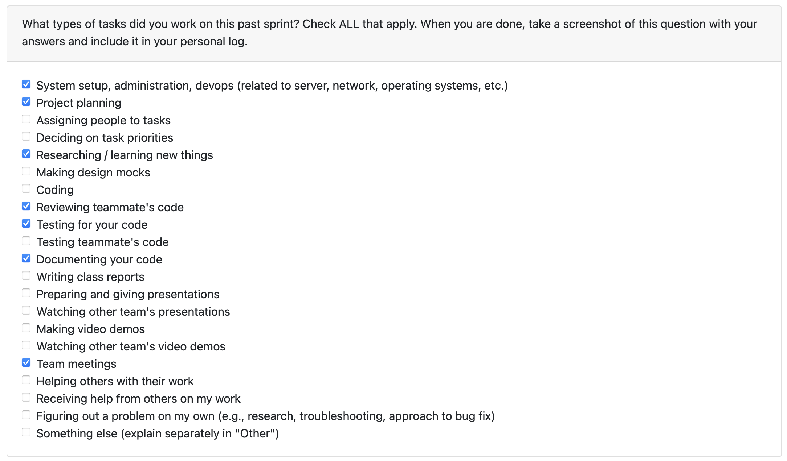

# Personal Log – Shreya Saxena

---

## Entry for Oct 6, 2025 → Oct 12, 2025

### Type of Tasks Worked On

---

### Recap of Weekly Goals
- Updated and helped in refining all project diagrams (DFD, UML, and System Architecture) based on Milestone 1 requirements.
- Updated repository configuration files (`.gitignore`, `README.md`, and `scripts/setup.sh`) for better clarity and structure.
- Implemented backend function to check if a file or directory exists.

---

### Features Assigned to Me
- System Architecture Diagram update and documentation  
- File existence utility function and unit tests  
- Repository setup scripts and files (`.gitignore`, `README.md`, `setup.sh`)

---

### Associated Project Board Tasks
| Task/Issue ID | Title                                    | Status     |
|----------------|------------------------------------------|-------------|
| 17           | System Architecture Diagram Update       | Completed  |
| 46           | Add File Existence Utility + Tests       | Completed  |
| 22           | Update `.gitignore`, README & Setup Script | Completed  |

---

### Progress Summary
- **Completed this week:**  
  - Updated and finalized DFD, UML, and System Architecture diagrams  
  - Implemented and tested file existence validation function  
  - Updated `.gitignore`, improved `README.md` with setup details, and added `setup.sh` script  
  - Collaborated with the team on refining documentation for Milestone 1  
- **In Progress this week:**  
  - None — all planned tasks completed  

---

### Additional Context (Optional)
- The architecture diagram and documentation updates helped clarify the system’s data flow and backend process design  
- The utility and test additions ensure smoother local validation during file uploads  

---

### Reflection

**What Went Well:**  
* Productive collaboration and clear progress across multiple deliverables  
* Successfully balanced both documentation and backend implementation tasks  
* Repository setup changes improved organization and clarity  

**What Could Be Improved:**  
* Clearer task ownership earlier in the week could have reduced overlap  
* More frequent commits could make version tracking smoother  

---

### Plan for Next Cycle
* Begin refining and implementing the next **file upload functions**  
* Work on **decompression logic** to handle uploaded archive files  
* Continue improving architecture documentation as implementation progresses  

---
