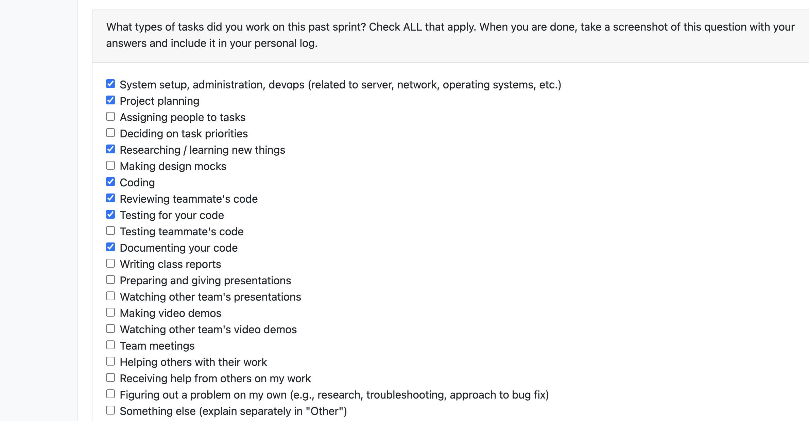

# Personal Log – Vanshika Singla

---

## Entry for Oct 6, 2025 → Oct 12, 2025

### Type of Tasks Worked On

---

### Recap of Weekly Goals
- Set up Docker containerization for the Python backend application
- Created comprehensive Docker configuration files and documentation
- Worked on Data Flow Diagram (DFD) refinements and system architecture
- Helped in refining all project diagrams (DFD, UML, and System Architecture) and documentation based on Milestone 1 requirements.

### Features Assigned to Me
- Research for Docker setup and needed requirements
- Docker containerization setup (Dockerfile, docker-compose.yml)
- Backend infrastructure configuration and requirements management and information in README
- Data Flow Diagram updates and documentation
- Set up Docker containerization for the Python backend application

---

### Associated Project Board Tasks
| Task/Issue ID | Title                                    | Status     |
|----------------|------------------------------------------|-------------|
| 16          | Updated DFD with explanation      | Completed  |
| 24           | Docker Knowledge research      | Completed  |
| 21          | Docker setup - dockerfile, compose.yml file, readme | Completed  |
| 31        | Setup and configuration (working on updating changes in all documents)    | Completed  |

---

### Progress Summary
- **Completed this week:**  
  - Created Dockerfile using python:3.11-slim base image with proper dependency management
  - Implemented docker-compose.yml with volume mounting for development workflow
  - Added requirements.txt with FastAPI, SQLAlchemy, GitPython, and other core dependencies
  - Updated README.Docker.md with comprehensive setup and troubleshooting instructions
  - Refined Data Flow Diagram to better represent system architecture and data processing
  - Set up basic FastAPI application structure with health endpoints
  - Testing Docker deployment using CMD command and docker build for container
  - Manual testing for DFD and legend showing in markup language 

- **In Progress this week:**  
  NA
---

### Additional Context (Optional)
- Docker setup enables consistent development environment across team members
- FastAPI backend structure provides foundation for file scanning and git analysis features
- Volume mounting in docker-compose allows for hot reload during development

---

### Reflection

**What Went Well:**  
* Productive collaboration and clear progress across multiple deliverables  
* Successfully balanced both documentation and backend implementation tasks  
* Repository setup changes improved organization and clarity  
* Successfully containerized the application with proper Python 3.11+ support
* Clear documentation helps team members get started quickly with the development environment including the DFD improvements provide better visualization of system data flow

**What Could Be Improved:**  
* Establishing dedicated collaboration hours for the team would help improve work-life balance and streamline dependencies, as asynchronous schedules sometimes lead to extended or irregular working hours for me and I see myself putting in more time than it should take
* Defining clearer task ownership and responsibilities earlier in the week could help minimize overlap and enhance overall efficiency.

---

### Plan for Next Cycle
* Work on the **consent management** feature in the back end 
* Begin refining and implementing the next **file upload functions**  
* Work on **decompression logic** to handle uploaded archive files  
* Continue improving the proposal and features documentation as implementation progresses  
* Implement core **file scanning logic** with proper containerized testing

---