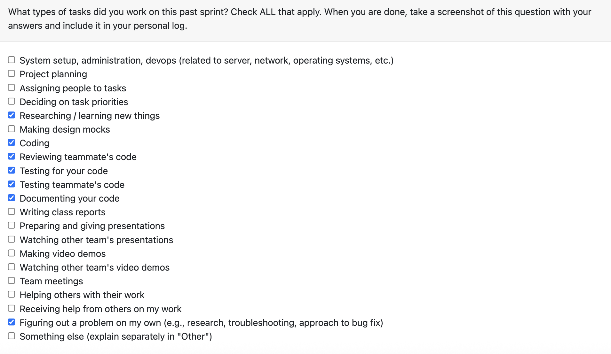

# Personal Log – Karim Jassani

---

## Entry for Oct 13, 2025 → Oct 19, 2025

### Type of Tasks Worked On

---

### Recap of Weekly Goals
- Completed work on functionality to check for zip
- completed comprehensive testing for the functionality
- completed multiple code reviews

---

### Features Assigned to Me
- Creating functionality to check for zip file

---

### Associated Project Board Tasks
| Task/Issue ID | Title       | Status     |
|---------------|-------------|------------|
| #48        | Check if path provided is a zipped folder | Completed  |

---

### Progress Summary
- **Completed this week:**  
  - function to check zip file

- **In Progress this week:**  
  - NA

---

### Additional Context (Optional)

This was a relatively lighter week for me in terms of tasks completed for the project since I had all my midterms this week, and have one more on Tuesday. I have communicated this with my teammates and I will be compensating for the same in the next week.

---

### Reflection
**What Went Well:**
* We had good communication as a team and we were able to split up our work effectively.
* Code reviews have been going well. Everyone has been giving positive suggestions on where to change or improve someone else's code.

**What Could Be Improved:**
* I will be compensating for the fewer contributions next week.
---

### Plan for Next Cycle
* To be discussed with the team