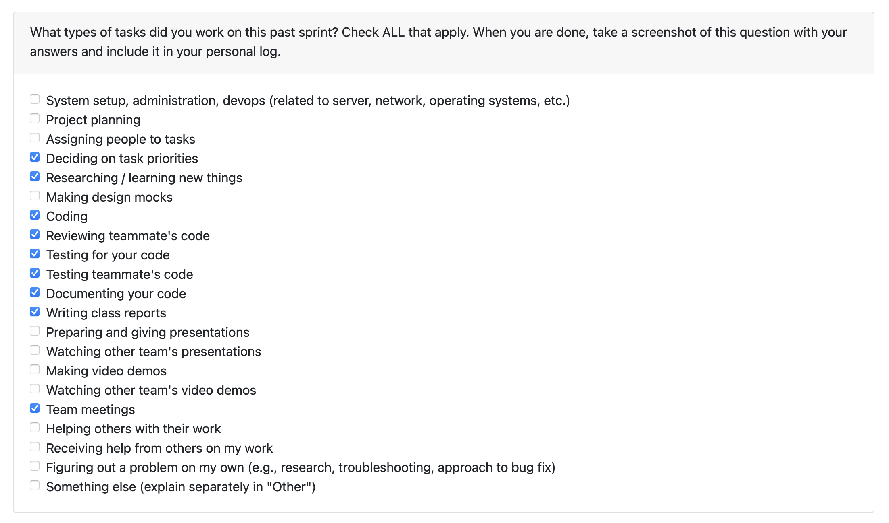

# Personal Log – Shreya Saxena

---

## Entry for Oct 20, 2025 → Oct 26, 2025

### Type of Tasks Worked On

---

### Recap of Weekly Goals
- Began and completed core updates for **FR2’s final ZIP handling flow:**
  - **Project Extraction Utility (#139):** Implemented `extract_and_list_projects()` to handle ZIP extraction and metadata listing.  
  - **Project Identification Utility (#153):** Added `_identify_projects()` helper to detect valid project directories using common markers (e.g., `setup.py`, `package.json`, `.git`).  
  - **Unit Tests (TDD – #152, #153):** Developed comprehensive pytest coverage before implementation to ensure reliability across valid, invalid, and edge cases.  
  - **Integration Alignment:** Verified extraction utilities integrate smoothly with existing folder validation and scanning modules.  

---

### Features Assigned to Me
- Folder Path Selector (FR2)  
- Project Extraction and Identification Utilities  
- Unit Testing for Project Detection  

---

### Associated Project Board Tasks
| Task/Issue ID | Title                                         | Status       |
|----------------|-----------------------------------------------|--------------|
| 139            | Read the Number of Projects Uploaded by User  | Completed  |
| 153            | Add Project Identification Logic (`_identify_projects`) | Completed |
| 86             | Test Cases for Validation and Extraction Functions | Completed |

---

### Progress Summary
- **Completed this week:**  
  - Implemented and tested both project extraction and identification utilities using a TDD approach.  
  - Ensured that extracted ZIPs are validated, decompressed, and scanned for distinct project folders with proper error handling.  
  - Extended FR2’s capabilities to read and interpret multiple uploaded projects automatically.  
  - Documented all changes and linked relevant PRs to their corresponding feature issues (#152, #153).  
  - Updated internal progress documentation under FR2 to reflect completion of project detection.  

- **In Progress this week:**  
  - Final test refinements for ZIP edge cases and directory permission variations.  
  - Preparing documentation updates and progress summaries for the next milestone.  

---

### Additional Context (Optional)
- These additions finalize **FR2’s backend functionality**, enabling seamless transition to **File Scanning (FR4)** in the next sprint.  
- Strong collaboration with teammates on consent flow and git detection utilities ensured feature compatibility and stability.  
- Maintained consistent modular design and standardized return schemas for all FR2 components.  

---

### Reflection

**What Went Well:**  
* Successfully implemented both extraction and project detection logic ahead of schedule.  
* Followed TDD effectively — all tests passed immediately after implementation.  
* Improved understanding of ZIP handling, directory traversal, and Python file I/O edge cases.  

**What Could Be Improved:**  
* More commits could lead to easier code tracking. 

---

### Plan for Next Cycle
* Start with code logic for file analysis.
* Collaborate on PR reviews for related backend utilities.  
* Begin setting up test environments for end-to-end validation of the Project Input workflow.  

---
