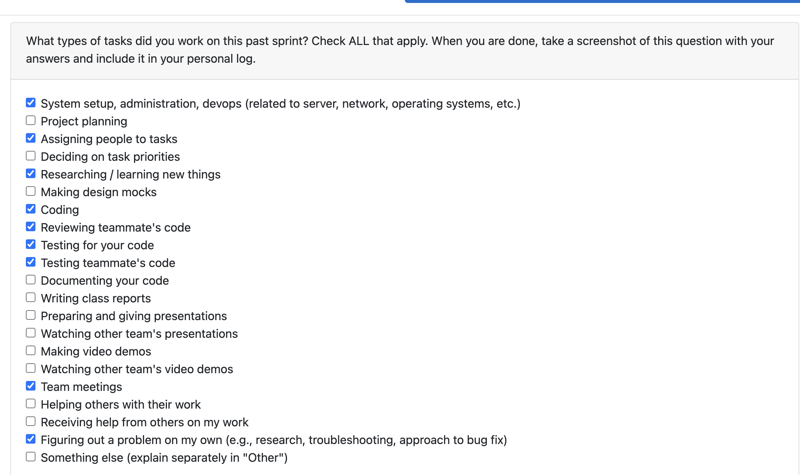

# Personal Log – Vanshika Singla

---

## Entry for Oct 20, 2025 → Oct 26, 2025

### Type of Tasks Worked On

### Type of Tasks Worked On
- Backend development (ConsentManager — Python)
- Command-line UX (Consent CLI — interactive prompts, detailed info)\
- Establishing connection with Database for consent management and storing data
- Revoking the consent and resetting the database 
- Testing & code review (manual tests, PR reviews, test planning)
- Project coordination (issue tracking, task assignments)
- Raising Bug- Docker interactivity

---

### Recap of Weekly Goals
- Fix the consent management and change the saving mechanism- use the DB for saving and retrieving the consent from consent table 
- Refine the consent messaging and privacy information (consent_text.py) — completed
- Work on the consent revoke function
- Also found a bug with the docker, it doesnt accept the interactive input from user so worked on that 
- Review related PRs and plan next steps: unit tests for ConsentManager, revoke-consent flow, and database integration for user input (issues #100, #84, #82) and test other teammates code

---

### Features Assigned to Me
- #30: Consent and user management
- #88: Consent Management
We have subtasks that are under these features
- Raised a bug

---

### Associated Project Board Tasks
| Task/Issue ID | Title                                            | Status     |
|-------------- |--------------------------------------------------|------------|
| #68           | Determine content on Consent Form                 | Closed     |
| #80           | Store Consent Status Locally                      | Closed     |
| #100          | Save the user input in database                   | Closed     |
| #88           | Consent Management                                | Closed      |
| #87           | Test Cases (Positive/Negative)                    | In Progress |
| #84           | Handle Consent Decline & OS Permission Denial     | Closed     |
| #74           | Implement Consent Screen UI *                     | Open       |
| #141          | Revoke the consent at any time when user wants to revoke the consent | Completed |
| #148          | TEST cases for the revoking consent               | Completed     |

---

### Issue Descriptions
- **#148: TEST cases for the revoking consent**  
All 3 tests pass, covering revoke scenarios (remove consent, handle no consent, grant-revoke-regrant).
Parent issue: #141.

- **#141: Revoke the consent at any time when user wants to revoke the consent**  
  When the consent is already given, user can be prompted to revoke the consent. This would change the consent provided to no in the database and exit the app. Next time when app is opened again, user is prompted to ask for the consent again.

- **#100: Save the user input in database**  
  Consent flag is saved in the database instead

- **#74: Implement Consent Screen UI ***  
  TBD later in development. Build the consent form interface according to design specs. Ensure clear "Accept" and "Decline" options and accessibility compliance.

### Progress Summary
- **Completed this week:**
  - Reviewed related PRs / provided feedback (Docker coverage, git-folder detection, and other team PRs)
  - Implemented consent revocation functionality (issue #141 — completed)
  - Created and passed test cases for consent revocation (issue #148 — all 3 tests pass, covering revoke scenarios: remove consent, handle no consent, grant-revoke-regrant)
  - Updated consent saving mechanism to use database instead of local storage (issue #100 — completed)
  - Docker configuration and compose files for development - added the configuration for interactivity (completed)

- **In Progress this week:**
  All the tasks from this planned week are finished 

---

### Additional Context (Optional)

I was able to notice that all of the consent manager cases are working in the main.py file and tests passed but when using docker-compose up --build, we were not able to interact with it, so my PRs' information have the ways I tried to fix it and which docker command worked for it to run in docker.
---

### Reflection
**What Went Well:**
- Successfully implemented and tested consent revocation
functionality, allowing users to revoke consent at any time and reset the database
- Created comprehensive test cases for consent revocation that all passed, covering edge cases like grant-revoke-regrant scenarios
- Collaborated on a critical Docker interactivity bug, enabling proper user input handling in containerized environments (e.g., via docker-compose up --build with updated configurations)
- Transitioned consent storage from local files to database for better persistence and scalability
- Actively participated in code reviews and testing across environments and attended all the team meetings 

**What Could Be Improved:**
- Communication can be made better for the team decisions 
- More updates can be provided for the small updates that are made feature wise so everyone is informed 
- I had to waste a lot of time in maintaining a good git flow because all my PRs were connected and delays in PR reviews caused me to put extra 2 hours in fixing the revert issues. 
---

### Plan for Next Cycle
- Refactor the CLI if needed to have a centralized CLI for consent management
- Take on new features and start building on them
- Continue participating in code reviews and helping team members
