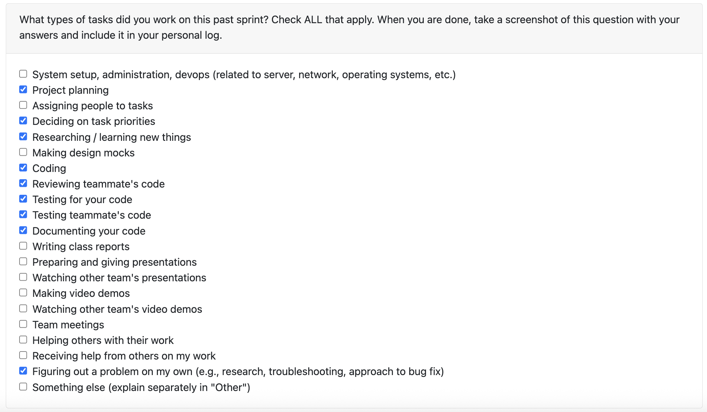

# Personal Log – Karim Jassani

---

## Entry for Oct 27, 2025 → Nov 2, 2025

### Type of Tasks Worked On

---

### Type of Tasks Worked On
- Extract Author's code commits
- Map changes to files
- Research Non LLM Coding analysis
- Documentation
- Test-driven development (pytest)
- PR documentation, issue linking, and progress tracking
- Peer review and coordination across backend modules

---

### Recap of Weekly Goals
- Analyse git repo
- Extract given author's commits from a repo
- Extract code out of the content

---

### Features Assigned to Me
- Extract author's code commits (git) 
- Map changes to files
- Unit and integration testing for function

---

### Associated Project Board Tasks
| Task/Issue ID | Title                                               | Status      |
|---------------|-----------------------------------------------------|-------------|
| #181           | Extract author's code commits (git)| Completed |
| #92           | Map changes to Files| Completed |

---

### Issue Descriptions for this week:

- **Extract author's code commits (git) ([COSC-499-W2025/capstone-project-team-3#181](https://github.com/COSC-499-W2025/capstone-project-team-3/issues/181)**  
Extracts detailed, per-file commit information (metadata + diffs) for all commits authored by a specified person across all branches in a Git repository.

---

### Progress Summary
- **Completed this week:**  
  - Completed important milestone "feature Extrapolate individual contributions for a given collaboration project"
  - This has been completed for code dommits inside a git repo

- **In Progress this week:**  
  - Functionality to check for code vs non code file
  - Extract ReadMe from repo
---

### Additional Context (Optional)
- Integration of the file scans is still pending due to previous tasks that would need to be merged into the main flow. 
---

### Reflection

**What Went Well:**  
- Great progress on project overall.
- Managed to split up work in a quick and efficient manner allowing us to tackle different parts of the project. 

**What Could Be Improved:**  
- Completing tasks earlier during the week can help us progress faster with the project. 

---

### Plan for Next Cycle
- Discuss handling non code files inside git repo
- Complete peer review for function to check is_code_file()
- continue working on non-llm analysis of code files