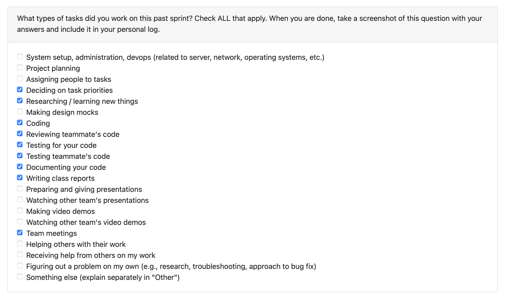

# Personal Log – Shreya Saxena

---

## Entry for Oct 27, 2025 → Nov 2, 2025

### Type of Tasks Worked On

---

### Type of Tasks Worked On
- Confirming 100% test coverage for FR-2.
- CLI-based user flow for file path input (`project-input-cli`)  
- ZIP extraction and project detection utilities  
- Test-driven development (pytest – validation & extraction)  
- Research on LLM and non-LLM strategies for non-code file analysis  
- PR documentation, issue linking, and progress tracking  

---

### Recap of Weekly Goals
- Complete FR2 implementation with full validation and extraction logic.  
- Implement and test the **file path input flow** via CLI for user project root handling.  
- Start FR6.1, Research potential approaches for **non-code file analysis** (LLM-based and algorithmic).  
- Maintain TDD workflow and ensure test coverage across all FR2 utilities.  
- Finalize FR2 documentation and start aligning it with FR6.1 (File Analysis).  

---

### Features Assigned to Me
- **FR2:** Folder Path Selector
- **FR6.1:** Non code Analysis  
- **Project Extraction & Identification Utilities** (`extract_and_list_projects`, `_identify_projects`)  
- **Test Coverage for Validation Utilities**

---

### Associated Project Board Tasks
| Task/Issue ID | Title                                               | Status      |
|----------------|-----------------------------------------------------|-------------|
| #71            | Native Folder Picker Integration                    | ✅ Completed |
| #79            | Validate Directory Read Access                      | ✅ Completed |
| #81            | Handle Invalid or Inaccessible Paths                | ✅ Completed |
| #83            | Handle Directory Size                               | ✅ Completed |
| #139           | Read the Number of Projects Uploaded by the User    | ✅ Completed |
| #153           | Project Identification from ZIPs                    | ✅ Completed |
| #86            | Test Cases (Validation & Extraction Utilities)      | ✅ Completed |
| #184            | Implement User Flow for inputting file path.	     | ✅ Completed |
| #186           | Researching LLM/non-LLM implementation for non code file analysis. | In-Progress |

---

### Issue Descriptions for this week:
- **#86: Test Cases**  
  Verified complete test coverage across FR2 submodules, including validation and extraction utilities. Ensured proper handling of valid, invalid, and edge case scenarios following TDD methodology.  

- **#184: Implement User Flow for inputting file path.**
  Built a CLI-driven workflow (`project-input-cli`) to accept user-provided file paths interactively or via command-line arguments. Integrated it with validation (`validate_read_access`) and project extraction (`extract_and_list_projects`) logic for both directory and `.zip` inputs.  

- **#186: Researching LLM/non-LLM implementation for non code file analysis.**  
  Conducted research with @abstractafua to explore suitable methods for analyzing non-code files. Compared potential LLM-based (semantic/contextual extraction) and non-LLM (heuristic or algorithmic) approaches for feature FR6.1 integration.  
---

- **In Progress this week:**  
  - Researching and implementing analysis for non code files.
  - Preparing for next milestone: validation integration and scanning coordination.

---

### Additional Context (Optional)
- FR2 backend feature set is now **fully complete**.  
- Established strong modular structure, reusable utilities, and standardized return schemas.  
- All functions verified and merged through passing tests and reviews.  

---

### Reflection

**What Went Well:**  
- Completed all FR2 subtasks successfully and before time.  
- Maintained 100% test coverage through TDD.
- Ensured seamless integration of ZIP handling with existing validation logic.  
- Actively reviewed and documented peer contributions for overall feature consistency.
- Started FR6.1.
- Added tests and input for cli flow for file path input.

**What Could Be Improved:**  
- Dedicated weekly meeting time. 

---

### Plan for Next Cycle
- Transition focus to **FR6.1**.  
- Support teammates in connecting folder validation outputs to scanning workflows.  
- Continue maintaining testing discipline and structured documentation.

---
* Followed TDD effectively — all tests passed immediately after implementation.  
* Improved understanding of ZIP handling, directory traversal, and Python file I/O edge cases.  

**What Could Be Improved:**  
* More commits could lead to easier code tracking. 

---

### Plan for Next Cycle
* Keep working on research an implementation of non-code file analysis. 
* Collaborate on PR reviews for related backend utilities.  
* Begin setting up test environments for end-to-end validation of the Project Input workflow.  

---
