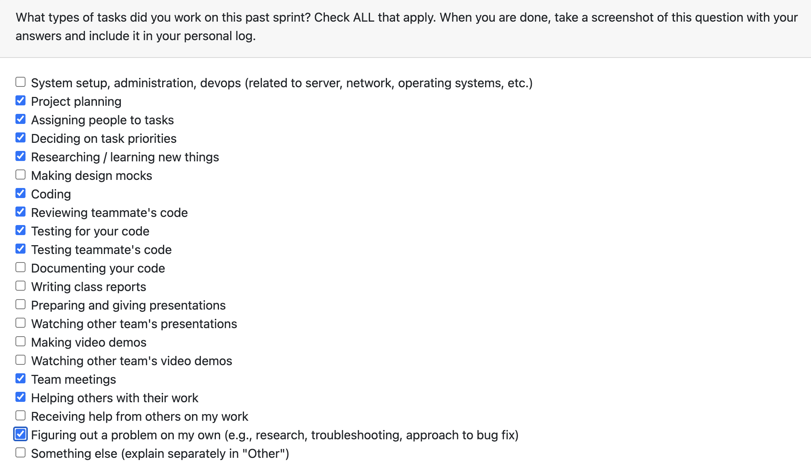

# Personal Log – Vanshika singla

---

## Entry for Oct 27, 2025 → NOV 2, 2025

### Type of Tasks Worked On


### Type of Tasks Worked On
- Deciding overall project and CLI flow; designing how utils will work so they can be reused later
- Proactively structuring code and project components to support future extensions and reuse
- Integrating the overall project flow across modules and wiring interactions between components (#164)
- Implementing the flow for the Consent Manager (Main calls cli folder, each folder calls utils functions) (#165)
- Researching NLP algorithms and approaches for analysis for non code files - or working backwards by calling Gemini API
- Implementing a Parse function to handle non-code files (document parsing) (#170)

---

### Recap of Weekly Goals
- Finalize the CLI and utils design to support a reusable, centralized CLI layer — completed
- Integrate core application flow so modules interact cleanly (entry points, consent flow, parsing) — completed
- Implement consent manager runtime flow and DB integration — completed
- Prototype parse function for non-code files to ensure analysis pipeline ingestion — completed
- Research NLP algorithms suitable for content analysis and produce recommendations — completed

---

### Features Assigned to Me
- #164: Decide project and CLI flow; design reusable utils and integrate overall project flow
- #165: Implement the Consent Manager flow (prompt → DB → revoke handling)
- #170: Parse function for non-code files (document parsing and metadata extraction)
- Colaborating on the NLP research 

---

### Associated Project Board Tasks
| Task/Issue ID | Title                                                                   | Status     |
|--------------:|-------------------------------------------------------------------------|------------|
| #164          | Decide project & CLI flow; design reusable utils; integrate overall flow | Completed  |
| #165          | Implement Consent Manager flow                                          | Completed  |
| #170          | Parse function for non-code files and testing the functioning                                      | In Review  |
| #186           | Colaborating on Researching LLM/non-LLM implementation for non code file analysis. | In-Progress |

---

### Issue Descriptions
- **#164: Decide project & CLI flow; design reusable utils; integrate overall flow**  
  Designed the high-level flow for how the app starts, how the CLI interacts with modules, and how utilities should be structured for reuse. Created a plan and initial scaffolding so future features can plug into a consistent CLI and utilities layer. Integrated core entry points so modules (consent, parser, analysis) communicate through defined interfaces.

- **#165: Implement Consent Manager flow**  
  Implemented end-to-end consent manager behavior: interactive CLI prompts, database-backed consent storage and retrieval, and a revoke flow that updates consent state and resets relevant DB entries. Ensured the flow is modular so it can be invoked from the centralized CLI and covered expected edge cases.

- **#170: Parse function for non-code files**  
  Implemented a parse utility to handle non-code files (documents, text, data files). The function extracts metadata, cleans and normalizes text, and produces a standardized output suitable for downstream NLP analysis. This work makes non-code content ingestible by the analysis pipeline.

---

### Progress Summary
- **Completed this week:**
  - Defined and scaffolded the overall CLI and project flow to support plug-in-style modules
  - Implemented the Consent Manager flow with DB integration and revoke behavior
  - Implemented a parser for non-code files and validated output format for analysis
  - Researched NLP algorithms and compiled initial recommendations for analysis steps and models

- **In Progress this week:**
  - None — the planned tasks for this cycle were completed

---

### Additional Context (Optional)
The focus for this cycle was architectural stabilization: centralizing CLI logic, creating reusable utilities, and ensuring the consent and parsing flows are modular and testable. The NLP research will continue for the week as we work backwards

---

### Reflection
**What Went Well:**
- Clearer, centralized CLI design that reduces duplicated prompt logic and simplifies feature additions
- Consent manager flow implemented and integrated with the DB, with revoke behavior handled
- Good time management and working on the Seperate parts 

**What Could Be Improved:**
- Comunicating properly the changed decisions in the smaller groups within the whole team would really help in the consistency of the project
- Sticking to the decisions made in the team meetings
- Dedicated time for team meetings and everyone showing up to them

---

### Plan for Next Cycle
- Work on the NLP for the coding and non coding analysis
```