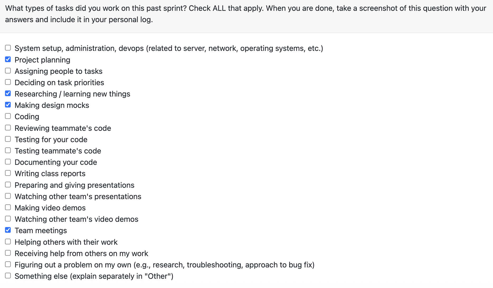
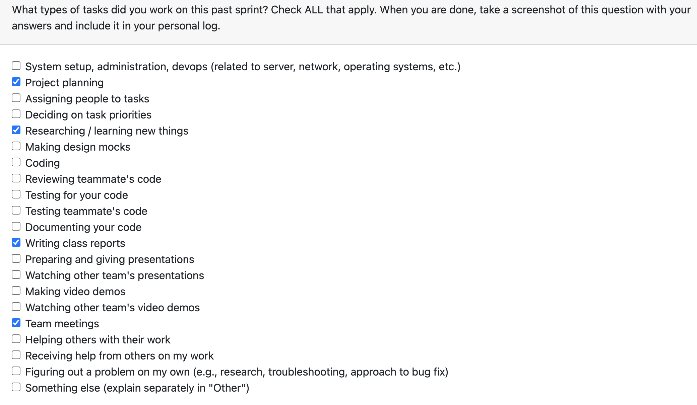
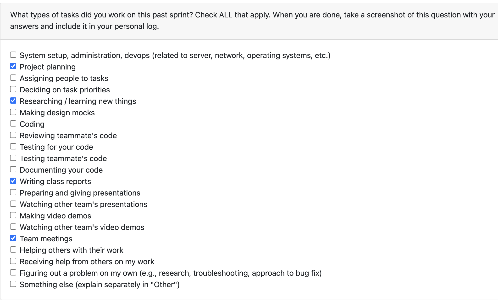

# Personal Log – Afua

---

## Entry for Sept 15, 2025 → Sept 21, 2025

### Type of Tasks Worked On
*(Insert screenshot from Peer Eval question or list tasks here)*

---

### Recap of Weekly Goals
- Participate in requirement gathering and review  
- Help document project goals and target users  
- Contribute to testing and non-functional requirement discussions  

---

### Features Assigned to Me (from Project Plan)
- Work Breakdown Structure documentation  
- Functional & Non-Functional requirements draft 

---

### Associated Project Board Tasks
| Task/Issue ID | Title                | Status     |
|---------------|----------------------|------------|
| #N/A          | Project Requirements | Completed  |

---

### Progress Summary
- **Completed this week:**  
  - Contributed to documenting project goals and target users  
  - Participated in requirement review and finalization  
- **In Progress this week:**  
  - N/A  

---

### Additional Context (Optional)
- Team collaboration strong; all members contributed equally this week.  

---

# Personal Log – Karim Jassani

---

## Entry for Sept 15, 2025 → Sept 21, 2025

### Type of Tasks Worked On

---

### Recap of Weekly Goals
- Participate in requirement gathering and review  
- Help document project goals and target users  
- Contribute to testing and non-functional requirement discussions  

---

### Features Assigned to Me (from Project Plan)
- Work Breakdown Structure documentation  
- Functional & Non-Functional requirements draft 

---

### Associated Project Board Tasks
| Task/Issue ID | Title                | Status     |
|---------------|----------------------|------------|
| #N/A          | Project Requirements | Completed  |

---

### Progress Summary
- **Completed this week:**  
  - Contributed to documenting project goals and target users  
  - Participated in requirement review and finalization  
- **In Progress this week:**  
  - N/A  

---

### Additional Context (Optional)
- All members worked collectively on requirements this week.  

---

# Personal Log – Karim Khalil

---

## Entry for Sept 15, 2025 → Sept 21, 2025

### Type of Tasks Worked On

---

### Recap of Weekly Goals
- Participate in requirement gathering and review  
- Help document project goals and target users  
- Contribute to testing and non-functional requirement discussions  

---

### Features Assigned to Me (from Project Plan)
- Work Breakdown Structure documentation  
- Functional & Non-Functional requirements draft  

---

### Associated Project Board Tasks
| Task/Issue ID | Title                | Status     |
|---------------|----------------------|------------|
| #N/A          | Project Requirements | Completed  |

---

### Progress Summary
- **Completed this week:**  
  - Contributed to documenting project goals and target users  
  - Participated in requirement review and finalization  
- **In Progress this week:**  
  - N/A  

---

### Additional Context (Optional)
- No blockers this week — full team participation.  

---

# Personal Log – Oluwadabira Omotoso

---

## Entry for Sept 15, 2025 → Sept 21, 2025

### Type of Tasks Worked On

---

### Recap of Weekly Goals
- Participate in requirement gathering and review  
- Help document project goals and target users  
- Contribute to testing and non-functional requirement discussions  

---

### Features Assigned to Me (from Project Plan)
- Work Breakdown Structure documentation  
- Functional & Non-Functional requirements draft 

---

### Associated Project Board Tasks
| Task/Issue ID | Title                | Status     |
|---------------|----------------------|------------|
| #N/A          | Project Requirements | Completed  |

---

### Progress Summary
- **Completed this week:**  
  - Contributed to documenting project goals and target users  
  - Participated in requirement review and finalization  
- **In Progress this week:**  
  - N/A  

---

### Additional Context (Optional)
- No blockers — smooth collaboration across all meetings.  

---

# Personal Log – Shreya Saxena

---

## Entry for Sept 15, 2025 → Sept 21, 2025

### Type of Tasks Worked On
Screenshot from Peer Eval question or task list:

---

### Recap of Weekly Goals
- Participate in requirement gathering and review  
- Help document project goals and target users  
- Contribute to testing and non-functional requirement discussions  

---

### Features Assigned to Me (from Project Plan)
- Work Breakdown Structure documentation  
- Functional & Non-Functional requirements draft   

---

### Associated Project Board Tasks
| Task/Issue ID | Title                | Status     |
|---------------|----------------------|------------|
| #N/A          | Project Requirements | Completed  |

---

### Progress Summary
- **Completed this week:**  
  - Contributed to documenting project goals and target users  
  - Participated in requirement review and finalization  
- **In Progress this week:**  
  - N/A  

---

### Additional Context (Optional)
- No blockers reported this week, consistent communication between team members.

---

# Personal Log – Vanshika

---

## Entry for Sept 15, 2025 → Sept 21, 2025

### Type of Tasks Worked On

---

### Recap of Weekly Goals
- Participate in requirement gathering and review  
- Help document project goals and target users  
- Contribute to testing and non-functional requirement discussions  

---

### Features Assigned to Me (from Project Plan)
- Work Breakdown Structure documentation  
- Functional & Non-Functional requirements draft  

---

### Associated Project Board Tasks
| Task/Issue ID | Title                | Status     |
|---------------|----------------------|------------|
| #N/A          | Project Requirements | Completed  |

---

### Progress Summary
- **Completed this week:**  
  - Contributed to documenting project goals and target users  
  - Participated in requirement review and finalization  
- **In Progress this week:**  
  - N/A  

---

### Additional Context (Optional)
- All members worked together effectively this week.  
