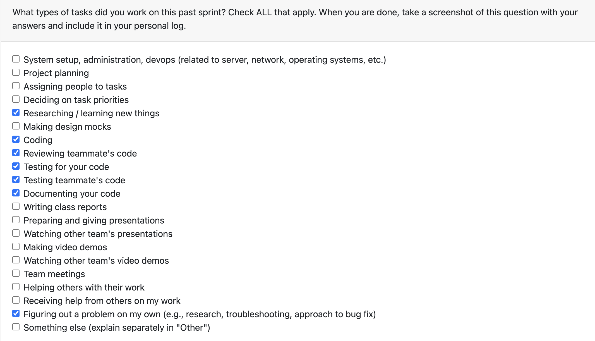

# Personal Log – Karim Khalil

---
## Entry for Week 1, jan 5 - jan 11

### Type of Tasks Worked On

### Type of Tasks Worked On
- Enhanced code analysis pipeline with user preference integration
- Implemented preference-weighted keyword prioritization system
- Added industry/job-specific resume bullet enhancement
- Refactored hardcoded pattern mappings to shared tech_patterns.py
- Added comprehensive comments for future maintainability
- Created and managed PR #428 for user preference enhancements

---

### Recap of Weekly Goals
✅ Enhance code analysis pipeline with user preferences — Completed
✅ Implement preference-weighted keyword prioritization — Completed
✅ Add industry-specific resume enhancements — Completed
✅ Refactor hardcoded patterns to shared file — Completed
✅ Add comprehensive documentation comments — Completed

---

### Features Assigned to Me
#436: Code Analysis Enhancement - Closed by PR #428

---

### Associated Project Board Tasks
| Task/Issue ID | Title                                                                   | Status     |
|---------------|-------------------------------------------------------------------------|------------|
| #436          | Code Analysis Enhancement                                               | Closed     |

---

### Issue Descriptions

Enhanced the code analysis pipeline with user preference integration to improve data quality and relevance for career-targeted analysis. This feature allows the system to prioritize keywords, patterns, and resume bullets based on the user's industry and job title preferences without breaking existing functionality.

Key implementations:
- Added user preference loading system that gracefully handles missing user data
- Implemented preference-weighted keyword prioritization for better relevance
- Enhanced resume bullet generation with industry/job-specific targeting
- Added pattern prioritization based on user career goals
- Refactored hardcoded pattern mappings to shared tech_patterns.py file for better maintainability

#436 – Code Analysis Enhancement

Closed by implementing the user preference system in PR #428. The enhancement improves the relevance and targeting of code analysis results for different career paths and industries.

---

### Progress Summary
- **Completed this week:**
Successfully enhanced the code analysis pipeline with user preference integration. Implemented preference-weighted keyword prioritization and industry/job-specific resume bullet enhancement. Refactored hardcoded pattern mappings to a shared tech_patterns.py file and added comprehensive documentation comments. Created PR #428 which received positive feedback and is currently under review.

---

### Reflection
**What Went Well:**
- Successfully designed and implemented user preference system with backward compatibility
- Effective refactoring of hardcoded patterns improved maintainability
- Comprehensive documentation added per reviewer feedback

**What Could Be Improved:**
- Better initial documentation could have prevented need for follow-up commit

---

### Plan for Next Cycle
- Create comprehensive unit tests for user preference system
- Begin planning next enhancement features based on team discussions

