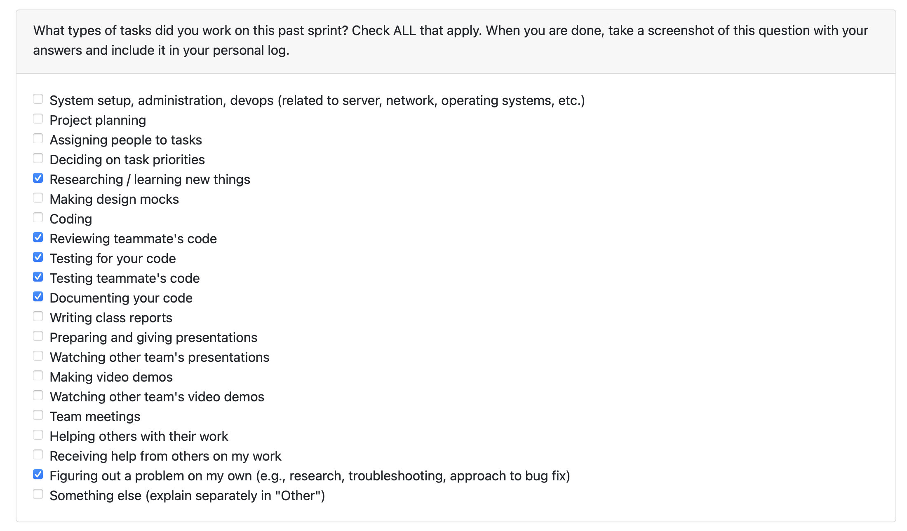

# Personal Log – Shreya Saxena

---

## Entry for Jan 5 → Jan 11, 2026

### Type of Tasks Worked On

### Type of Tasks Worked On
- Implemented backend infrastructure for project thumbnail management
- Added production-ready error handling for thumbnail operations
- Created comprehensive test suites for new features

### Additional Contribution
- Integrated user preferences with non-code analysis pipeline
- Enhanced domain keyword detection using user industry and job title
- Implemented relative path storage for cross-environment compatibility

---

### Features Assigned to Me
- Project Thumbnail Management System
- User Preference Integration with Non-Code Analysis
- Domain Keyword Detection Enhancement
- Test Coverage for Thumbnail and User Preference Features

---

### Associated Project Board Tasks
| Task/Issue ID | Title                                               | Status      |
|----------------|-----------------------------------------------------|-------------|
| #426           | Enhance user preference integration in non code local analysis.        | ✅ Completed |
| #434            | Implement end-to-end functionality to add thumbnails per project.
   |  In Progress |
| #435           | Create base utilities for thumbnail file path.        | ✅ Completed |

---

### **Issue Descriptions for This Week**

---

#### **#435: Project Thumbnail Management Backend**
Implemented core thumbnail management utilities with production-ready features:
- Image validation with support for multiple formats (.jpg, .jpeg, .png, .gif, .webp, .bmp)
- Transactional file operations with automatic cleanup on DB failure
- Multi-extension handling to prevent duplicate thumbnails
- Relative path storage for Docker/CI/production portability
- Comprehensive test coverage with 6 passing tests

**Key improvements based on code review:**
- Wrapped DB updates in try-except with automatic file cleanup on failure
- Implemented glob-based deletion of all existing thumbnails before setting new ones
- Switched from absolute to relative path storage (data/thumbnails/) for environment independence

---

#### **User Preference Integration with Non-Code Analysis**
Enhanced the non-code analysis pipeline to use user preferences (industry, job title) for smarter domain detection:
- Implemented 1.5x scoring boost when detected domain matches user's industry
- Built enhanced keyword dictionaries based on user's job title and industry
- Added optional `user_context` field showing detection quality and domain matching
- Maintained backward compatibility - analysis works with or without user preferences

---

#### **Code Cleanup Based on Review**
Removed `get_job_context()` helper function that was initially defined but not yet integrated into the analysis pipeline. Function was tested but unused, so removed it along with its test cases to keep codebase clean.

---

### Reflection

**What Went Well:**  
- Successfully implemented production-ready thumbnail management with robust error handling
- Effectively integrated user preferences to improve analysis accuracy without breaking existing functionality
- Responded well to code review feedback and made improvements promptly
- Created comprehensive test coverage for all new features

**What Could Be Improved:**  
- More commits between changes for easier code tracking.

---

### Plan for Next Cycle
- Continue working on thumbnail integration.
- Intgerate updated user preference code within main.
- Continue work on Milestone-2 features
- Monitor thumbnail and user preference features in production

---
