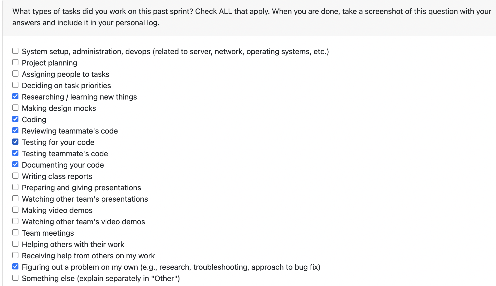

# Personal Log – Vanshika Singla

---
## Entry for Week 1, jan 5 - jan 11

### Type of Tasks Worked On

### Type of Tasks Worked On
- Set up and configured CI/CD pipeline that triggers on every PR and push to main/master
- Created plan for workflow and documented in README for team approval
- Fixed permission issues and conducted testing
- Identified and documented pre-existing test import errors in the codebase
- Opened bug report for CI test failures

---

### Recap of Weekly Goals
✅ Configure CI/CD pipeline with pytest and coverage reports — Completed
✅ Create workflow plan and get team approval — Completed
✅ Fix permission issues and test — Completed
✅ Document CI test failures — Completed

---

### Features Assigned to Me
#291: CI Pipeline - Runs tests with pytest and generates coverage reports
#292: Create the Plan for the workflow - Add plan in README and get team approval
#429: Bug report - CI failing with ImportError in test_analysis_merger.py

---

### Associated Project Board Tasks
| Task/Issue ID | Title                                                                   | Status     |
|---------------|-------------------------------------------------------------------------|------------|
| #291          | CI Pipeline                                                             | Closed     |
| #292          | Create the Plan for the workflow                                        | Open       |
| #429          | Bug report - CI failing with ImportError                                | Opened needs to be assigned to the developers who worked on those files    |

---

### Issue Descriptions

#291 – CI Pipeline

Set up the continuous integration pipeline that triggers on every PR and push to main/master. Configured GitHub Actions to run all tests with pytest and generate coverage reports. This catches bugs before they reach production and ensures code quality across the project.

#292 – Create the Plan for the Workflow

Created comprehensive plan for the CI/CD workflow and documented it in the README for team review and approval. Fixed permission issues during implementation and conducted testing to ensure the workflow runs correctly.

#429 – Bug Report: CI Failing with ImportError

Identified and documented a pre-existing test issue where CI is failing with an ImportError from tests/utils/test_analysis_merger.py. The error indicates that retrieve_results_from_db cannot be imported from app.utils.analysis_merger_utils. 
Opened PR with detailed suggestions to address the issue:

---

### Progress Summary
- **Completed this week:**
Successfully set up the CI/CD pipeline with pytest and coverage reporting. Created workflow plan, documented it in README. Fixed permission issues and conducted testing. Identified a pre-existing test import error and documented comprehensive solutions for the team to address.

---

### Reflection
**What Went Well:**
- Successfully configured CI pipeline with pytest and coverage reports
- Fixed permission issues and tested thoroughly
- Provided detailed documentation for the import error bug

**What Could Be Improved:**

---

### Plan for Next Cycle
- Add other CI/CD plan to workflow mentioned in readme
- Follow up on bug fix implementation
- Discuss on other features and requirements and start working on them.

