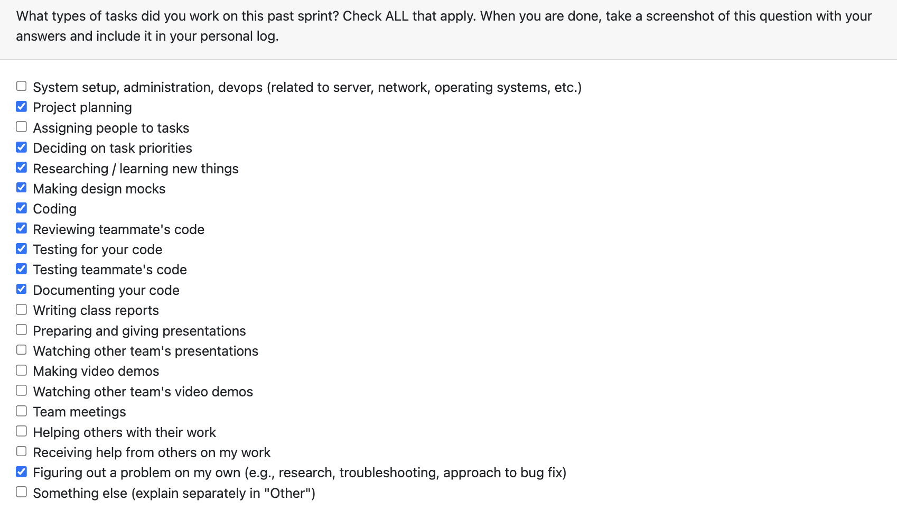

# Personal Log – Karim Jassani

---

## Week-10, Entry for Mar 9 → Mar 15, 2026

---

### Connection to Previous Week

Last week I added basic funcitonality for the score override ui functionality - this week I am building on that page and also managinng interactions and flow through that page
---

### Pull Requests Worked On

- **[PR #832 - Score override page visuals + Integrate with portfolio](https://github.com/COSC-499-W2025/capstone-project-team-3/pull/832)** 
- Expanded project score override with visuals and explainations of score to make it user friendly
- Added top improvement opportunities - tips
- Added Why this score? section on the portfolio for each project card (esnured not visible on download version)
- Refactored Score Override UI into reusable components
- Added detail frontend test coverage for the new UI and integration

---

### Associated Issues Completed
| Issue ID | Title | Status |
|----------|-------|--------|
| [#829](https://github.com/COSC-499-W2025/capstone-project-team-3/issues/829) | Score Override Page UI Visuals | ✅ Closed|
| [#830](https://github.com/COSC-499-W2025/capstone-project-team-3/issues/830) | Portfolio page connection to score override page | ✅ Closed|
| [#831](https://github.com/COSC-499-W2025/capstone-project-team-3/issues/830) | Portfolio page score section - recruiter friendly | ✅ Closed|

---

## Pull Requests Reviewed

- **[PR #819 - Updated Navigation bar and Navigation in ResumeBuilder and ProjectSelection](https://github.com/COSC-499-W2025/capstone-project-team-3/pull/819)** 

- **[PR #833 - User Preference Flow/Navigation Updated](https://github.com/COSC-499-W2025/capstone-project-team-3/pull/833)** 

- **[PR #821 - Added date validation handling to data management UI.](https://github.com/COSC-499-W2025/capstone-project-team-3/pull/821)** 

- **[PR #817 - LinkedIn URL integrated back to front-end](https://github.com/COSC-499-W2025/capstone-project-team-3/pull/817)** 

- **[PR #812 - Updated user preference UI](https://github.com/COSC-499-W2025/capstone-project-team-3/pull/812)** 

---

### Reflection

**What Went Well:**
- Completed the score override page
- Seamlessly integrate with portfolio
- Prepared for peer testing

**What Could Be Improved:**
- Could add more comprehensive tests for edge cases

---

### Plan for Next Week

- check overall flow and minor improvements before presentations