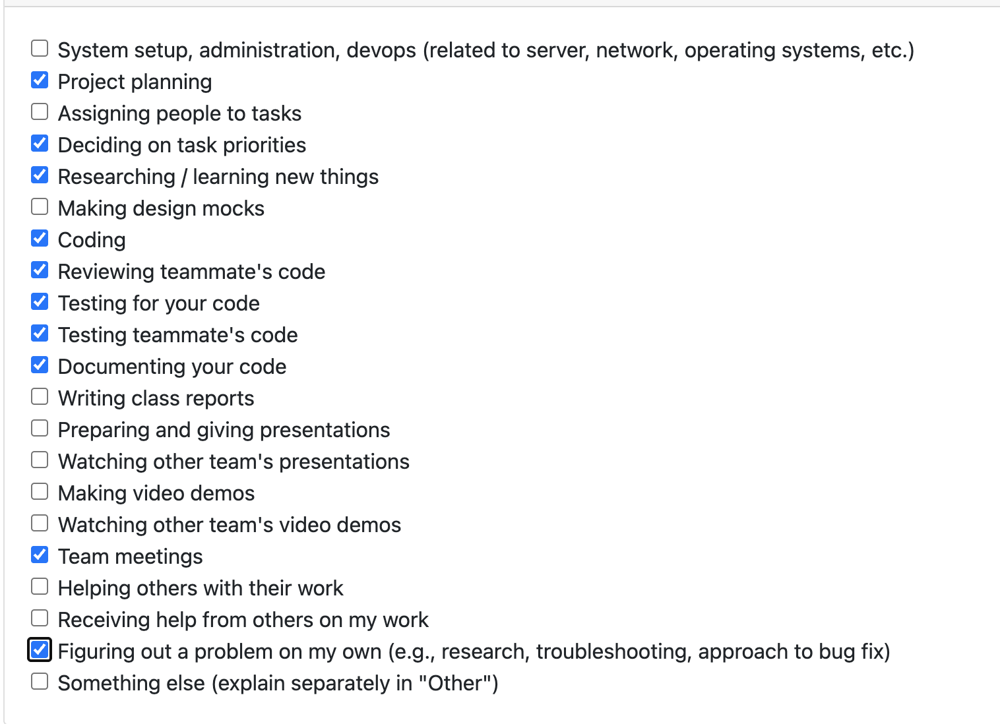

# Personal Log – Karim Khalil

---

## Week-10, Entry for Mar 9 → Mar 15, 2026

---

### Connection to Previous Week

Building on Week 9 portfolio and frontend migration work, this week focused on consolidating upload + analysis into one desktop flow and addressing reviewer feedback quickly. I also helped shape the Peer Testing 2 UI task list so testers can follow a clear UI-only path instead of CLI-heavy steps.

---

### Pull Requests Worked On

- **[PR #794 – added main api analysis page](https://github.com/COSC-499-W2025/capstone-project-team-3/pull/794)** ✅ Merged  
  - Added `AnalysisRunnerPage` to configure/run analysis after ZIP upload.
  - Preloaded extracted projects, supported per-project `local/ai` mode selection, and displayed run results (`analyzed/skipped/failed`).
  - Connected Upload page handoff into the analysis flow.

- **[PR #809 – merged analysis and upload page](https://github.com/COSC-499-W2025/capstone-project-team-3/pull/809)** ✅ Merged  
  - Unified Upload + Analysis into a single-page desktop UX and removed old `AnalysisRunnerPage`.
  - Added per-project similarity action overrides (`create_new` / `update_existing`) in both frontend and backend payload handling.
  - Added AI consent modal + AI notice in settings.
  - Added tooltip guidance for similarity behavior and refined wording based on review feedback.
  - Implemented post-run form reset to prevent stale `upload_id` reruns.
  - Hid non-user-facing technical values (upload ID/project path) from UI.
  - Hardened deterministic mapping by using full project path as primary key end-to-end, with backend fallback compatibility.
  - Updated Upload page frontend tests for the new one-page flow and consent behavior.

---

### Associated Issues Completed

| Issue ID | Title | Status |
|----------|-------|--------|
| [#836](https://github.com/COSC-499-W2025/capstone-project-team-3/issues/836) | Add API analysis page / flow setup | ✅ Closed by [#794](https://github.com/COSC-499-W2025/capstone-project-team-3/pull/794) |
| [#835](https://github.com/COSC-499-W2025/capstone-project-team-3/issues/835) | Merge upload + analysis flow on desktop | ✅ Closed by [#809](https://github.com/COSC-499-W2025/capstone-project-team-3/pull/809) |

---

## Work Breakdown

### Coding Tasks

- Built and shipped initial analysis runner flow in desktop frontend (`PR #794`).
- Refactored to a single-page upload + analysis flow (`PR #809`) to improve UX and reduce context switching.
- Implemented per-project similarity-action override support across frontend and backend.
- Added AI consent gate modal and AI data-use notice for safer UX.
- Improved similarity help tooltip and clarified 70% threshold + exact-match skip behavior.
- Added defensive reset behavior after successful runs to avoid stale upload references.

### Testing & Debugging Tasks

- Ran targeted frontend tests for Upload page flow updates (`npm test -- UploadPage.test.tsx --runInBand`).
- Added/updated tests for one-page flow, AI consent behavior, and successful-run reset behavior.
- Updated backend analysis API test to validate path-based per-project override behavior.

### Collaboration & Review Tasks

- Addressed reviewer comments from @dabby04 and @6s-1 in follow-up commits on `PR #809`.
- Clarified parsing behavior and scope follow-ups on `PR #794` discussion.
- Contributed to drafting/refining the **Peer Testing 2 task list** with a UI-first flow (first-time user, returning user, upload/analysis decisions, navigation expectations).

---

### Issues & Blockers

**Issues Encountered:**

- Re-run attempts after successful analysis failed because backend cleanup invalidated prior `upload_id`.
- Ambiguity risk when mapping per-project overrides by project name only.

**Resolution:**

- Reset upload form state after successful run to prevent stale rerun errors.
- Switched to full project path as deterministic key for per-project mappings (with backend fallback for compatibility).

---

### Reflection

**What Went Well:**

- The one-page flow significantly improved usability and review outcomes.
- Reviewer feedback was addressed quickly with focused, low-risk patches.

**What Could Be Improved:**

- nothing much for this week all was great

---

### Plan for Next Week

- Continue UI polish based on peer testing feedback.
- Expand integration test coverage around upload-analysis edge cases.
- Support team with review/testing for remaining Milestone 3 tasks.
