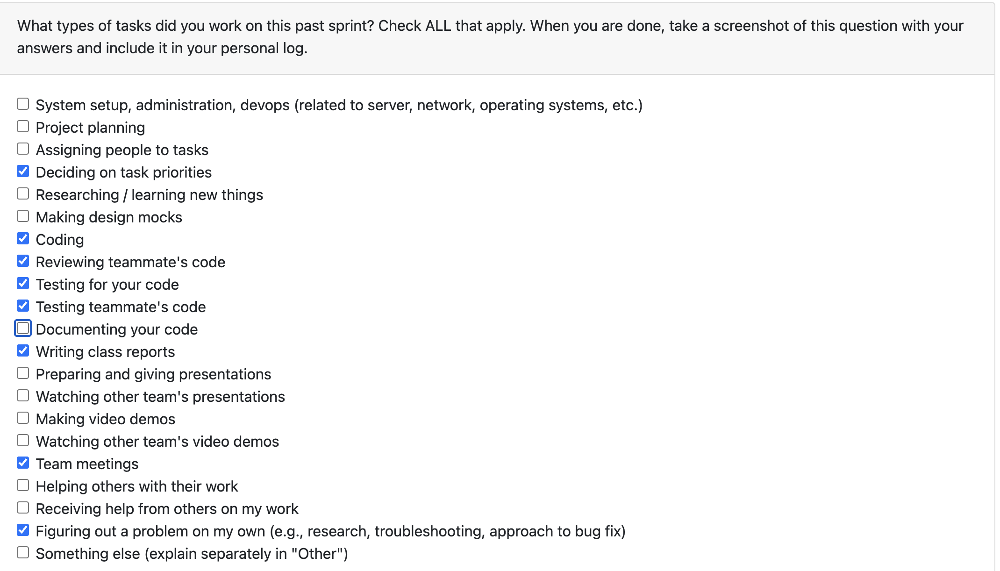

# Personal Log – Vanshika Singla

---

## Week-10, Entry for Mar 9 → Mar 15, 2026

---

### Connection to Previous Week

Building from last week's work on consent management, this week focused on having a landing page for the application- one stop for all so we can get rid of nav bar soon, therefore, worked on enhancing the Hub Page UI/UX, improving the consent page visual design from CLI to GUI. Additionally, I worked on manual testing and documentation for peer testing.

---

### Pull Requests Worked On

- **[PR #798 – Add Upload File Panel for Hub Page](https://github.com/COSC-499-W2025/capstone-project-team-3/pull/798)** ✅ Merged  
  - Added upload page as a new navigation option on the hub page for easier access to file upload functionality.

- **[PR #792 – Change Visuals for Consent Text and Flow Connection](https://github.com/COSC-499-W2025/capstone-project-team-3/pull/792)** ✅ Merged  
  - Redesigned ConsentPage with lightweight text parser (stripCliChrome + parseBlocks) to strip CLI decorations and convert text into structured blocks.
  - Rendered titles, sub-headings, checklists, and paragraphs instead of raw blocks.
  - Added button style variants (btn-outline for Decline/Revoke, btn-secondary for More Info).
  - Updated ConsentPage.css with serif typography, checkmark list items, section headings, and responsive adjustments using global CSS variables.
  - Removed CLI-specific --clear-data command from consent_text.py (not applicable in desktop GUI).

- **[PR #791 – Hub Page End-to-End UI Flow](https://github.com/COSC-499-W2025/capstone-project-team-3/pull/791)** ✅ Merged  
  - Implemented complete end-to-end UI flow for the Hub Page navigation between app features.

---

### Associated Issues Completed

| Issue ID | Title | Status |
|----------|-------|--------|
| [#788](https://github.com/COSC-499-W2025/capstone-project-team-3/issues/788) | Create a central Hub Page for navigating between app features | ✅ Closed by [#791](https://github.com/COSC-499-W2025/capstone-project-team-3/pull/791) |
| [#789](https://github.com/COSC-499-W2025/capstone-project-team-3/issues/789) | Add accessible aria-labels to Hub Page navigation cards | ✅ Closed by [#791](https://github.com/COSC-499-W2025/capstone-project-team-3/pull/791) |
| [#790](https://github.com/COSC-499-W2025/capstone-project-team-3/issues/790) | Add comprehensive unit tests for the Hub Page | ✅ Closed by [#797](https://github.com/COSC-499-W2025/capstone-project-team-3/pull/797) |
| [#793](https://github.com/COSC-499-W2025/capstone-project-team-3/issues/793) | Cleaner GUI for consent text | ✅ Closed by [#792](https://github.com/COSC-499-W2025/capstone-project-team-3/pull/792) |
| [#795](https://github.com/COSC-499-W2025/capstone-project-team-3/issues/795) | Establish connection for first time user for consent page | ✅ Closed by [#792](https://github.com/COSC-499-W2025/capstone-project-team-3/pull/792) |
| [#796](https://github.com/COSC-499-W2025/capstone-project-team-3/issues/796) | Add upload page as a new option on hub page | ✅ Closed by [#798](https://github.com/COSC-499-W2025/capstone-project-team-3/pull/798) |
| [#797](https://github.com/COSC-499-W2025/capstone-project-team-3/issues/797) | Update tests for hubpage | ✅ Closed by [#797](https://github.com/COSC-499-W2025/capstone-project-team-3/pull/797) |

---

## Work Breakdown

### Coding Tasks

- **Hub Page UI Flow (`#791`, `#798`)**  
  - Created central Hub Page for navigating between app features with accessible aria-labels for navigation cards.
  - Added upload file panel as a new option on hub page for streamlined user experience.

- **Consent Page Visual Redesign (`#792`)**  
  - Implemented text parser to strip CLI decorations (=== borders, prompts) and structure content into readable blocks.
  - Added semantic rendering: titles, sub-headings, checkmark lists, and paragraphs.
  - Styled with serif typography, proper spacing, and button variants (outline/secondary).
  - Removed CLI-specific commands from consent_text.py for desktop GUI compatibility.
  - Established proper connection flow for first-time users on consent page.

---

### Testing & Debugging Tasks

- **Manual Testing for Peer Testing**  
  - Conducted comprehensive manual testing across all features for peer testing preparation.
  - Created documentation for peer testing scenarios and expected behaviors.

- **Hub Page Unit Tests (`#797`)**  
  - Added comprehensive unit tests for Hub Page components.
  - Verified navigation functionality and accessibility features.

- **Consent Page Testing**  
  - Tested text parsing and rendering of structured content blocks.
  - Verified button interactions and navigation flows for first-time users.
  - Confirmed responsive design and CSS variable usage.

---

### Collaboration & Review Tasks

- Prepared peer testing documentation and test scenarios.
- Reviewed the team mates PRs and provided comments where needed.
- Addressed feedback for PRs 

---

### Issues & Blockers

**Issues Encountered:**

- CLI-specific text formatting in consent page needed parsing for better desktop GUI presentation.

**Resolution:**

- Implemented lightweight text parser to convert CLI output into structured, readable blocks with proper styling. (PR #792)

---

### Reflection

**What Went Well:**

- Successfully improved Hub Page navigation and user experience with clear, accessible UI.
- Consent page redesign significantly improved readability and visual appeal.
- Comprehensive testing preparation for peer testing milestone.

**What Could Be Improved:**

NA

---

### Plan for Next Week

- Implement feedback received from peer testing.
- Continue improving UI/UX based on user testing results.
- Support team with additional testing and documentation as needed.
- Final pull for the Milestone 3 and finish it asap
