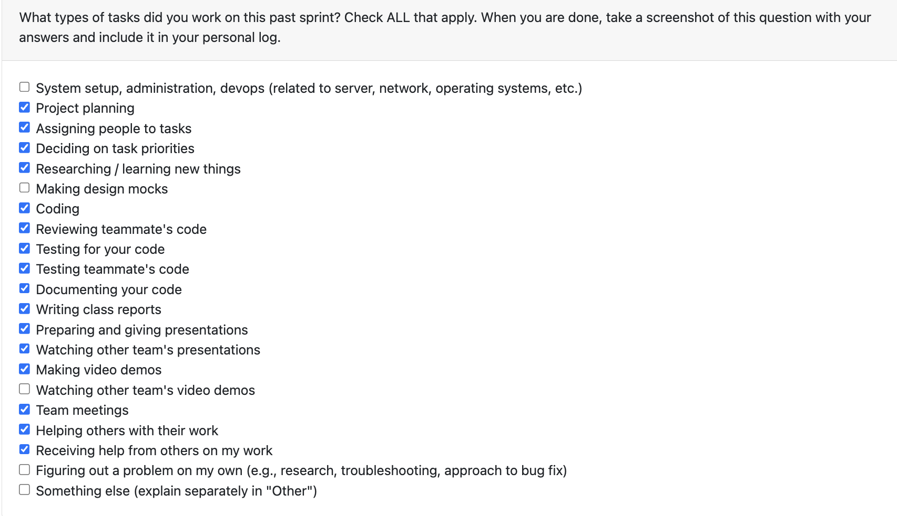

# Personal Log – Karim Jassani

---

## Week 11 & 12, Entry for Mar 16 → Mar 29, 2026

---

### Pull Requests Worked On

- **[PR #942 - Input Validation and Marking Required Fields](https://github.com/COSC-499-W2025/capstone-project-team-3/pull/942)** 
- Added required-field indicators for Full name, Email, Job Title, and Industry on the profile form
- Added client-side validation for required profile fields, email format, and inline field errors before save
- Updated LinkedIn input to `type="url"` with a full URL placeholder and cleared field errors as users edit
- Added education validation for numeric GPA, GPA range `0` to `4.33`, and end date after start date
- Added thorough frontend test coverage for validation behaviour and error handling

- **[PR #893 - Score Override Enhance](https://github.com/COSC-499-W2025/capstone-project-team-3/pull/893)** 
- Added info banners for unchanged scores at saturation, missing overrideable code metrics, and breakdown load failures
- Prevented users from excluding the last remaining code metric to match backend validation
- Added persistent hint notes to explain score override constraints and documentation metric behaviour
- Improved score override feedback so edge cases no longer leave users with a blank or confusing page
- Added frontend test coverage for the new score override constraints and status messaging

- **[PR #956 – Update the Data Flow Diagrams (Level 0 & Level 1)](https://github.com/COSC-499-W2025/capstone-project-team-3/pull/956)** 
  - Refreshed context (Level 0) and decomposition (Level 1) DFDs with current external entities, processes, and data stores.  
  - Documented diagrams in-repo with draw.io link and static PNGs; unified narrative description in `docs/plan/DFD.md`.

---

### Associated Issues Completed
| Issue ID | Title | Status |
|----------|-------|--------|
| [COSC-499-W2025/capstone-project-team-3#940](https://github.com/COSC-499-W2025/capstone-project-team-3/issues/940) | Input Validation for User Preferences | ✅ Closed|
| [COSC-499-W2025/capstone-project-team-3#941](https://github.com/COSC-499-W2025/capstone-project-team-3/issues/941) | Mark Required Input Fields | ✅ Closed|
| [COSC-499-W2025/capstone-project-team-3#892](https://github.com/COSC-499-W2025/capstone-project-team-3/issues/892) |Score Override Enhance | ✅ Closed|
| [COSC-499-W2025/capstone-project-team-3#956](https://github.com/COSC-499-W2025/capstone-project-team-3/issues/956) | Update Data Flow Diagram | ✅ Closed|

---

## Pull Requests Reviewed

- **[PR #945 - Updated system architecture](https://github.com/COSC-499-W2025/capstone-project-team-3/pull/945)** 

- **[PR #946 - removed static folder , added portfolio tests , and fixed 2 broken tests](https://github.com/COSC-499-W2025/capstone-project-team-3/pull/946)** 

- **[PR #900 - Dark mode branch fix](https://github.com/COSC-499-W2025/capstone-project-team-3/pull/900)** 

- **[PR #899 - Added drag and drop to new sections](https://github.com/COSC-499-W2025/capstone-project-team-3/pull/899)** 

- **[PR #869 - Add exclude document type feature for analysis.](https://github.com/COSC-499-W2025/capstone-project-team-3/pull/869)** 

- **[PR #843 - Made updates to navigation](https://github.com/COSC-499-W2025/capstone-project-team-3/pull/843)** 

- **[PR #945 - Updated system architecture](https://github.com/COSC-499-W2025/capstone-project-team-3/pull/945)** 

- **[PR #948 - Cover letter ai-consent api key settings](https://github.com/COSC-499-W2025/capstone-project-team-3/pull/948)** 

---

### Reflection

**What Went Well:**
- Video Demo Completed

**What Could Be Improved:**
- Some PRs were larger than ideal due to the tightly-coupled full-stack nature of the features, though this was justified by the scope.

---

### Plan for Next Week

- Project Voting and wrap up
