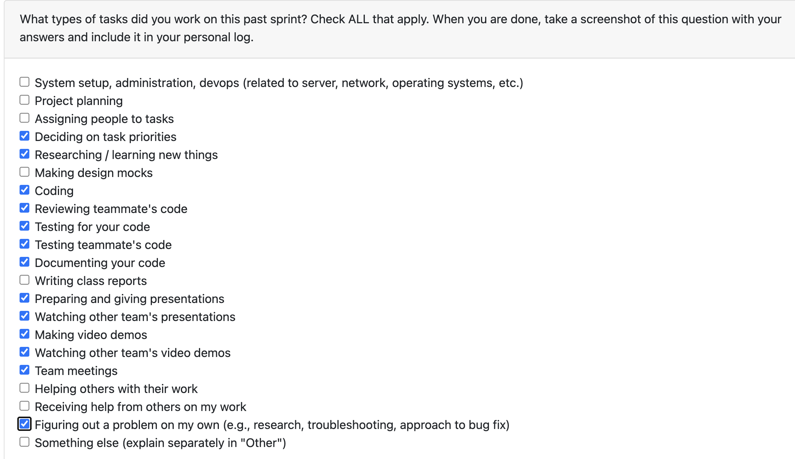

# Personal Log – Karim Khalil

---

## Week 11 & 12, Entry for Mar 16 → Mar 29, 2026

---

### Connection to Previous Week

Building on the portfolio page and desktop frontend polish from Week 10, these final two weeks focused on adding the remaining portfolio visualizations (activity heatmap, collaboration network graph with star and network modes), adding navigation breadcrumbs across pages, writing comprehensive portfolio tests, fixing broken tests, cleaning up unused assets, and helping update the system architecture documentation. This wraps up all remaining work for the project.

---

### Pull Requests Worked On

- **[PR #842 – added home buttons and fixed some styling](https://github.com/COSC-499-W2025/capstone-project-team-3/pull/842)** ✅ Merged  
  - Added consistent `Home › [Page]` breadcrumb navigation across all main pages.
  - Fixed Upload page visual consistency (left-corner breadcrumb placement, background/style alignment with other pages).

- **[PR #859 – Portfolio heatmap](https://github.com/COSC-499-W2025/capstone-project-team-3/pull/859)** ✅ Merged  
  - Added a GitHub-style activity heatmap visualization to the Portfolio page using real commit dates.
  - Wired `graphs.daily_activity` into the portfolio API output.
  - Persisted parsed git commits (including commit dates) into `GIT_HISTORY` during analysis.
  - Added fallback daily-activity logic for local/non-git projects.
  - Added upload cleanup defaults after analysis to reduce disk pressure.
  - Moved resume PDF/LaTeX temp/cache paths from `/tmp` to app data paths to avoid runtime failures on low-space systems.
  - Addressed reviewer feedback: fixed peak activity display when no projects exist, prevented git history erasure on failed parse, changed heatmap color theme from green to blue per team styling.

- **[PR #897 – Portfolio network graph](https://github.com/COSC-499-W2025/capstone-project-team-3/pull/897)** ✅ Merged  
  - Built a full-stack collaboration network graph feature for the Portfolio page.
  - **Backend:** `extract_all_contributors()` in `git_utils.py` to walk all commits across branches, `_persist_collaborators()` in `analysis.py` to store contributor data, `_build_collaboration_network()` in `generate_portfolio.py` with two fallback paths (live extraction and `GIT_HISTORY` table derivation).
  - **Frontend:** Canvas-based force-directed graph with continuous physics simulation, drag-and-drop nodes, hover highlighting, dynamic scaling, dark/light theme toggle, edge badges showing shared-project count, info panel, and legend.
  - **HTML Export:** Standalone vanilla-JS version of the graph embedded in the exported HTML file with full interactivity.

- **[PR #904 – added actual network graph with star graph](https://github.com/COSC-499-W2025/capstone-project-team-3/pull/904)** ✅ Merged  
  - Added a fully connected network graph mode alongside the existing star topology.
  - Users can toggle between Star mode (user as center, direct collaborator connections only) and Network mode (peer-to-peer collaborator connections included).
  - Added mode-aware physics (stronger repulsion and longer springs in network mode), mode-aware node sizing (commit count in star, project breadth in network), dashed/subtler peer edges, and hover-only edge badges.
  - Added a cap of 50 collaborators to prevent O(n²) performance issues on large repos (addressed reviewer feedback from @6s-1).

- **[PR #945 – Updated system architecture](https://github.com/COSC-499-W2025/capstone-project-team-3/pull/945)** 🔄 Open (co-assigned with @dabby04)  
  - Helped update the system architecture diagram and description. (Note: the architecture description content was authored by @dabby04.)

- **[PR #946 – removed static folder, added portfolio tests, and fixed 2 broken tests](https://github.com/COSC-499-W2025/capstone-project-team-3/pull/946)** 🔄 Open  
  - Removed unused static folder from the codebase.
  - Added 30 new tests for the PortfolioPage covering collaboration network, activity heatmap, analysis cards, and scoring methodology sections.
  - Fixed 2 broken tests: missing `userEvent` import in NavBar tests and stale sidebar heading text in PortfolioPage tests.
  - Fixed score edit input range to use 0–100 instead of 0–1.

---

### Associated Issues Completed

| Issue ID | Title | Status |
|----------|-------|--------|
| [#949](https://github.com/COSC-499-W2025/capstone-project-team-3/issues/949) | Add home breadcrumb buttons across pages | ✅ Closed by [#842](https://github.com/COSC-499-W2025/capstone-project-team-3/pull/842) |
| [#950](https://github.com/COSC-499-W2025/capstone-project-team-3/issues/950) | Portfolio activity heatmap | ✅ Closed by [#859](https://github.com/COSC-499-W2025/capstone-project-team-3/pull/859) |
| [#952](https://github.com/COSC-499-W2025/capstone-project-team-3/issues/952) | Portfolio collaboration network graph | ✅ Closed by [#897](https://github.com/COSC-499-W2025/capstone-project-team-3/pull/897) |
| [#953](https://github.com/COSC-499-W2025/capstone-project-team-3/issues/953) | Add network mode to collaboration graph | ✅ Closed by [#904](https://github.com/COSC-499-W2025/capstone-project-team-3/pull/904) |
| [#954](https://github.com/COSC-499-W2025/capstone-project-team-3/issues/954) | Cleanup static folder, add portfolio tests, fix broken tests | 🔄 Open via [#946](https://github.com/COSC-499-W2025/capstone-project-team-3/pull/946) |

---

## Work Breakdown

### Coding Tasks

- Built and shipped the activity heatmap feature end-to-end (backend daily-activity data + frontend visualization) (`PR #859`).
- Built and shipped the collaboration network graph feature full-stack (contributor extraction, persistence, aggregation, force-directed canvas rendering, HTML export) (`PR #897`).
- Added star/network mode toggle with mode-aware physics, node sizing, and peer edges (`PR #904`).
- Added consistent breadcrumb navigation across all main pages and fixed Upload page styling (`PR #842`).
- Removed unused static folder and fixed score edit input range (`PR #946`).

### Testing & Debugging Tasks

- Added 30 new Jest/RTL tests for PortfolioPage covering collaboration network, activity heatmap, analysis cards, and scoring methodology (`PR #946`).
- Fixed 2 broken tests: missing `userEvent` import in NavBar and stale sidebar heading in PortfolioPage (`PR #946`).
- Full test suite: 440 passed, 0 failed.

### Collaboration & Review Tasks

- Addressed reviewer feedback from @dabby04 (empty heatmap edge case, git history erasure guard) and @6s-1 (heatmap color theme, collaborator cap) on `PR #859` and `PR #904`.
- Responded to reviewer questions from @abstractafua about fallback extraction methods on `PR #897`.
- Co-assigned on system architecture documentation update with @dabby04 (`PR #945`).

---

### Issues & Blockers

**Issues Encountered:**

- Heatmap showed peak activity date even when no projects existed in the database.
- Git history clearing before writing new commits could erase data if parsing fails.
- Collaboration network graph had O(n²) edge computation for peer connections on large repos.

**Resolution:**

- Added guard to show "no activity yet" when project list is empty.
- Changed to only replace git history when new commit data is valid and non-empty.
- Added a cap of 50 collaborators to bound the peer-edge computation.

---

### Reflection

**What Went Well:**

- The collaboration network graph turned out to be a standout feature — reviewers called it "fire" and the interactive star/network toggle adds real value for showcasing teamwork.
- All reviewer feedback was addressed promptly across all PRs.
- Wrapped up with a clean test suite (440 tests, 0 failures).

**What Could Be Improved:**

- Some PRs were larger than ideal due to the tightly-coupled full-stack nature of the features, though this was justified by the scope.

---

### Plan for Next Week

- Project voting and final wrap-up.
