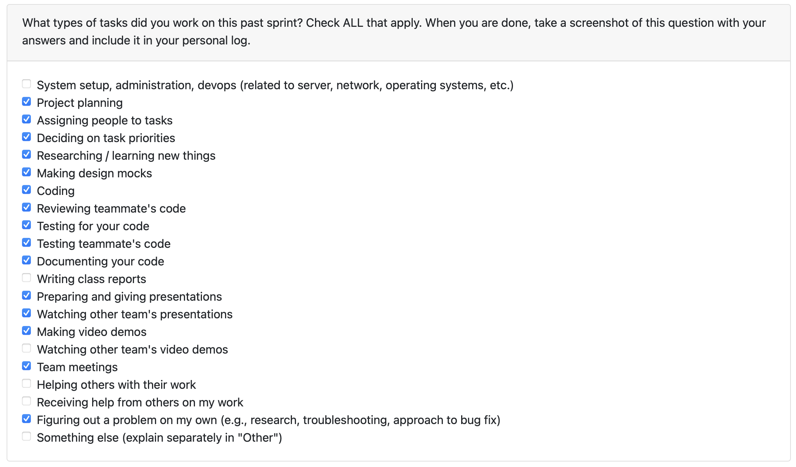

# Personal Log – Shreya Saxena

---

## Week 11 & 12, Entry for Mar 16 → Mar 29, 2026

### Pull Requests Worked On

- **[PR #956 – Update the Data Flow Diagrams (Level 0 & Level 1)](https://github.com/COSC-499-W2025/capstone-project-team-3/pull/956)** ✅ Merged  
  - Refreshed context (Level 0) and decomposition (Level 1) DFDs with current external entities, processes, and data stores.  
  - Documented diagrams in-repo with draw.io link and static PNGs; unified narrative description in `docs/plan/DFD.md`.

- **[PR #959 – Updated API documentation for newer APIs](https://github.com/COSC-499-W2025/capstone-project-team-3/pull/959)** ✅ Merged  
  - Extended `docs/API_DOCUMENTATION.md` with scan-project, learning recommendations, Gemini key, ATS scoring, profile picture, resume duplicate/rename, and cover-letter generate vs save.  
  - Renumbered endpoint sections and updated Quick Reference.

- **[PR #844 – Skill/project name editing on Data Management page](https://github.com/COSC-499-W2025/capstone-project-team-3/pull/844)** ✅ Merged  
  - Add/remove skills, edit skill and project names, skill type selection for new skills on Data Management UI with API wiring.

- **[PR #848 – ATS scoring for resumes](https://github.com/COSC-499-W2025/capstone-project-team-3/pull/848)** ✅ Merged  
  - Backend ATS score endpoint; resume vs job description compatibility; experience months from project dates; desktop ATS page; hub/sidebar entry; score history; persisted session state; frontend API module and wiring.

- **[PR #869 – Exclude document type for analysis](https://github.com/COSC-499-W2025/capstone-project-team-3/pull/869)** ✅ Merged  
  - Per-upload file-type exclusions in the analysis flow.

- **[PR #873 – Job Match page tests and navigation](https://github.com/COSC-499-W2025/capstone-project-team-3/pull/873)** ✅ Merged  
  - Tests for ATS-related files; navigation between resume and ATS pages; fixes for master resume persistence and resume IDs; restored ATS history session behavior.

- **[PR #902 – Job Match: analyse all resumes, per-session history deletion](https://github.com/COSC-499-W2025/capstone-project-team-3/pull/902)** ✅ Merged  
  - Improved skills-match scoring; empty resume handling; dropdown refresh; delete individual history entries; score-all-resumes flow with UI and comparator; styling aligned with app.

- **[PR #903 – Data Management UX improvements with tests](https://github.com/COSC-499-W2025/capstone-project-team-3/pull/903)** ✅ Merged  
  - Empty-state banner when no projects; project count auto-detector; tests.

- **[PR #905 – Excluded file types regardless of similarity score](https://github.com/COSC-499-W2025/capstone-project-team-3/pull/905)** ✅ Merged  
  - File exclusion logic applied consistently regardless of similarity match path.

- **[PR #914 – Learnings page and profile/nav updates](https://github.com/COSC-499-W2025/capstone-project-team-3/pull/914)** ✅ Merged  
  - Curated course catalog; backend scoring from master resume + preferences; desktop course cards (thumbnails, links, free/paid badges); hub card; User Preferences Learning tab; profile defaults; sidebar profile section with username; empty-insights handling.

---

### Associated Issues Completed

| Issue ID | Title | Status |
|----------|-------|--------|
| [#957](https://github.com/COSC-499-W2025/capstone-project-team-3/issues/957) | Update Data Flow Diagram | ✅ Closed |
| [#958](https://github.com/COSC-499-W2025/capstone-project-team-3/issues/958) | Update API documentation | ✅ Closed |
| [#826](https://github.com/COSC-499-W2025/capstone-project-team-3/issues/826) | Add "add skill" option on DM UI page | ✅ Closed |
| [#827](https://github.com/COSC-499-W2025/capstone-project-team-3/issues/827) | Add "Remove skill" option from DM UI page | ✅ Closed |
| [#845](https://github.com/COSC-499-W2025/capstone-project-team-3/issues/845) | Add skill name editing to Data Management page | ✅ Closed |
| [#846](https://github.com/COSC-499-W2025/capstone-project-team-3/issues/846) | Add edit project/skill name ability to data management page | ✅ Closed |
| [#847](https://github.com/COSC-499-W2025/capstone-project-team-3/issues/847) | Add skill type selection for skill addition | ✅ Closed |
| [#850](https://github.com/COSC-499-W2025/capstone-project-team-3/issues/850) | Implemented ATS scoring page (resume-to-job-description score) | ✅ Closed |
| [#851](https://github.com/COSC-499-W2025/capstone-project-team-3/issues/851) | Experience calculation from project dates (total months on ATS results) | ✅ Closed |
| [#852](https://github.com/COSC-499-W2025/capstone-project-team-3/issues/852) | Added ATS Scoring to sidebar navigation | ✅ Closed |
| [#853](https://github.com/COSC-499-W2025/capstone-project-team-3/issues/853) | Added ATS Scoring to Dashboard page | ✅ Closed |
| [#854](https://github.com/COSC-499-W2025/capstone-project-team-3/issues/854) | Implemented ATS score history tab | ✅ Closed |
| [#855](https://github.com/COSC-499-W2025/capstone-project-team-3/issues/855) | Persist ATS scoring session state | ✅ Closed |
| [#856](https://github.com/COSC-499-W2025/capstone-project-team-3/issues/856) | Added API module for ATS scoring | ✅ Closed |
| [#857](https://github.com/COSC-499-W2025/capstone-project-team-3/issues/857) | Connected backend to frontend for ATS | ✅ Closed |
| [#870](https://github.com/COSC-499-W2025/capstone-project-team-3/issues/870) | Add exclude document type feature for analysis | ✅ Closed |
| [#874](https://github.com/COSC-499-W2025/capstone-project-team-3/issues/874) | Add tests for files added for ATS scoring | ✅ Closed |
| [#875](https://github.com/COSC-499-W2025/capstone-project-team-3/issues/875) | Add navigation between resume and ATS score pages | ✅ Closed |
| [#876](https://github.com/COSC-499-W2025/capstone-project-team-3/issues/876) | Fixed bugs: master resume persistence, storing resume ids | ✅ Closed |
| [#877](https://github.com/COSC-499-W2025/capstone-project-team-3/issues/877) | Restore history session for ATS scoring | ✅ Closed |
| [#918](https://github.com/COSC-499-W2025/capstone-project-team-3/issues/918) | Improve scoring accuracy for skills match on Job Match page | ✅ Closed |
| [#919](https://github.com/COSC-499-W2025/capstone-project-team-3/issues/919) | Add empty resume handling | ✅ Closed |
| [#920](https://github.com/COSC-499-W2025/capstone-project-team-3/issues/920) | Add automatic dropdown refresh | ✅ Closed |
| [#921](https://github.com/COSC-499-W2025/capstone-project-team-3/issues/921) | Add individual history deletion per session | ✅ Closed |
| [#922](https://github.com/COSC-499-W2025/capstone-project-team-3/issues/922) | Score all resumes on Job match score | ✅ Closed |
| [#923](https://github.com/COSC-499-W2025/capstone-project-team-3/issues/923) | Add UI to score all resumes | ✅ Closed |
| [#924](https://github.com/COSC-499-W2025/capstone-project-team-3/issues/924) | Add comparator logic to score all resumes | ✅ Closed |
| [#925](https://github.com/COSC-499-W2025/capstone-project-team-3/issues/925) | Empty resume handling for job match scoring | ✅ Closed |
| [#926](https://github.com/COSC-499-W2025/capstone-project-team-3/issues/926) | Update UI styling to match rest of app | ✅ Closed |
| [#915](https://github.com/COSC-499-W2025/capstone-project-team-3/issues/915) | Add banner when no projects are displayed | ✅ Closed |
| [#916](https://github.com/COSC-499-W2025/capstone-project-team-3/issues/916) | Add project number auto-detector | ✅ Closed |
| [#927](https://github.com/COSC-499-W2025/capstone-project-team-3/issues/927) | Update file exclusion logic regardless of similarity score | ✅ Closed |
| [#929](https://github.com/COSC-499-W2025/capstone-project-team-3/issues/929) | Curate catalog with courses | ✅ Closed |
| [#930](https://github.com/COSC-499-W2025/capstone-project-team-3/issues/930) | Backend scoring with master resume and profile preferences | ✅ Closed |
| [#931](https://github.com/COSC-499-W2025/capstone-project-team-3/issues/931) | Add thumbnails to desktop UI for courses | ✅ Closed |
| [#932](https://github.com/COSC-499-W2025/capstone-project-team-3/issues/932) | Add links per course | ✅ Closed |
| [#933](https://github.com/COSC-499-W2025/capstone-project-team-3/issues/933) | Add information plus links and free/paid badges per course | ✅ Closed |
| [#934](https://github.com/COSC-499-W2025/capstone-project-team-3/issues/934) | Add learning page card on hub page | ✅ Closed |
| [#935](https://github.com/COSC-499-W2025/capstone-project-team-3/issues/935) | Create tab for learning recommendations on profile page | ✅ Closed |
| [#936](https://github.com/COSC-499-W2025/capstone-project-team-3/issues/936) | Update profile tab to default as stored/not edited | ✅ Closed |
| [#937](https://github.com/COSC-499-W2025/capstone-project-team-3/issues/937) | Update sidebar to have profile section at the top | ✅ Closed |
| [#938](https://github.com/COSC-499-W2025/capstone-project-team-3/issues/938) | Update sidebar profile section to have username | ✅ Closed |
| [#939](https://github.com/COSC-499-W2025/capstone-project-team-3/issues/939) | Add handling for when no insights have been provided | ✅ Closed |

---

## Work Breakdown

### Documentation

- **DFD (PR #956):** Level 0/1 diagrams updated; `docs/plan/DFD.md` with interactive draw.io link, embedded PNGs, single-flow narrative.  
- **API docs (PR #959):** Documented new routes (learning, Gemini, ATS, scan-project, profile picture, resume ops, cover letter split).

### Data Management

- **PR #844:** Skill add/remove, rename project/skill, skill type on add; chronological API usage as needed.  
- **PR #903:** Empty projects banner, project count auto-detector, tests.

### ATS / Job Match

- **PR #848:** End-to-end ATS feature—API, scoring UI, history, persistence, nav, experience months.  
- **PR #873:** Tests, resume ↔ ATS navigation, resume id / master resume fixes, history session restore.  
- **PR #902:** Score-all-resumes, history item delete, empty resume handling, dropdown refresh, skills-match tuning, styling.

### Upload / analysis

- **PR #869:** User-selectable document/file-type exclusions for analysis.  
- **PR #905:** Exclusions honored on re-upload paths independent of similarity outcome.

### Learning & profile chrome

- **PR #914:** Course catalog + recommendation API; User Preferences Learning tab; hub card; sidebar profile block and username; profile defaults; no-insights messaging.

---

### Testing & Quality

- ATS and Job Match test coverage; Data Management UX tests; ongoing regression with team suite.

### Collaboration

- PR descriptions, reviews, and alignment with Milestone 3 wrap-up.

---

### Reflection

**What went well:** Large documentation pass (DFD + API) alongside feature delivery; ATS/Job Match evolved from first slice to score-all and history polish; learning recommendations tied profile data to a clear UI path.

**What could be improved:** Continue monitoring edge cases for empty resumes and API base URL configuration in desktop builds.

---

### Plan for Next Cycle

- Course voting and wrap up!

---
