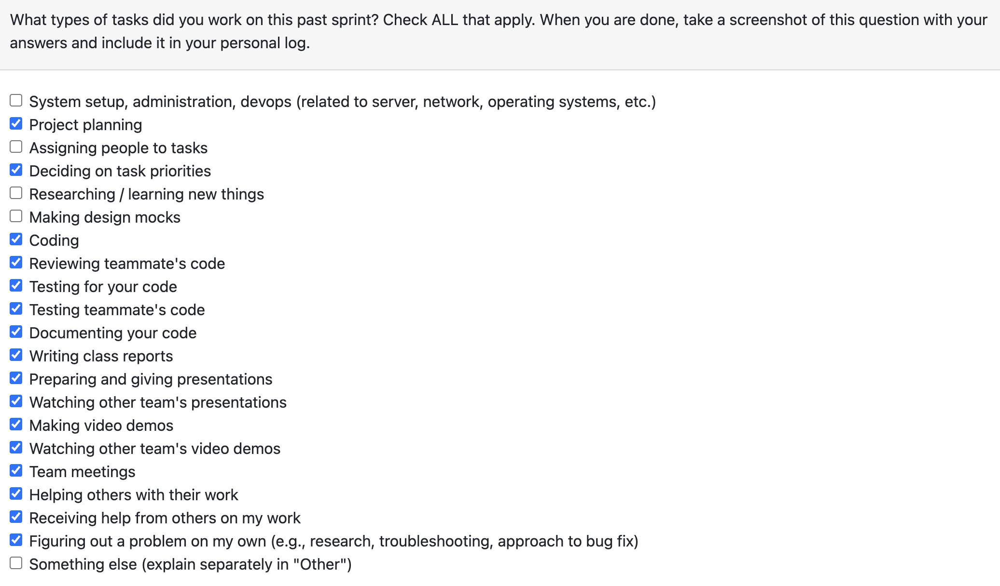

# Personal Log – Vanshika Singla

---

## Week-11 & 12 Combined, Entry for Mar 16 → Mar 29, 2026

---

### Connection to Previous Week

Building on the accessibility improvements (text size controls, keyboard navigation) and similarity detection work from Week 10, this combined two-week period focused on completing the similarity detection features, documentation, and final refinements. Additionally, I contributed to peer testing feedback implementation, created video demos, and supported team presentations.

---

### Pull Requests Worked On

- **[PR #890 – Similarity Detection Features](https://github.com/COSC-499-W2025/capstone-project-team-3/pull/890)** ✅ Merged  
  - Implemented persistent results table after analysis.
  - Added Files, Similarity Score, and Matched Project columns for enhanced transparency.
  - Created Similarity Detection Modal with detailed metrics.
  - Redesigned Upload Flow for Live Similarity Detection.
  - Created new backend endpoint for Per-Project Similarity Analysis.
  - Created Clickable Similarity Indicators.
  - Added Visual Highlighting for Similarity-Detected Projects.
  - Disabled run analysis button once analysis is already done to prevent issues.
  - Created Similarity Indicator Visual Component.
  - Implemented API endpoints for similarity detection.

- **[PR #906 – Text Size Accessibility Controls](https://github.com/COSC-499-W2025/capstone-project-team-3/pull/906)** ✅ Merged  
  - Implemented text size feature with controls for users with visual impairments.
  - Added keyboard navigation for accessibility controls.
  - Ensured text size persistence across sessions using local storage.
  - Verified text size controls do not interfere with existing UI elements.
  - Tested text size feature on different screen sizes.

- **[PR #943 – M3 Test Report Documentation](https://github.com/COSC-499-W2025/capstone-project-team-3/pull/943)** ✅ Merged  
  - Created test report for M3 documentation.
  - Added testing for frontend similarity API endpoint.

---

### Associated Issues Completed

| Issue ID | Title | Status |
|----------|-------|--------|
| #878 | New Backend Endpoint for Per-Project Similarity Analysis | ✅ Closed |
| #879 | Redesign Upload Flow for Live Similarity Detection | ✅ Closed |
| #881 | Add Files, Similarity Score, and Matched Project columns to table for enhanced transparency | ✅ Closed |
| #882 | Persistent Results Table After Analysis | ✅ Closed |
| #883 | Clickable Similarity Indicators | ✅ Closed |
| #886 | Create Similarity Indicator Visual Component | ✅ Closed |
| #887 | API endpoints for similarity | ✅ Closed |
| #907 | Add text size accessibility controls for users with visual impairments | ✅ Closed |
| #908 | Text size controls should not interfere with existing UI elements | ✅ Closed |
| #909 | Ensure text size persistence across sessions | ✅ Closed |
| #911 | Test text size feature on different screen sizes | ✅ Closed |
| #912 | Tests for nav bar for accessibility | ✅ Closed |
| #913 | Testing file for theme context | ✅ Closed |
| #944 | Add test report for m3 documentation | ✅ Closed |

---

## Work Breakdown

### Coding Tasks

- **Persistent Results Table**  
  - Implemented results table that persists after analysis completion.
  - Added new columns: Files, Similarity Score, Matched Project for transparency.
  - Enabled Clickable Similarity Indicators for detailed view.
  - Added Visual Highlighting for projects with detected similarity.

- **Similarity Detection Features**  
  - Created Similarity Detection Modal displaying detailed metrics.
  - Redesigned upload flow to support live similarity detection.
  - Built Similarity Indicator Visual Component for UI consistency.
  - Implemented new backend endpoints for per-project similarity analysis.
  - Created API endpoints for similarity detection functionality.

- **Analysis Control**  
  - Added logic to disable "Run Analysis" button after analysis completes to prevent duplicate runs.

- **Text Size Accessibility Controls**  
  - Implemented text size adjustment controls for users with visual impairments.
  - Added keyboard navigation support for accessibility.
  - Ensured text size persists across sessions using localStorage.
  - Tested text size feature on different screen sizes (mobile, tablet, desktop).
  - Verified controls do not interfere with existing UI elements.

- **Theme Context Testing**  
  - Created testing file for theme context validation.
  - Added unit tests for theme switching functionality.

---

### Testing & Documentation Tasks

- **Nav Bar Accessibility Tests**  
  - Created comprehensive test suite for nav bar accessibility features.
  - Verified keyboard navigation and ARIA labels.

- **M3 Test Report Documentation (#944)**  
  - Created comprehensive test report for Milestone 3 documentation.
  - Documented test cases, results, and coverage.
  - Added testing for frontend similarity API endpoints.

---

### Collaboration & Review Tasks

- Reviewed team members' pull requests and provided constructive feedback.
- Conducted code reviews for accessibility improvements and similarity features.
- Created video demo for project presentation.
- Contributed to preparing team presentations for Milestone 3.
- Attended weekly team sync meetings.
- Participated in peer testing reviews and discussions.

---

### Issues & Blockers

**Issues Encountered:**

NA

---

### Reflection

**What Went Well:**

- Successfully implemented comprehensive accessibility features (text size, keyboard navigation).
- Contributed to team presentation and demo creation and that went really well as professor really liked the enthusiasm.
- Maintained active involvement in PR reviews and team collaboration.
- Completed all planned tasks for the milestone.

**What Could Be Improved:**

NA

---

### Plan for Next Week

- Address any feedback from M3 presentation.
- Support team with final refinements and documentation
- Project Voting and Final Wrap-up.

