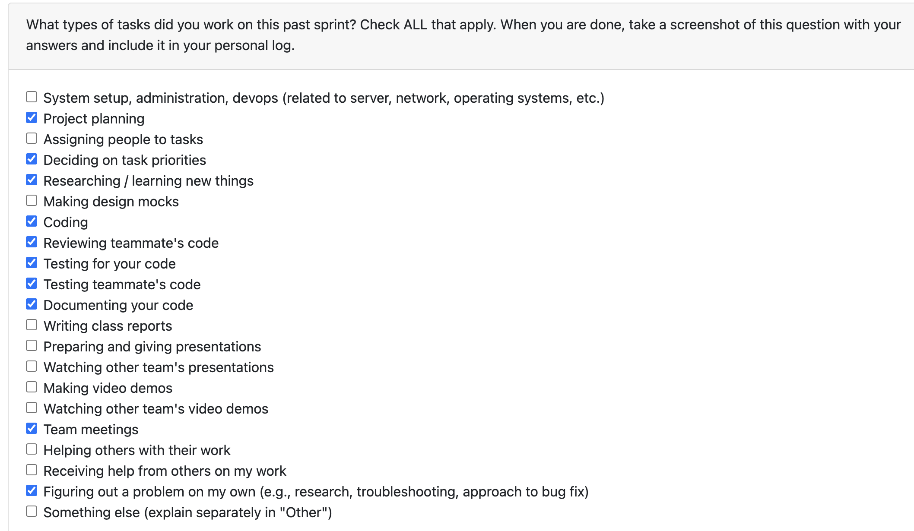

# Personal Log – Karim Khalil

---

## Week-2, Entry for Jan 11 → Jan 18, 2026

---

### Connection to Previous Week
Building on the foundational work from last week where I began the code analysis refactoring process, this week focused on completing phase 2 of the refactoring by extracting user preferences and text processing utilities into dedicated modules, fixing critical failing tests, and adding comprehensive test coverage for the refactored code analysis components.

---

### Pull Requests Worked On
- **[PR #467 - Fixed failing tests](https://github.com/COSC-499-W2025/capstone-project-team-3/pull/467)** ✅ Merged
  - Fixed 11 failing test cases in test_non_code_file_checker.py
  - Resolved MagicMock comparison errors and missing function parameters
  - Ensured all 88 tests pass for proper CI/CD pipeline execution
- **[PR #470 - Refactored code analysis](https://github.com/COSC-499-W2025/capstone-project-team-3/pull/470)** ✅ Merged
  - Phase 2 refactoring: extracted user_preferences.py (148 lines) and text_processing.py (58 lines)
  - Reduced main file from 1507 to 1321 lines (186 lines extracted)
  - Maintained backward compatibility and added comprehensive test suite
- **[PR #482 - Added tests](https://github.com/COSC-499-W2025/capstone-project-team-3/pull/482)** 🔄 In Review
  - Added comprehensive test coverage for code analysis utilities
  - Created new test suites for text processing and user preferences
  - Enhanced existing code analysis tests with new function coverage

---

### Associated Issues Completed
| Issue ID | Title | Status |
|----------|-------|--------|
| [#468](https://github.com/COSC-499-W2025/capstone-project-team-3/issues/468) | Fix failing tests in test_non_code_file_checker.py | ✅ Closed |
| [#469](https://github.com/COSC-499-W2025/capstone-project-team-3/issues/469) | Refactor code analysis part 2 - Extract user preferences and text processing | ✅ Closed |
| [#481](https://github.com/COSC-499-W2025/capstone-project-team-3/issues/481) | Create tests for code analysis part 1 | ✅ Closed |

---

## Work Breakdown

### Coding Tasks

#### Test Fixes ([#468](https://github.com/COSC-499-W2025/capstone-project-team-3/issues/468))
- Fixed 11 failing test cases in test_non_code_file_checker.py
- Resolved MagicMock comparison errors by updating _make_mock_commit helper function
- Fixed missing function parameters in verify_user_in_files test calls
- Added required usernames field to test metadata dictionaries
- Corrected user identity handling in classify_non_code_files_with_user_verification

#### Code Analysis Refactoring Phase 2 ([#469](https://github.com/COSC-499-W2025/capstone-project-team-3/issues/469))
- Extracted user_preferences.py (148 lines) - User preference loading and application utilities
- Extracted text_processing.py (58 lines) - Shared text processing helpers for code analysis
- Reduced main code_analysis_utils.py from 1507 to 1321 lines (186 lines extracted)
- Maintained backward compatibility and all existing functionality
- Improved code modularity and maintainability for better code reviews

#### Test Coverage Enhancement ([#481](https://github.com/COSC-499-W2025/capstone-project-team-3/issues/481))
- Created comprehensive test suite for text processing utilities (4 test functions)
- Created comprehensive test suite for user preferences utilities (5 test functions) 
- Updated existing code analysis tests to cover newly added functions
- Enhanced edge case handling for None inputs and malformed data
- Added proper mocking for external dependencies

---

###  Testing & Debugging Tasks

- Fixed 11 previously failing tests in test_non_code_file_checker.py
- Created comprehensive test suite for user_preferences.py (11 test cases)
- Developed extensive test coverage for text_processing.py (4 test functions)
- Enhanced existing code analysis tests with new function coverage
- Verified all tests pass locally (88 tests in non-code file checker, 10 new code analysis tests)
- Implemented proper mocking strategies for external dependencies
- Validated backward compatibility after refactoring
- Tested all PRs reviewed for teammates by locally running their code on my system 

---

### Collaboration & Review Tasks

- Responded to code review feedback from @6s-1 on PR #470 regarding missing test coverage
- Addressed requests for additional test cases by creating dedicated PR #482
- Collaborated with team on modular refactoring approach for maintainability
- Documented changes and updated inline comments for clarity
- Received approvals from multiple team members (@6s-1, @dabby04, @kjassani)
- Reviewed and commented on teammates PRs

---

### Issues & Blockers

**Issue Encountered:**
- 11 test cases were failing in test_non_code_file_checker.py, blocking CI/CD pipeline
- MagicMock comparison errors due to improper mock object setup
- Missing function parameters in updated function signatures

**Resolution:**
- Fixed MagicMock comparison issues by ensuring proper string values in mock objects
- Updated all test calls to include required username parameter
- Added missing metadata fields to test dictionaries
- Fixed user identity handling bug in classify_non_code_files_with_user_verification

---

### Reflection

**What Went Well:**
- Successfully completed phase 2 of code analysis refactoring with clean module separation
- Fixed all failing tests quickly to unblock CI/CD pipeline
- Maintained backward compatibility throughout major refactoring
- Created comprehensive test coverage for extracted modules
- Received positive feedback from team on modular approach improving code reviews

**What Could Be Improved:**
- Better initial test coverage planning to avoid follow-up PR requests

---

### Plan for Next Week
- Continue contributing to Milestone-2 requirements (API's & UI)
- Monitor refactored modules in production for any edge cases
---
