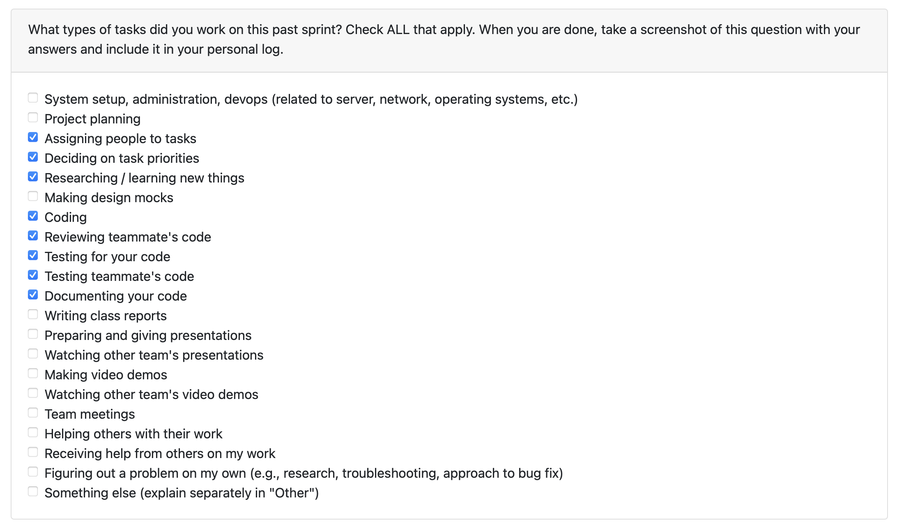

# Personal Log – Shreya Saxena

---

## Week-2, Entry for Jan 11 → Jan 18, 2026

---

### Connection to Previous Week
Building on the foundational work from last week where I implemented base utilities for thumbnail management ([#435](https://github.com/COSC-499-W2025/capstone-project-team-3/issues/435)) and enhanced user preference integration for non-code analysis ([#427](https://github.com/COSC-499-W2025/capstone-project-team-3/issues/427)), this week focused on completing the end-to-end integration of user preferences within the main application workflow and local analysis pipeline.

---

### Pull Requests Worked On
- **[PR #449 - Integrate User Preferences within Main and Local Analysis Workflow](https://github.com/COSC-499-W2025/capstone-project-team-3/pull/449)** ✅ Merged
  - Successfully integrated user preference functionality into main.py and local analysis
  - Addressed database connection leak issues
  - Updated comprehensive test coverage

---

### Associated Issues Completed
| Issue ID | Title | Status |
|----------|-------|--------|
| [#451](https://github.com/COSC-499-W2025/capstone-project-team-3/issues/451) | Integrate User Preferences within the main and local analysis workflow | ✅ Closed |
| [#450](https://github.com/COSC-499-W2025/capstone-project-team-3/issues/450) | Implement end-to-end user preference integration in local non code analysis | ✅ Closed |
| [#452](https://github.com/COSC-499-W2025/capstone-project-team-3/issues/452) | BugFix: DB Connection Leak Fix in user preference integration | ✅ Closed |
| [#434](https://github.com/COSC-499-W2025/capstone-project-team-3/issues/434) | Implement end-to-end functionality to add thumbnails per project | 🔄 In Progress |

---

## Work Breakdown

### Coding Tasks

#### User Preference Integration ([#451](https://github.com/COSC-499-W2025/capstone-project-team-3/issues/451))
- Integrated user preference retrieval into main.py workflow
- Updated local analysis pipeline to accept and utilize user preferences
- Enhanced domain keyword detection using user industry and job title
- Implemented 1.5x scoring boost when detected domain matches user's industry
- Maintained backward compatibility - analysis works with or without user preferences

#### End-to-End Local Analysis Integration ([#450](https://github.com/COSC-499-W2025/capstone-project-team-3/issues/450))
- Built enhanced keyword dictionaries based on user's job title and industry
- Added optional `user_context` field showing detection quality and domain matching
- Ensured seamless integration with existing non-code analysis utilities

#### Bug Fixes ([#452](https://github.com/COSC-499-W2025/capstone-project-team-3/issues/452))
- Identified and fixed database connection leak in user preference integration
- Implemented proper connection cleanup using context managers
- Added error handling to prevent resource leaks

---

###  Testing & Debugging Tasks

- Updated test suites for user preference integration in main.py
- Created comprehensive tests for local analysis with user preferences
- Added test cases for database connection management
- Verified backward compatibility with existing analysis pipeline
- Validated domain matching logic with different user preference scenarios
- Tested all PRs reviewed for teammates by locally running their code on my system. 

---

### Collaboration & Review Tasks

- Responded to code review feedback on PR #449
- Addressed requested changes for database connection handling
- Collaborated with team on integration approach
- Documented changes and updated inline comments for clarity
- Reviewed and commented on teammates PRs.

---

### Issues & Blockers

**Issue Encountered:**
- Database connection leak was discovered during testing - connections weren't being properly closed after user preference retrieval

**Resolution:**
- Implemented proper connection management using context managers
- Added try-except-finally blocks to ensure cleanup
- Created dedicated test cases to verify connection cleanup

---

### Reflection

**What Went Well:**
- Successfully completed end-to-end integration of user preferences
- Fixed critical database connection leak before it reached production
- Maintained backward compatibility throughout all changes
- Created comprehensive test coverage for all new functionality

**What Could Be Improved:**
- More granular commits to make code review easier
- Better documentation of integration points initially

---

### Plan for Next Week
- Complete thumbnail integration ([#434](https://github.com/COSC-499-W2025/capstone-project-team-3/issues/434))
- Monitor user preference integration in production for any edge cases
- Work on additional test coverage for thumbnail functionality
- Work on Milestone-2 requirements.
---
