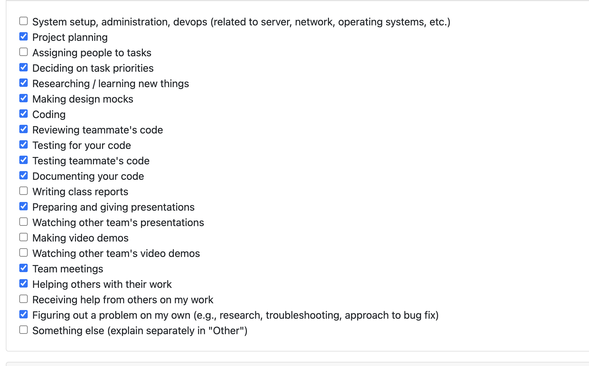

# Personal Log – Karim Khalil

---

## Week-3, Entry for Jan 18 → Jan 25, 2026

---

### Pull Requests Worked On
- **[PR #509 - completed post api for portfolio generation](https://github.com/COSC-499-W2025/capstone-project-team-3/pull/509)** ✅ Merged
  - Added POST endpoint at `/api/portfolio/generate` for portfolio generation
  - Supports both full portfolio generation (empty request) and selective generation (specific project IDs)
  - Implemented comprehensive test suite with 4 test cases
  - Fixed duplicate function names and removed duplicate metrics in response

- **[PR #504 - fixed final failing test](https://github.com/COSC-499-W2025/capstone-project-team-3/pull/504)** ✅ Merged
  - Fixed hardcoded year (2025) in failing test case
  - Replaced with dynamic current year to prevent future test failures
  - Updated `test_run_scan_flow_with_real_timestamps` test case

- **[PR #537 - completed fix for encoding issue on certain content extraction](https://github.com/COSC-499-W2025/capstone-project-team-3/pull/537)** ✅ Approved
  - Fixed critical encoding issues when parsing files with Unicode characters
  - Implemented robust encoding fallback strategy (utf-8 → utf-16 → latin-1 → cp1252 → iso-8859-1)
  - Enhanced `extract_contents()`, `detect_language()`, and line counting functions
  - Added 4 comprehensive encoding test cases

---

### Associated Issues Completed
| Issue ID | Title | Status |
|----------|-------|--------|
| [#508](https://github.com/COSC-499-W2025/capstone-project-team-3/issues/508) | Portfolio generation POST API endpoint | ✅ Closed |
| [#503](https://github.com/COSC-499-W2025/capstone-project-team-3/issues/503) | Fix failing test with hardcoded year | ✅ Closed |
| [#536](https://github.com/COSC-499-W2025/capstone-project-team-3/issues/536) | Encoding error when parsing files with special characters | ✅ Closed |

---

## Work Breakdown

### Coding Tasks

#### Portfolio Generation API
- Implemented POST `/api/portfolio/generate` endpoint with flexible project selection
- Created comprehensive portfolio generation logic in `generate_portfolio.py`
- Added project categorization functionality (AI vs local analysis types)
- Integrated with existing project retrieval and analysis systems
- Implemented proper error handling and validation for project IDs

#### Bug Fixes & Maintenance
- Fixed hardcoded year in test case causing annual test failures
- Resolved critical encoding issues affecting file parsing with Unicode characters
- Removed duplicate function names and cleaned up duplicate metrics in portfolio responses
- Enhanced code robustness with comprehensive fallback strategies

#### Encoding Enhancement
- Implemented multi-encoding fallback strategy for robust file reading
- Enhanced `extract_contents()`, `count_lines_of_code()`, and `count_lines_of_documentation()` functions
- Added encoding detection and error handling for files with special characters
- Resolved `UnicodeDecodeError` exceptions in `cp1252` encoding scenarios

---

### Testing & Debugging Tasks

- Created comprehensive test suites for portfolio generation API:
  - `test_post_portfolio_generate` - Standard functionality testing
  - `test_post_portfolio_generate_empty_projects` - Empty request handling
  - `test_post_portfolio_generate_null_projects` - Null project validation
  - `test_portfolio_generation_database_error` - Database error handling

- Added encoding-specific test coverage:
  - `test_extract_contents_with_utf8_encoding` - UTF-8 file reading validation
  - `test_extract_contents_with_latin1_fallback` - Latin-1 fallback testing
  - `test_extract_contents_with_error_replacement` - Error replacement validation
  - `test_count_lines_of_code_with_encoding_issues` - Code counting with encoding issues

- Fixed `test_run_scan_flow_with_real_timestamps` to use dynamic year calculation
- All tests passing locally and in CI/CD pipeline

---

### UI/UX & Design Tasks

- Created draft portfolio display design and presented to team
- Demonstrated portfolio generation functionality and UI mockups
- Gathered team feedback on user experience

---

### Collaboration & Review Tasks

- Reviewed multiple teammate PRs with detailed feedback and testing
- Responded promptly to code review feedback from team members
- Created detailed PR descriptions with comprehensive testing instructions
- Prepared comprehensive application testing for upcoming peer testing sessions
- Collaborated on milestone 2 requirement planning and task distribution

---

### Reflection

**What Went Well:**
- Successfully delivered complete portfolio generation feature with robust API
- Proactively identified and resolved critical encoding issues before production impact
- Created comprehensive test coverage ensuring reliability and maintainability
- Effective collaboration with team members through thorough code reviews
- Prepared well-designed portfolio UI mockups for team feedback

**What Could Be Improved:**
- Earlier identification of encoding issues through more comprehensive testing scenarios
- Better initial estimation of encoding complexity and fallback requirements

---

### Plan for Next Week
- Complete milestone 2 requirements implementation
- Conduct thorough peer testing sessions and document findings
- Integrate portfolio display UI with backend API endpoints
- Continue code review collaboration with team members
- Monitor portfolio generation API performance and usage patterns
- Address any issues discovered during peer testing phase

---
