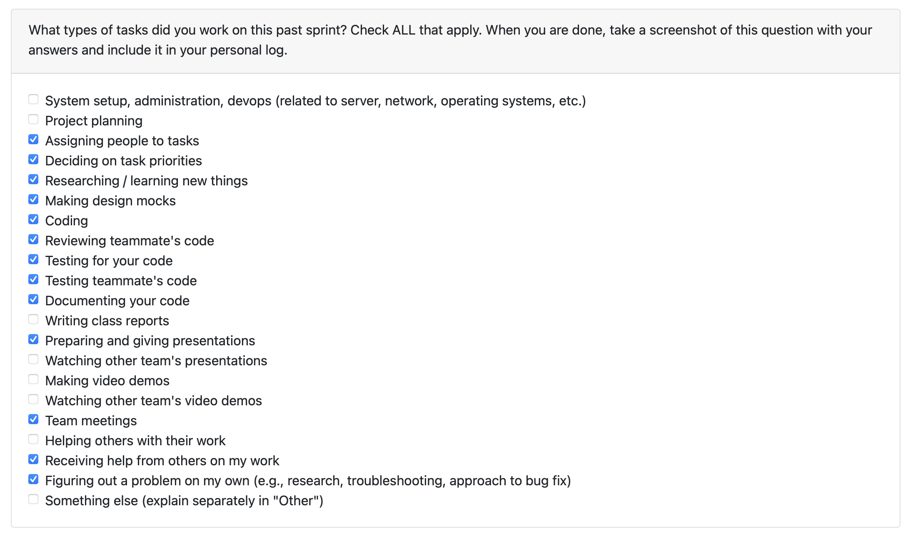

# Personal Log – Shreya Saxena

---

## Week-3, Entry for Jan 18 → Jan 25, 2026

---

### Pull Requests Worked On
- **[PR #496 - GET API Endpoints for Skills Data](https://github.com/COSC-499-W2025/capstone-project-team-3/pull/496)** ✅ Merged
  - Added endpoint to retrieve all unique skills across projects
  - Added endpoint for most frequently used skills with configurable limits
  - Implemented comprehensive test suite with 13 test cases
  
- **[PR #510 - GET API Endpoint for Chronological Skills](https://github.com/COSC-499-W2025/capstone-project-team-3/pull/510)** 🔄 Awaiting Reviews
  - Created /api/skills/chronological endpoint
  - Returns skills sorted by most recent usage
  - Configurable limit (default 10, range 1-50)

- **[PR #527 - Updated and fixed non code analysis summary along with milestone-1 feedback.](https://github.com/COSC-499-W2025/capstone-project-team-3/pull/527)** 🔄 Awaiting Reviews
  - Created /api/skills/chronological endpoint
  - Returns skills sorted by most recent usage
  - Configurable limit (default 10, range 1-50)

---

### Associated Issues Completed
| Issue ID | Title | Status |
|----------|-------|--------|
| [#498](https://github.com/COSC-499-W2025/capstone-project-team-3/issues/498) | GET API for all skills | ✅ Closed |
| [#499](https://github.com/COSC-499-W2025/capstone-project-team-3/issues/499) | GET API for frequency-sorted skills | ✅ Closed |
| [#511](https://github.com/COSC-499-W2025/capstone-project-team-3/issues/511) | GET API for chronologically-sorted skills | 🔄 Awaiting Reviews |
| [#512](https://github.com/COSC-499-W2025/capstone-project-team-3/issues/512) |Non Code Analysis Troubleshooting  | 🔄 Awaiting Reviews |
| [#528](https://github.com/COSC-499-W2025/capstone-project-team-3/issues/528) |Troubleshoot user preferences error
  | 🔄 Awaiting Reviews |

---

## Work Breakdown

### Coding Tasks

#### Skills API Endpoints 
- Created `/api/skills/all` endpoint returning unique skills sorted alphabetically
- Both endpoints include skill name, frequency count, and source (technical/soft)
- Implemented proper error handling and validation
- Structured response format consistent with existing API patterns

#### Frequency Skills API Endpoints 
- Created `/api/skills/frequency` endpoint with configurable limit (default: 10, max: 50)
- Implemented proper error handling and validation
- Structured response format consistent with existing API patterns

#### Chronological Skills Endpoint
- Implemented `/api/skills/chronological` endpoint
- Returns skills sorted by most recent usage (descending)
- Added alphabetical secondary sort for consistent ordering
- Included latest_use timestamp, source, and frequency in response
- Configurable limit with range validation (1-50)

#### Bug Fixes - Non-Code Summary Generation
- Fixed critical bug where non-code projects had empty/missing summaries
- Root cause: `analyze_project_clean()` being called with incorrect `email` parameter
- Removed email parameter from function calls in main.py
- Added input validation in analysis_merger_utils.py
- Enhanced debugging with comprehensive output tracking data flow

---

###  Testing & Debugging Tasks

- Created comprehensive test suites for all updated tests 
- Test coverage includes: response structure validation, frequency counting, sorting behavior, limit validation, edge cases, and error handling
- Updated test assertions in test_main.py for non-code summary bug fix
- Added 3 new edge case tests in test_analysis_merger.py
- Verified user preferences properly integrated (industry/job title mapping)
- All tests passing for both skills API and analysis merger
- Tested all PRs reviewed for teammates by locally running their code on my system

---

### Collaboration & Review Tasks

- Presented my individual figma design in team meeting
- Documented API endpoints with clear parameter descriptions
- Responded to code review feedback 
- Reviewed and commented on teammates' PRs
- Created detailed PR descriptions with testing instructions

---

### Reflection

**What Went Well:**
- Successfully delivered 3 new API endpoints for skills data
- Created comprehensive test coverage for new functionality
- Fixed critical bug before it impacted production users in peer testing
- Maintained backward compatibility in all changes
- Worked on Milestone01 feedbakc

**What Could Be Improved:**
- Earlier detection of the non-code summary bug through better monitoring
- Better communication with team about effort expectations.

---

### Plan for Next Week
- Continue work on thumbnail integration ([#434](https://github.com/COSC-499-W2025/capstone-project-team-3/issues/434))
- Begin work on additional Milestone-2 requirements
- Monitor new skills API endpoints in production
---
