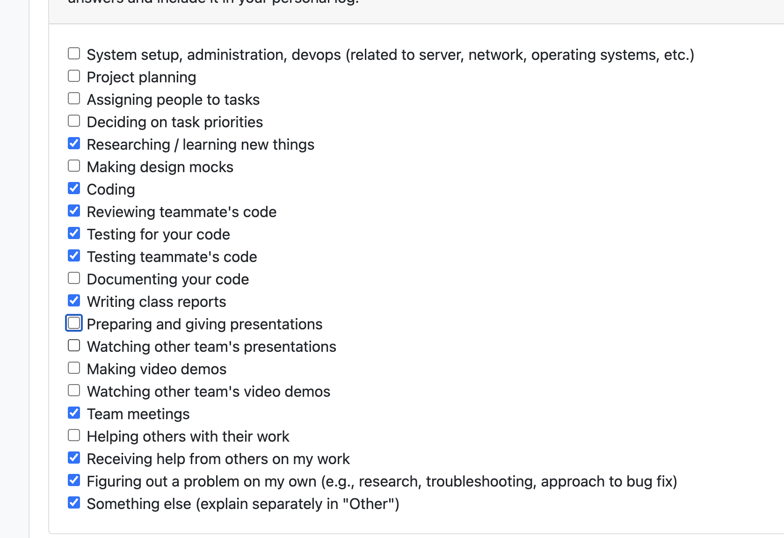

# Personal Log – Vanshika Singla

---
## Entry for Week 3, Jan 19 - Jan 25

### Type of Tasks Worked On
- Implemented API endpoints for user preferences management
- Added automated tests for user preference API endpoints
- Analyzed requirements for incremental information (Feature 21) and duplicate file detection (Feature 22)
- Designed new flow for incremental updates and duplicate file handling
- Collaborated on M2 feature planning and logic documentation
- Investigated Docker pipeline failures and implemented fixes (#488)
- Fixed the docker build action for the CI pipeline

---

### Recap of Weekly Goals
✅ Implement user preferences API endpoints — Completed
✅ Add automated tests for user preferences functionality — Completed
✅ Analyze Feature 21 and 22 requirements — Completed
✅ Design flow for incremental updates and duplicates — Completed
✅ Document new architectural approach for M2 features — Completed

---

### Features Assigned to Me
#505: API endpoint for user preferences - Enable web-based user preference management
#506: Testing of user preference API endpoint - Automated tests for preference endpoints
#522: Logic for Feature 21 and 22 for M2 - Design flow for incremental info and duplicate handling
#523: Feature 21 - M2 - Incremental information - Allow adding zipped folders with additional data
#524: Feature 22 - Duplicate file requirement - Detect and manage duplicate files in system

---

### Associated Project Board Tasks
| Task/Issue ID | Title                                                    | Status       |
|---------------|------------------------------------------------------------|--------------|
| #505          | API endpoint for user preferences                          | Completed    |
| #506          | Testing of user preference API endpoint                    | Completed    |
| #522          | Logic for Feature 21 and 22 for M2                         | Completed    |
| #523          | Feature 21 - M2 - Incremental information                 | In Progress  |
| #524          | Feature 22 - Duplicate file requirement                   | In Progress  |
| #488          | Investigate and fix Docker pipeline failures              | Completed    |

---

### Issue Descriptions

**#505 – API endpoint for user preferences**

Implemented three API endpoints to enable web-based user preference management:
- GET /api/user-preferences - Retrieve latest user preferences (name, email, GitHub, education, industry, job title)
- POST /api/user-preferences - Save or update user preferences using UPSERT logic
- Proper error handling when no preferences found (404 HTTPException)
- Figuring out the concept of upserting is important for this API endpoint

This enables users to manage their profile information through a web interface rather than CLI prompts. Implementation uses FastAPI with Pydantic models and integrates with the existing SQLite USER_PREFERENCES table. The UPSERT pattern ensures single user profile (user_id=1) is maintained across updates.

**#506 – Testing of user preference API endpoint**

Added comprehensive automated tests for user preferences API:
- test_get_user_preferences() - Verify retrieval of stored preferences
- test_post_user_preferences() - Verify saving and updating preferences
- test_get_empty_preferences() - Verify proper 404 error handling
- test_upsert_logic() - Confirm that multiple POST calls update the same record
- test_all_fields_saved() - Ensure all user fields are correctly persisted

**#522 – Logic for Feature 21 and 22 for M2**

Investigated critical issues with integrating incremental updates and duplicate detection into the current project signature system:
- Analyzed how current project_signature is based on SHA256 hash of file signatures
- Identified that incremental updates change the signature, breaking versioning
- Designed new flow using PROJECT_VERSIONS table to track changes across updates
- Proposed file deduplication logic before signature calculation
- Documented approach for maintaining backward compatibility with existing projects

This completed work establishes the architectural foundation for both Feature 21 and 22 before implementation begins.

**#488 – Investigate and fix Docker pipeline failures**

Identified and resolved critical issues preventing Docker image builds in the CI/CD pipeline:
- **Root Cause Analysis:** Discovered that the Docker build was failing due to missing Python dependencies during the build process and incorrect file permissions in the container
- **Issues Found:**
  - NLTK model downloads were timing out due to network issues
  - Cache mounting wasn't persisting pip dependencies correctly
  - User permission issues were preventing proper file ownership transitions
  - Sentence-transformers model pre-download was attempting to write to read-only directories
  
- **Fixes Implemented:**
  - Restructured RUN commands to combine package installations and reduce layer count
  - Added proper error handling for model downloads with retry logic
  - Fixed directory permissions by creating cache directories before user switch
  - Optimized apt-get calls to reduce image size and build time
  - Added proper cleanup of apt cache to minimize Docker image footprint
  
The fixes ensure the Docker build passes consistently on every CI/CD run, preventing failed deployments and enabling reliable containerization of the application.

---

### Reviewing and Collaboration
- Discussed Feature 21 and 22 integration challenges with another team member 
- Tested other teammates PRs and reviewed their logs while providing feedback for any inconsistent behaviour
- Collaborated on ci testing pipeline for the fix of the local same number of 

---

### Progress Summary
- **Completed this week:**
Successfully implemented user preference API endpoints with full test coverage, enabling web-based profile management similar to consent management work from Week

---

### Blockers
- Even though i was able to find the logic for the feature 21, we still have some issues with the flow and have to make the fix there so we will have to work on this later. 

---

### Reflection
**What Went Well:**
- Test coverage is comprehensive and catches edge cases

**What Could Be Improved:**
- Equal distribution of work could help prevent bottlenecks on specific features as i spent alot of time deciding on the tasks
- If reviewer can provide all the reviews in one go rather than in chunks would be great.

---

### Plan for Next Cycle
- Complete implementation of Feature 21 (incremental information handling) with new versioning approach
- Make sure to address any feedback we received in the stations on monday 
- Work on any other assigned features 