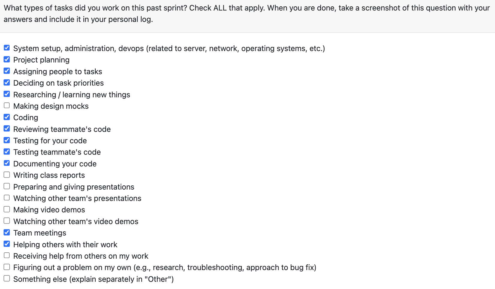

# Personal Log – Karim Jassani

---

## Week-2, Entry for Jan 27 → Feb 8, 2026

---

### Pull Requests Worked On
- **[PR #554 - Resolve confusion between project score vs rank + rename project scan score](https://github.com/COSC-499-W2025/capstone-project-team-3/pull/554)** 

- **[PR #575 - Allow user to edit project score (part 1)](https://github.com/COSC-499-W2025/capstone-project-team-3/pull/575)** 

- **[PR #603 - Enhancement: Is_collaborative function - Git Code Analysis)](https://github.com/COSC-499-W2025/capstone-project-team-3/pull/603)** 

- **[PR #612 - Allow user to edit project score (part 2)](https://github.com/COSC-499-W2025/capstone-project-team-3/pull/612)** 
---

### Associated Issues Completed
| Issue ID | Title 
|----------|-------
| [#552](https://github.com/COSC-499-W2025/capstone-project-team-3/issues/552) | Resolve project score vs rank confusion |
| [#553](https://github.com/COSC-499-W2025/capstone-project-team-3/issues/553) | Rename project scan score |
| [#571](https://github.com/COSC-499-W2025/capstone-project-team-3/issues/571) | Add score override fields + reset on reanalysis |
| [#572](https://github.com/COSC-499-W2025/capstone-project-team-3/issues/572) | Implement score breakdown builder |
| [#602](https://github.com/COSC-499-W2025/capstone-project-team-3/issues/602) | Update Is_collaborative function |
| [#573](https://github.com/COSC-499-W2025/capstone-project-team-3/issues/573) | Implement override recalculation + renormalization |

---

## Work Breakdown

### Coding Tasks

#### **[PR #554 – Resolve confusion between project score vs rank + rename project scan score](https://github.com/COSC-499-W2025/capstone-project-team-3/pull/554)**  

- Corrected misuse of *rank* vs *score* across 16 affected files  
- Renamed “project rank” → **PROJECT.score** wherever it represents contribution score  
- Enforced PROJECT.score ∈ \[0, 1\] at the database layer using CHECK constraints and triggers  
- Renamed scan coverage metric to **project scan score** to distinguish it from contribution score  
- Renamed calculation helper to `calculate_project_scan_score`  
- Updated CLI output, tests, and documentation to reflect corrected semantics  
- Prevented invalid score states from being persisted at the DB level  

---

#### **[PR #575 – Allow user to edit project score (Part 1: schema + breakdown)](https://github.com/COSC-499-W2025/capstone-project-team-3/pull/575)**  

**Context**: Introduced the foundation for user-editable project scores while preserving system integrity and transparency into how scores are computed.

- Added `score_overridden` and `score_overridden_value` fields to PROJECT schema  
- Added DB-level triggers to enforce override values remain within \[0,1\]  
- Ensured overrides are cleared automatically when a project is re-analyzed  
- Implemented `compute_project_score_breakdown()` to expose:  
  - Raw metric values  
  - Caps and normalized values  
  - Weights and per-metric contributions  
  - Subtotals and blend percentages (Git vs non-Git)  
- Added unit tests validating breakdown consistency with existing score calculations  

---

#### **[PR #603 – Enhance is_collaborative logic to unify author identities](https://github.com/COSC-499-W2025/capstone-project-team-3/pull/603)**  

**Context**: Identified inflated author counts caused by treating real emails and GitHub noreply emails as separate contributors, leading to incorrect collaboration detection and misleading logs/tests.

- Updated `is_collaborative` to accept **author_aliases** and collapse them into a single logical author  
- Reused existing `author_matches` logic (exact match + GitHub noreply username extraction)  
- Introduced canonical author key resolution with precedence:  
  - real email → noreply username → commit name  
- Updated `run_git_parsing_from_files` to pass selected identifiers as aliases  
- Simplified collaboration detection by tracking a single `unique_authors` set:  
  - `"primary"` bucket for matched aliases  
  - canonical keys for all other authors  
- Ensures collaboration is detected only when *truly distinct* contributors exist  

---

#### **[PR #612 – Allow user to edit project score (Part 2: override recalculation)](https://github.com/COSC-499-W2025/capstone-project-team-3/pull/612)**  

**Context**: Completed the score override workflow by enabling selective metric exclusion and mathematically correct score recomputation.

- Implemented override recalculation logic that:  
  - Excludes selected code metrics  
  - Renormalizes remaining metric weights  
  - Recomputes final score using existing Git / non-Git blend ratios  
- Added validation for:  
  - Empty or invalid exclusion sets  
  - Unknown metric names  
  - Weight renormalization edge cases  
  - Cap behavior during recomputation  
- Added focused unit tests to guarantee correctness and regression safety  

---

###  Testing & Debugging Tasks

- Added database-level tests to validate project score integrity, ensuring contribution scores are always constrained to the valid [0,1] range and invalid states are rejected.
- Introduced unit tests to verify correctness and transparency of project score breakdowns, ensuring per-metric contributions and blends exactly match final computed scores.
- Implemented test coverage for author identity normalization in collaboration detection, ensuring real emails and GitHub noreply aliases are treated as a single contributor.
- Added edge-case tests for score override recalculation, validating metric exclusion, weight renormalization, cap enforcement, and error handling for invalid inputs.

---

### Collaboration & Review Tasks

- **[PR #595 - Create tailored resume](https://github.com/COSC-499-W2025/capstone-project-team-3/pull/595)**
- **[PR #577 - Feature 28: Added Endpoint for deleting edited resumes. ](https://github.com/COSC-499-W2025/capstone-project-team-3/pull/577)**
- **[PR #567 - Updated DB_SCHEMA with table of skills and unique key](https://github.com/COSC-499-W2025/capstone-project-team-3/pull/567)**
- **[PR #561 - Bugfix collaboration score and correct username detection](https://github.com/COSC-499-W2025/capstone-project-team-3/pull/561)**

---

### Reflection

**What Went Well:**
- important feature of re ranking project is on track
- author matching enhanced in git code analysis, improving is collab funciton
- well on track for milestone 2

**What Could Be Improved:**
- some communication gaps that could be improved and cleared.
---

### Plan for Next Week
- The re-rank project functionality is almost complete - next week will focus on cli + api integraiton
