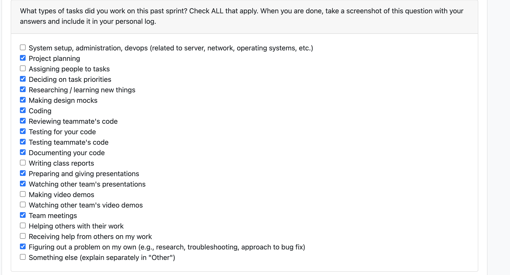

# Personal Log – Karim Khalil

---

## Week-4&5, Entry for Jan 26 → Feb 8, 2026

---

### Connection to Previous Week
Building on the foundational work from previous weeks, I focused on implementing the complete Portfolio Dashboard JavaScript ecosystem. This included creating the core framework, advanced Chart.js visualizations, comprehensive project rendering, and analysis capabilities to provide users with a sophisticated portfolio management interface.

---

### Pull Requests Worked On
- **[PR #606 - completed js code](https://github.com/COSC-499-W2025/capstone-project-team-3/pull/606)** ✅ Merged
  - Enhanced the Portfolio Dashboard JavaScript with advanced project rendering and analysis capabilities
  - Added comprehensive project display functionality including top projects ranking system and detailed analysis aggregation
  - Implemented interactive editable fields with click-to-edit functionality and visual feedback
  - Added Chart.js defensive coding with robust guard clauses to prevent rendering failures
  - Test classes updated
- **[PR #588 - Portfolio js part2](https://github.com/COSC-499-W2025/capstone-project-team-3/pull/588)** ✅ Merged
  - Implemented advanced Chart.js visualization capabilities with five different chart types
  - Added professional styling with consistent color schemes and responsive design
  - Created dynamic chart management with destruction and recreation for real-time updates
  - Implemented language distribution, project complexity, score distribution, and monthly activity visualizations
  - Test classes updated
- **[PR #570 - added portfolio interactivity js functions - PART 1](https://github.com/COSC-499-W2025/capstone-project-team-3/pull/570)** ✅ Merged
  - Implemented core Portfolio Dashboard JavaScript foundation with class-based architecture
  - Added project selection system with dynamic sidebar and real-time filtering
  - Created API integration layer for seamless connection to existing endpoints
  - Implemented overview cards display for essential portfolio metrics visualization
  - Test classes updated
- **[PR #557 - added portfolio endpoints to create a portfolio page](https://github.com/COSC-499-W2025/capstone-project-team-3/pull/557)** ✅ Merged
  - Implemented comprehensive Portfolio API endpoint with rich project data
  - Added project filtering via query parameters and support for GitHub/local project analysis
  - Created custom response headers for client metadata and comprehensive error handling
  - Added GET /api/portfolio-dashboard for HTML interface and portfolio.js serving
  - Test classes updated

---

### Associated Issues Completed
| Issue ID | Title | Status | Related PRs |
|----------|-------|--------|-------------|
| [#555](https://github.com/COSC-499-W2025/capstone-project-team-3/issues/555) | Portfolio API Endpoint Implementation | ✅ Closed | PR #557 |
| [#569](https://github.com/COSC-499-W2025/capstone-project-team-3/issues/569) | Portfolio Dashboard JavaScript Foundation | ✅ Closed | PR #570, #588 |

### Additional PRs Completed (Enhancement Work)
| PR ID | Title | Status |
|-------|-------|--------|
| [#606](https://github.com/COSC-499-W2025/capstone-project-team-3/pull/606) | Enhanced Portfolio Dashboard with Advanced Project Rendering | ✅ Merged |

---

## Work Breakdown

### Coding Tasks

* **PR #557 – Portfolio API Endpoints:** Implemented comprehensive GET /api/portfolio endpoint with optional project filtering, rich data structure including overview stats, project metrics, skills timeline, and complexity analysis. Added GET /api/portfolio-dashboard for HTML interface. Test classes updated.
* **PR #570 – Portfolio JavaScript Foundation:** Created core PortfolioDashboard class with project selection system, dynamic sidebar filtering, API integration layer, and overview cards display. Implemented Select All/Deselect All functionality with real-time updates. Test classes updated.
* **PR #588 – Chart.js Visualizations:** Implemented five chart types (pie, bar, horizontal bar, line charts) with professional styling, responsive design, and dynamic chart management. Added language distribution, project complexity, score distribution, and monthly activity visualizations. Test classes updated.
* **PR #606 – Advanced Project Rendering:** Enhanced dashboard with top projects ranking system, detailed analysis aggregation, interactive editable fields, and Chart.js defensive coding. Added cross-project data analysis and comprehensive error handling. Test classes updated.

---

### Testing & Debugging Tasks

* Updated test classes for comprehensive Portfolio API endpoint functionality (PR #557)
* Added tests for PortfolioDashboard class async calls and project filtering (PR #570)
* Created tests for Chart.js methods, rendering, data processing, and error handling (PR #588)
* Implemented tests for project interaction, DOM manipulation, and chart configuration (PR #606)
* Validated endpoint responses, parameter handling, and database error scenarios across all PRs

---

### Collaboration & Review Tasks

* Addressed comprehensive code review feedback from team members on XSS vulnerabilities and security best practices
* Responded to suggestions for optional chaining, performance optimizations, and TODO ticket creation
* Participated in discussions about PR size management and best practices for large feature implementations
* Collaborated on breaking down large features into focused, reviewable PRs to maintain development velocity

---

### Issues & Blockers

**Issue Encountered:**

* Large PR sizes
* Need to implement TODO items for editing logic and performance optimizations flagged during code review
* Chart.js dependency management and defensive coding requirements to handle missing libraries gracefully

**Resolution:**

* Broke portfolio work into focused, logical PRs (API endpoints, core framework, visualizations, advanced rendering) to maintain reviewability while delivering complete functionality
* Added comprehensive defensive coding with guard clauses and try/catch blocks to handle Chart.js availability and DOM element existence
* Implemented robust error handling with fallback mechanisms and detailed console logging for debugging
* Created TODO items with team member assignments for future enhancements like editing logic implementation

---

### Reflection

**What Went Well:**

* Successfully implemented complete Portfolio Dashboard ecosystem from API to advanced JavaScript visualizations
* Maintained high code quality with comprehensive test coverage across all four major PRs
* Effective collaboration with team members through detailed code reviews and responsive feedback incorporation
* Created professional, production-ready features with defensive coding and error handling best practices

**What Could Be Improved:**
* Create more detailed documentation for complex Chart.js implementations to improve maintainability

---

### Plan for Next Cycle

* Implement frontend HTML interface to display the Portfolio Dashboard JavaScript functionality
* Address TODO items for editing logic implementation and performance optimizations
* Work on frontend integration and user interface enhancements for Milestone 2 completion
