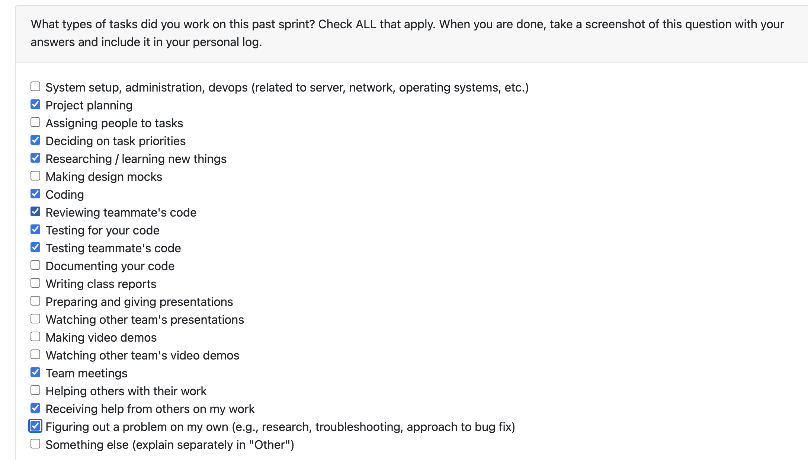

# Personal Log – Vanshika

---

## Week-4&5, Entry for Jan 26 → Feb 8, 2026

---

### Connection to Previous Week
Building on the foundational similarity detection work from previous weeks and also changing the behaviour for the DB for similar projects, I focused on implementing the complete similarity scoring system, automated threshold logic and containment score and making a strong metrix to check that similarity, and critical bug fixes for collaboration scoring and username detection. This work significantly improved the accuracy of our project analysis and contribution tracking.

---

### Pull Requests Worked On
- **[PR #525 - Feature 21- Incremental load feature and updated logic](https://github.com/COSC-499-W2025/capstone-project-team-3/pull/525)** ✅ Merged
  - Implemented incremental load feature for project updates
  - Added logic to handle incremental project data loading
  - Created versioning system for tracking project changes
- **[PR #561 - Bugfix collaboration score and correct username detection](https://github.com/COSC-499-W2025/capstone-project-team-3/pull/561)** ✅ Merged
  - Fixed critical bug in collaboration score calculation
  - Corrected username detection logic for accurate authorship tracking
  - Improved accuracy of git detection in code and non-code streams
  - While doing it, found another bug across both streams (addressed in other PR)
- **[PR #587 - Dynamic threshold setting for incremental load and containment](https://github.com/COSC-499-W2025/capstone-project-team-3/pull/587)** ✅ Merged
  - Implemented dynamic threshold settings for incremental load feature
  - Added containment logic for threshold management
  - Created adaptive threshold system for improved accuracy
- **[PR #615 - Add author key in non code stream - Bugfix part2](https://github.com/COSC-499-W2025/capstone-project-team-3/pull/615)** 👀 In Review
  - Added author key tracking in non-code stream
  - Fixed authorship detection for non-code contributions
  - Improved accuracy of contribution tracking across all file types

---

### Associated Issues Completed
| Issue ID | Title | Status | Related PRs |
|----------|-------|--------|-------------|
| [#525](https://github.com/COSC-499-W2025/capstone-project-team-3/issues/525) | Feature 21- Incremental load feature and updated logic | ✅ Closed | PR #525 |
| [#561](https://github.com/COSC-499-W2025/capstone-project-team-3/issues/561) | Bugfix collaboration score and correct username detection | ✅ Closed | PR #561 |
| [#563](https://github.com/COSC-499-W2025/capstone-project-team-3/issues/563) | Create similarity score logic for projects | ✅ Closed | - |
| [#564](https://github.com/COSC-499-W2025/capstone-project-team-3/issues/564) | Update the db with the project if detected similar | ✅ Closed | - |
| [#587](https://github.com/COSC-499-W2025/capstone-project-team-3/issues/587) | Dynamic threshold setting for incremental load and containment | ✅ Closed | PR #587 |
| [#598](https://github.com/COSC-499-W2025/capstone-project-team-3/issues/598) | Create logic for automated dynamic threshold value | ✅ Closed | - |
| [#599](https://github.com/COSC-499-W2025/capstone-project-team-3/issues/599) | Testing for automated dynamic threshold | ✅ Closed | - |

### Issues In Progress
| Issue ID | Title | Status | Related PRs |
|----------|-------|--------|-------------|
| [#600](https://github.com/COSC-499-W2025/capstone-project-team-3/issues/600) | Allows user to edit the threshold for incremental load | 🔄 In Progress | - |

### Issues In Review
| Issue ID | Title | Status | Related PRs |
|----------|-------|--------|-------------|
| [#614](https://github.com/COSC-499-W2025/capstone-project-team-3/issues/614) | Testing for author key | 👀 In Review | - |
| [#615](https://github.com/COSC-499-W2025/capstone-project-team-3/issues/615) | Add author key in non code stream - Bugfix part2 | 👀 In Review | PR #615 |

---

## Work Breakdown

### Coding Tasks

* **PR #525 – Incremental Load Feature:** Implemented incremental load feature with updated logic for project versioning, added handling for incremental project data, and created system for tracking project changes over time.
* **PR #561 – Bug Fixes:** Fixed collaboration score calculation bug, corrected username detection logic, and improved authorship tracking accuracy across code and non-code streams.
* **PR #587 – Dynamic Threshold Settings:** Implemented dynamic threshold settings for incremental load feature, added containment logic for threshold management, and created adaptive system for improved accuracy.
* **PR #615 – Author Key in Non-Code Stream:** Added author key tracking in non-code stream, fixed authorship detection for non-code contributions, and improved contribution tracking across all file types.

---

### Testing & Debugging Tasks

* Comprehensive testing for incremental load feature and versioning system (PR #525)
* Validated dynamic threshold settings and containment logic (PR #587)
* Tested username detection improvements and collaboration score accuracy (PR #561)
* Debugged authorship tracking issues in git detection system
* Testing for automated dynamic threshold (#599)
* Validated author key implementation in non-code stream (PR #615)

---

### Collaboration & Review Tasks

* Conducted extensive code reviews for team members across multiple PRs
* Participated in frontend prototype discussions for meeting planning
* Identified and reported critical system-wide bug affecting authorship and git detection accuracy
* Contributed to frontend prototype development for team discussions
* Collaborated on username and email conflict resolution strategies

---

### Issues & Blockers

**Issue Encountered:**

* Complex integration of incremental load feature with existing project versioning system
* Username and email conflicts causing inaccurate contribution tracking
* Collaboration score calculation inconsistencies
* Author key missing in non-code stream affecting contribution accuracy

**Resolution:**

* Implemented incremental load feature with updated logic for seamless project updates
* Created dynamic threshold system for incremental load and containment
* Fixed username detection logic to properly handle multiple author identifiers
* Corrected collaboration score calculation to accurately reflect team contributions
* Added author key tracking in non-code stream to improve overall authorship accuracy

---

### Reflection

**What Went Well:**

* Successfully implemented incremental load feature with versioning system
* Created robust dynamic threshold logic for incremental load and containment
* Fixed critical bugs that significantly improved system accuracy
* Effective collaboration through code reviews and bug identification
* Contributed to frontend prototype and identified system-wide bugs

**What Could Be Improved:**

* Earlier identification of author key issues in non-code stream
* More comprehensive initial testing to catch edge cases sooner
* Better coordination on PR reviews to get all feedback at once

---

### Plan for Next Cycle

* Complete user-editable threshold feature for incremental load (#600)
* Finalize username and email conflict resolution (#560)
* Complete author key testing (#614)
* Continue frontend prototype work and code reviews
* Address any additional bugs discovered in similarity detection system

