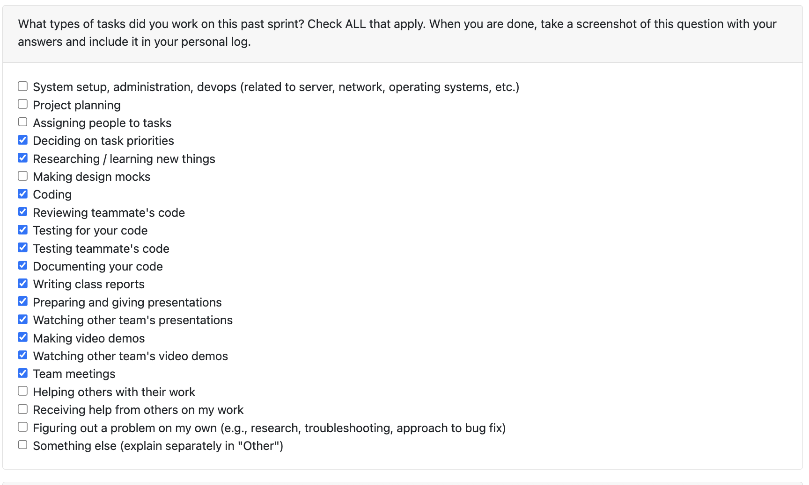

# Personal Log – Karim Jassani

---

## Week-6, Entry for Feb 9 → Feb 15, 2026

---

### Connection to Previous Week

Last week I had setip the foundations for the Project Score Override funcitonality so this week I completed the utils functions along with test cases for, and the API Integration.
---

### Pull Requests Worked On

- **[PR #664 - Project Score Override Utils](https://github.com/COSC-499-W2025/capstone-project-team-3/pull/664)** 
  - Introduced centralized score-override utility to handle effective/display score resolution (score, score_original, override flags). 
  - Implemented override lifecycle: preview (non-persistent), apply (persistent), and clear/reset endpoints. 
  - Added focused unit tests covering override behavior, validation logic, and edge cases to prevent scoring regressions.

- **[PR #641 - API Integration Project Score Override](https://github.com/COSC-499-W2025/capstone-project-team-3/pull/666)** 
  - Made existing GET /api/projects and GET /api/projects/{signature} override-aware by returning score, score_original, score_overridden, score_overridden_value, and display_score.
  - Added new override-related endpoints: score breakdown, preview, apply, and clear to support full override workflow. 
  - Updated retrieval layer (get_portfolio_resume_insights() and get_projects_by_signatures()) to include effective score columns from PROJECT, ensuring consistency across portfolio and resume flows.

---

### Associated Issues Completed
| Issue ID | Title | Status |
|----------|-------|--------|
| [#663](https://github.com/COSC-499-W2025/capstone-project-team-3/issues/663) | Add Core Score Override Utility | ✅ Closed|
| [#665](https://github.com/COSC-499-W2025/capstone-project-team-3/issues/665) | Integrate Score Override into Projects API | ✅ Closed|
| [#667](https://github.com/COSC-499-W2025/capstone-project-team-3/issues/667) | Update retrieval insights + retrieval tests | ✅ Closed|

---

## Pull Requests Reviewed

- **[PR #640 - Added tests and fixed console error](https://github.com/COSC-499-W2025/capstone-project-team-3/pull/640)** 

- **[PR #643 - Added chronological skill/project managing to cli, updated skill date extraction logic.](https://github.com/COSC-499-W2025/capstone-project-team-3/pull/643)** 

- **[PR #655 - GET/ Consent Text and set up for consent Ui ](https://github.com/COSC-499-W2025/capstone-project-team-3/pull/655)** 

- **[PR #669 - UI/view tailored](https://github.com/COSC-499-W2025/capstone-project-team-3/pull/669)** 

---

### Reflection

**What Went Well:**
- Successfully incorporated the important score override functionality before reading break, along wiht API
- rebased previous branch so I am not blocked for review

**What Could Be Improved:**
- All good

---

### Plan for Next Week

- Implement the CLI for score breakdown 