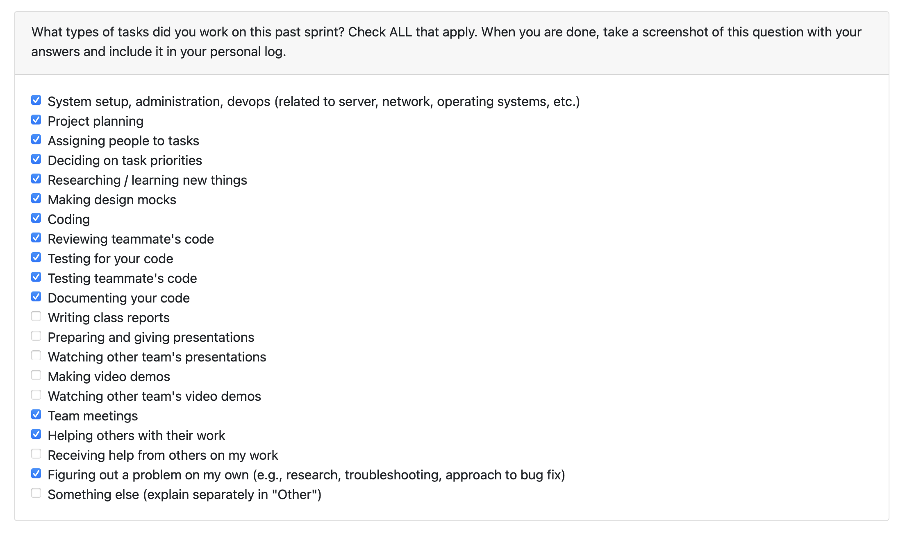

# Personal Log – Shreya Saxena

---

## Week-4+5, Entry for Jan 26 → Feb 8, 2026

---

### Pull Requests Worked On
- **[PR #546 - Feature 23: Edit/Update Project Duration Dates & Base Utils for Chronological Results](https://github.com/COSC-499-W2025/capstone-project-team-3/pull/546)** ✅ Merged
  - Added CLI tool to view and edit project dates from analyzed projects
  - Created new DB utility manager for SQLite connection and operations
  - Implemented interactive CLI for listing projects and validating dates
  - Added comprehensive test coverage with temp SQLite DB testing
  - 558 lines of new code with complete scaffolding for reliability

- **[PR #550 - Feature 26: POST API Endpoint for Adding Thumbnail for Project](https://github.com/COSC-499-W2025/capstone-project-team-3/pull/550)** ✅ Merged
  - Created POST API endpoint to handle file path input to database
  - Added thumbnail support for projects

- **[PR #577 - Feature 28: Endpoint for Deleting Edited Resumes](https://github.com/COSC-499-W2025/capstone-project-team-3/pull/577)** ✅ Merged
  - Added endpoint for edited resume deletion
  - Implemented proper cleanup and validation

- **[PR #589 - Feature 23: Chronological Information Managing for Skills Date](https://github.com/COSC-499-W2025/capstone-project-team-3/pull/589)** ✅ Merged
  - Updated database to contain chronological skills
  - Updated Chronological manager to produce editable output
  - Updated Chronological utils to accept editing of dates for skills

---

### Associated Issues Completed
| Issue ID | Title | Status |
|----------|-------|--------|
| [#548](https://github.com/COSC-499-W2025/capstone-project-team-3/issues/548) | Create base chronological information managing utils file | ✅ Closed |
| [#549](https://github.com/COSC-499-W2025/capstone-project-team-3/issues/549) | Create chronological information managing for editing/updating project date | ✅ Closed |
| [#551](https://github.com/COSC-499-W2025/capstone-project-team-3/issues/551) | Create POST API endpoint to get the file path input to db | ✅ Closed |
| [#578](https://github.com/COSC-499-W2025/capstone-project-team-3/issues/578) | Add endpoint for edited resume deletion | ✅ Closed |
| [#590](https://github.com/COSC-499-W2025/capstone-project-team-3/issues/590) | Update database to contain chronological skills | ✅ Closed |
| [#591](https://github.com/COSC-499-W2025/capstone-project-team-3/issues/591) | Update Chronological manager to produce editable output for user | ✅ Closed |
| [#592](https://github.com/COSC-499-W2025/capstone-project-team-3/issues/592) | Update Chronological utils to accept editing of dates for skills | ✅ Closed |

---

## Work Breakdown

### Coding Tasks

#### Chronological Project Dates CLI Tool (Feature 23 - Part 1)
- Created interactive CLI tool to view and edit project dates from analyzed projects
- Implemented new DB utility manager for SQLite connection and operations
- Added project listing with date prompting and validation
- Built confirmation workflow for updates with error handling
- Created comprehensive test suite with temp SQLite DB for reliability
- Total 558 lines including complete scaffolding and test coverage

#### Thumbnail API Endpoint (Feature 26)
- Implemented POST API endpoint for adding project thumbnails
- Added file path input handling to database
- Integrated thumbnail support with existing project structure

#### Resume Deletion Endpoint (Feature 28)
- Created endpoint for deleting edited resumes
- Implemented proper cleanup and validation logic
- Added error handling for deletion operations

#### Chronological Skills Management (Feature 23 - Part 2)
- Updated database schema to contain chronological skills data
- Enhanced Chronological manager to produce editable output for users
- Extended Chronological utils to accept editing of dates for skills
- Integrated skills date management with existing chronological tools

---

###  Testing & Debugging Tasks

- Created comprehensive test suites for all new features
- Developed comprehensive test suite for chronological project dates CLI tool using temp SQLite DB
- Tested project date updates, ordering, input normalization, and connection closing
- Verified thumbnail POST endpoint with various file path inputs
- Tested resume deletion endpoint for proper cleanup and error handling
- Created test coverage for chronological skills date management functionality
- Test coverage includes: response structure validation, edge cases, and error handling
- All tests passing for chronological tools and new endpoints
- Tested all PRs reviewed for teammates by locally running their code on my system

---

### Collaboration & Review Tasks

- Presented my individual figma design in team meeting
- Documented API endpoints with clear parameter descriptions
- Responded to code review feedback 
- Reviewed and commented on teammates' PRs
- Created detailed PR descriptions with testing instructions

---

### Reflection

**What Went Well:**
- Successfully delivered 4 merged PRs with comprehensive functionality
- Implemented complete Feature 23 (chronological editing) across projects and skills
- Built robust CLI tool with 558 lines including full test coverage
- Added thumbnail and resume deletion endpoints with proper validation
- Maintained backward compatibility in all changes
- All test suites passing with comprehensive coverage

**What Could Be Improved:**
- Could have broken down Feature 23 into smaller incremental PRs for easier review
- Better time estimation for complex features like the CLI tool

---

### Plan for Next Week
- Integrate chronological CLI tools with main application workflow
- Continue work on Milestone-2 requirements
- Monitor new endpoints (thumbnail, resume deletion) in production
- Address any feedback from merged PRs
- Support team with peer testing and code reviews
---

## Week-7, Entry for Feb 16 → Feb 22, 2026

---

### Pull Requests Worked On

- **[PR #670 - Feature-36: Added API documentation for overall project (Pt-1)](https://github.com/COSC-499-W2025/capstone-project-team-3/pull/670)** ✅ Merged
  - Added comprehensive endpoint documentation for projects, skills, user preferences, health, and institutions
  - Documented request/response formats, parameters, and error codes
  - Created clear examples with JSON and JavaScript code samples

- **[PR #675 - Feature-36: Added API documentation for overall project (Pt-2)](https://github.com/COSC-499-W2025/capstone-project-team-3/pull/675)** ✅ Merged
  - Completed API documentation for thumbnails, portfolio, and resume endpoints
  - Added documentation for all 30+ API endpoints in the system
  - Included JavaScript usage examples and quick reference guide
  - Finalized complete API documentation for Milestone 2

- **[PR #681 - Thumbnail unique feature: Added support for GIF/SVG while uploading thumbnail](https://github.com/COSC-499-W2025/capstone-project-team-3/pull/681)** ✅ Merged
  - Implemented unique feature allowing GIF and SVG thumbnails for creative flexibility
  - Updated backend validation to accept image/gif and image/svg+xml formats
  - Modified frontend to allow SVG/GIF selection in file upload dialogs
  - Added comprehensive tests for new file format support
  - Completed end-to-end thumbnail functionality (Feature-26)

- **[PR #691 - Added API client functions and event handlers for deletion of saved resumes](https://github.com/COSC-499-W2025/capstone-project-team-3/pull/691)** ✅ Merged
  - Implemented frontend delete functionality for saved resumes
  - Created API client function to call DELETE /resume/{id} endpoint
  - Added delete button with confirmation dialog in Resume Sidebar
  - Updated state management to refresh resume list after deletion
  - Ensured Master Resume cannot be deleted (safety feature)

- **[PR #693 - Added option to let user add skill+date, edit skill names, restructured chronological menu](https://github.com/COSC-499-W2025/capstone-project-team-3/pull/693)** ✅ Merged
  - Implemented add skills with dates via CLI
  - Added skill name editing/renaming functionality with database persistence
  - Restructured "Chronological Manager" into intuitive "Corrections Menu"
  - Separated concerns: [1] Project dates, [2] Skills dates, [3] Manage skills
  - Added comprehensive tests for all new CLI features
  - Completed Feature-23: chronological information management

---

### Associated Issues Completed

| Issue ID | Title | Status |
|----------|-------|--------|
| [#672](https://github.com/COSC-499-W2025/capstone-project-team-3/issues/672) | Add Endpoint documentation for project, skills, user preferences, health and institutions | ✅ Closed |
| [#673](https://github.com/COSC-499-W2025/capstone-project-team-3/issues/673) | Add endpoint documentation for thumbnail, project, resume and portfolio | ✅ Closed |
| [#671](https://github.com/COSC-499-W2025/capstone-project-team-3/issues/671) | M2 Feature-36 Add clear documentation for all of the API endpoints | ✅ Closed |
| [#434](https://github.com/COSC-499-W2025/capstone-project-team-3/issues/434) | M2 Feature-26: Implement end-to-end functionality to add thumbnails per project | ✅ Closed |
| [#682](https://github.com/COSC-499-W2025/capstone-project-team-3/issues/682) | Unique feature: Add GIF/SVG as thumbnail for creative flexibility for the user | ✅ Closed |
| [#611](https://github.com/COSC-499-W2025/capstone-project-team-3/issues/611) | Delete Resume (UI) | ✅ Closed |
| [#692](https://github.com/COSC-499-W2025/capstone-project-team-3/issues/692) | Implement add skills section in CLI | ✅ Closed |
| [#694](https://github.com/COSC-499-W2025/capstone-project-team-3/issues/694) | Implement allowing the users to edit skills in CLI | ✅ Closed |
| [#695](https://github.com/COSC-499-W2025/capstone-project-team-3/issues/695) | Restructure chronological menu to separate concerns for skill editing and chronological editing | ✅ Closed |
| [#547](https://github.com/COSC-499-W2025/capstone-project-team-3/issues/547) | M2 Feature-23: Allow users to update chronological information in CLI | ✅ Closed |

---

## Work Breakdown

### Coding Tasks

#### API Documentation (Feature-36, PR #670 & #675)
- Documented all 30+ API endpoints with clear descriptions
- Created comprehensive request/response examples for each endpoint
- Added JavaScript code samples for common use cases
- Documented query parameters, headers, and error responses
- Created Quick Reference guide for developer convenience
- Organized documentation by functional areas (Projects, Skills, Resume, Portfolio, etc.)

#### GIF/SVG Thumbnail Support (PR #681)
- Extended backend validation to accept GIF and SVG image formats
- Updated allowed_types list in POST endpoint: `["image/jpeg", "image/jpg", "image/png", "image/gif", "image/svg+xml", "image/webp"]`
- Modified frontend file input to explicitly accept new formats
- Created unit tests for SVG and GIF upload validation
- Verified cache-busting works with new file types
- Completed unique feature implementation for creative portfolio thumbnails

#### Resume Deletion UI (PR #691)
- Implemented `deleteResume(id)` API client function in TypeScript
- Added delete button to `ResumeSidebar` component (appears only for non-master resumes)
- Created confirmation dialog before deletion (`window.confirm`)
- Implemented `handleDeleteResume` in `ResumeBuilderPage` with state updates
- Added logic to refresh resume list and adjust active selection after deletion
- Added frontend unit tests for delete functionality

#### Chronological CLI Enhancements (PR #693)
- Renamed menu from "PROJECT CHRONOLOGICAL MANAGER" to "PROJECT CORRECTIONS MENU"
- Split `_manage_project_skills` into two focused methods:
  - `_manage_skill_dates()`: Update dates only (menu option [2])
  - `_manage_skills()`: Add, remove, rename skills (menu option [3])
- Implemented `_add_skill()` with date prompts and validation
- Created `_edit_skill_name()` with database persistence via `update_skill_name()`
- Added comprehensive input validation and error handling
- Updated all CLI prompts for consistency across main.py

---

### Testing & Debugging Tasks

- Added unit tests for SVG and GIF thumbnail uploads (`test_upload_svg_thumbnail`, `test_upload_gif_thumbnail`)
- Verified cache headers in thumbnail GET endpoint tests
- Created frontend tests for `deleteResume` API client function
- Added CLI tests for add skill functionality (`test_add_skill_with_cli`, validation tests)
- Created CLI tests for skill name editing (`test_edit_skill_name`, preservation tests)
- Updated tests to reflect new chronological menu structure
- All 33 tests passing for chronological manager and utilities
- Verified API documentation accuracy against actual codebase

---

### Collaboration & Review Tasks

- Created comprehensive API documentation for entire team and external developers
- Participated in reading break planning and Milestone 2 wrap-up discussions
- Responded to code review feedback across all PRs
- Reviewed and tested teammates' PRs locally
- Created detailed PR descriptions with testing instructions for all 5 PRs
- Updated documentation with clear examples and usage patterns

---

### Reflection

**What Went Well:**
- Successfully delivered 5 merged PRs completing multiple Milestone 2 features
- Completed Feature-23 (chronological management) with comprehensive CLI enhancements
- Completed Feature-26 (thumbnails) with unique GIF/SVG support
- Completed Feature-36 (API documentation) covering all 30+ endpoints
- Implemented resume deletion UI connecting frontend to backend seamlessly
- All features include thorough testing and validation
- Strong code quality maintained across all PRs

**What Could Be Improved:**
- API documentation could have been done earlier to help team integration
- Could have coordinated better with frontend team on resume deletion UI patterns
- Better time management during reading break to balance workload

---

### Plan for Next Week
- Begin Milestone 3 requirements and planning
- Monitor all newly merged features for any production issues
- Continue peer reviews and support team with testing
- Address any feedback from Milestone 2 feature delivery
- Prepare for final Milestone 2 presentation and demo

---
