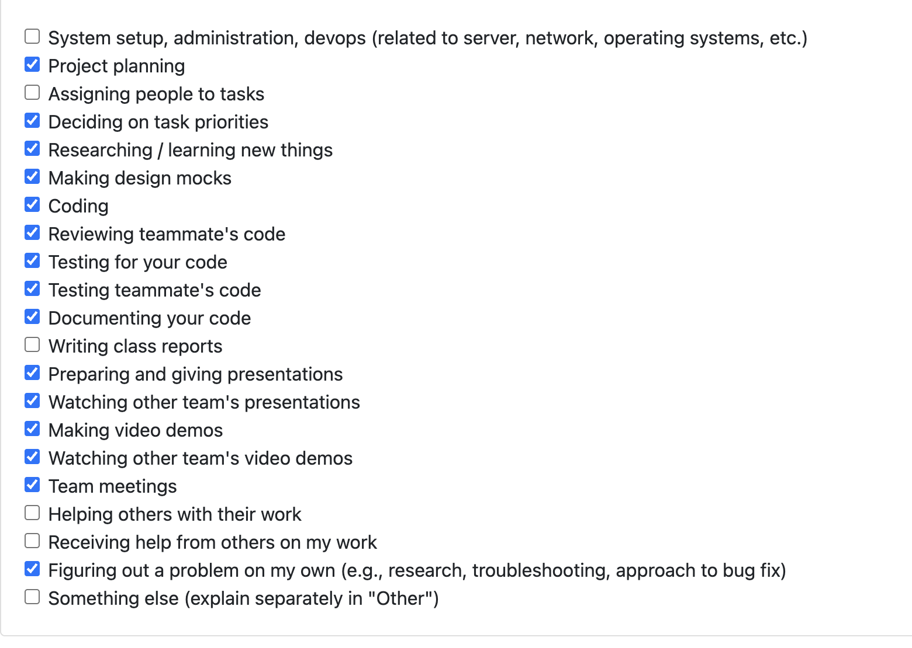

# Personal Log – Karim Khalil

---

## Week-8, Entry for Feb 23 → Mar 1, 2026

---

### Connection to Previous Week

Following the Week-7 migration and scoring work, I focused this week on polishing score override visibility, adding API-driven analysis execution flow for frontend integration, and surfacing project roles in portfolio cards.

---

### Pull Requests Worked On

- **[PR #713 - completed overriden value](https://github.com/COSC-499-W2025/capstone-project-team-3/pull/713)** ✅ Merged
  - Improved overridden score display in portfolio project cards.
  - Added UI display for excluded metrics used in custom score equation.
  - Included related updates across DB/API/UI paths and tests.

- **[PR #723 - created the main flow api with a draft ui to test api call](https://github.com/COSC-499-W2025/capstone-project-team-3/pull/723)** ✅ Merged
  - Added `POST /api/analysis/run` for non-interactive API-driven analysis execution.
  - Added `GET /api/analysis/uploads/{upload_id}/projects` to support per-project mode selection in UI.
  - Added non-interactive similarity handling in scan flow.
  - Added draft UI (`analysis_runner.html/js`) for endpoint testing during migration.

- **[PR #729 - Portfolio role](https://github.com/COSC-499-W2025/capstone-project-team-3/pull/729)** ✅ Merged
  - Displayed inferred project roles on each portfolio project card.
  - Added test coverage for updated portfolio payload behavior.

- **[PR #744 - fixed editing score on portfolio, removed functions/classes from github card, & fixed thumbnail on html](https://github.com/COSC-499-W2025/capstone-project-team-3/pull/744)** ✅ Merged
  - Fixed score editing on portfolio cards to prevent save failures.
  - Removed Functions/Classes rows from GitHub project cards to avoid misleading zero values.
  - Fixed interactive HTML export so attached thumbnails render in downloaded files.

- **[PR #734 - Updated system architecture](https://github.com/COSC-499-W2025/capstone-project-team-3/pull/734)** ✅ Merged (assisted/reviewed)
  - Contributed support and review feedback on architecture update.
  - Helped validate milestone alignment of the updated architecture docs/diagram.

---

### Associated Issues Completed
| Issue ID | Title | Status |
|----------|-------|--------|
| [#745](https://github.com/COSC-499-W2025/capstone-project-team-3/issues/745) | Project score overrides in portfolio | ✅ Closed via PR #713 |
| [#746](https://github.com/COSC-499-W2025/capstone-project-team-3/issues/746) | API-driven main analysis flow | ✅ Closed via PR #723 |
| [#747](https://github.com/COSC-499-W2025/capstone-project-team-3/issues/747) | Portfolio role tags on project cards | ✅ Closed via PR #729 |
| [#748](https://github.com/COSC-499-W2025/capstone-project-team-3/issues/748) | Portfolio score-edit fix, GitHub card metric cleanup, thumbnail export fix | ✅ Closed via PR #744 |

---

## Work Breakdown

### Coding Tasks

- Completed score override UI clarity improvements in portfolio cards.
- Implemented new API contract for running the main analysis flow without CLI prompts.
- Added project role display to cards for improved contribution context.
- Fixed portfolio score edit save flow and cleaned GitHub-only metric display.
- Fixed interactive HTML export to preserve project thumbnails in downloaded files.

### Testing & Debugging Tasks

- Ran focused tests around projects/portfolio/score override behavior.
- Added endpoint-focused tests for analysis API flow.
- Manually validated draft analysis runner for end-to-end API behavior and fallback handling.
- Manually validated score edit flow, GitHub card metric rendering, and interactive HTML thumbnail export.

### Collaboration & Review Tasks

- Addressed reviewer comments and clarified expected behavior in PR threads.
- Participated in architecture update support/review with teammates.

### Additional Team/Class Activities

- Prepared my video demo for the portfolio section.
- Gave the live class presentation with the team.
- Attended peer presentations and provided feedback to other teams.

---

### Reflection

**What Went Well:**
- Landed key migration-enabling backend work (`/api/analysis/run`) with strong reviewer feedback.
- Improved portfolio UX with clearer override and role context.
- Contributed to both implementation and team presentation responsibilities.

**What Could Be Improved:**
- Expand documentation alongside draft/testing utilities when introducing migration scaffolding.

---

### Plan for Next Week

- Continue integrating final frontend flow on top of the new analysis APIs.
- Replace draft API tester UI with production desktop flow.
- Address remaining portfolio polish items and test coverage gaps.
