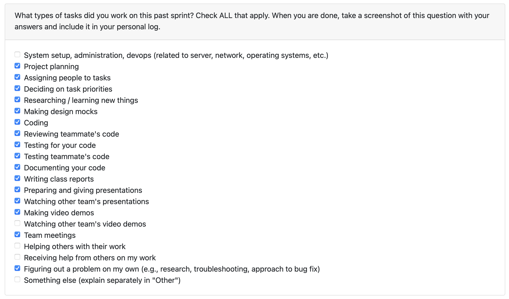

## Week-8, Entry for Feb 23 → Mar 1, 2026

---

### Pull Requests Worked On

- **[PR #711 - Add delete button to resume dropdown](https://github.com/COSC-499-W2025/capstone-project-team-3/pull/711)** ✅ Merged
  - Enhanced resume deletion UI by adding delete button to dropdown menu
  - Improved user experience with more intuitive delete access
  - Maintained existing safety features (Master Resume cannot be deleted)

- **[PR #714 - Added API endpoints for chronological management](https://github.com/COSC-499-W2025/capstone-project-team-3/pull/714)** ✅ Merged
  - Created GET endpoint to list all chronological projects
  - Created GET endpoint to retrieve specific project with skills and dates
  - Created PUT endpoint to update project start/end dates
  - Created GET endpoint to list all skills for a specific project
  - Created POST endpoint to add new skills with dates to a project
  - Created PUT endpoint to update skill dates
  - Created PUT endpoint to update skill names (rename)
  - Created DELETE endpoint to remove skills from a project
  - Comprehensive API layer for chronological management (Feature-33)

---

### Associated Issues Completed

| Issue ID | Title | Status |
|----------|-------|--------|
| [#712](https://github.com/COSC-499-W2025/capstone-project-team-3/issues/712) | Update the deletion for resume on UI to include dropdown | ✅ Closed |
| [#715](https://github.com/COSC-499-W2025/capstone-project-team-3/issues/715) | Add API endpoints to list and retrieve chronological projects | ✅ Closed |
| [#716](https://github.com/COSC-499-W2025/capstone-project-team-3/issues/716) | Add API endpoint to update project dates | ✅ Closed |
| [#717](https://github.com/COSC-499-W2025/capstone-project-team-3/issues/717) | Add API endpoints to list and add skills for a project | ✅ Closed |
| [#718](https://github.com/COSC-499-W2025/capstone-project-team-3/issues/718) | Add API endpoints to update skill date and name | ✅ Closed |
| [#719](https://github.com/COSC-499-W2025/capstone-project-team-3/issues/719) | Add API endpoint to delete a skill | ✅ Closed |
| [#720](https://github.com/COSC-499-W2025/capstone-project-team-3/issues/720) | Add API Endpoints for Chronological Management | ✅ Closed |

---

## Work Breakdown

### Coding Tasks

#### Resume Deletion UI Enhancement (PR #711)
- Moved delete button to dropdown menu for better UX
- Updated UI components to integrate dropdown delete action
- Maintained all existing safety features and validation
- Ensured seamless integration with existing resume management flow

#### Chronological Management API Endpoints (Feature-33, PR #714)
- **Project Endpoints:**
  - `GET /api/chronological/projects` - List all projects with chronological data
  - `GET /api/chronological/projects/{project_id}` - Get specific project with skills and dates
  - `PUT /api/chronological/projects/{project_id}/dates` - Update project start/end dates

- **Skill Endpoints:**
  - `GET /api/chronological/projects/{project_id}/skills` - List all skills for a project
  - `POST /api/chronological/projects/{project_id}/skills` - Add new skill with date
  - `PUT /api/chronological/projects/{project_id}/skills/{skill_name}/date` - Update skill date
  - `PUT /api/chronological/projects/{project_id}/skills/{skill_name}/name` - Rename skill
  - `DELETE /api/chronological/projects/{project_id}/skills/{skill_name}` - Delete skill

- Added comprehensive request/response validation
- Implemented proper error handling for all endpoints
- Created RESTful API structure following best practices
- Added complete test coverage for all new endpoints

---

### Design & Documentation Tasks

#### Figma UI Design for Chronological Management
- Created comprehensive Figma mockups for chronological management interface
- Designed intuitive UI for viewing and editing project/skill dates
- Included visual designs for skill management (add, edit, delete)
- Ensured responsive design patterns for all screen sizes
- Followed existing design system and brand guidelines

#### M2 Presentation Video
- Created comprehensive video demonstration for Milestone 2
- Covered Feature-23: Chronological information management (CLI)
- Covered Feature-24: [Feature details]
- Covered Feature-26: Thumbnail functionality with GIF/SVG support
- Covered Feature-33: API endpoints for chronological management
- Demonstrated end-to-end workflows and user interactions
- Recorded clear explanations and technical details

---

### Testing & Debugging Tasks

- Added unit tests for all 8 new chronological API endpoints
- Tested GET endpoints with various project IDs and edge cases
- Tested PUT endpoints with date validation and format handling
- Tested POST endpoint with new skill creation and duplicate handling
- Tested DELETE endpoint with cascade effects and validation
- Verified error responses for invalid requests (404, 400, 500)
- All tests passing with comprehensive coverage
- Tested resume dropdown delete functionality across different scenarios

---

### Collaboration & Review Tasks

- Created detailed PR descriptions with API endpoint documentation
- Participated in Milestone 2 final review meetings
- Prepared individual presentation materials and demo scripts
- Responded to code review feedback promptly
- Reviewed and tested teammates' PRs locally
- Coordinated with team on M2 presentation structure and timing

---

### Reflection

**What Went Well:**
- Successfully delivered comprehensive API layer for chronological management (8 endpoints)
- Enhanced resume deletion UX with dropdown integration
- Created clear Figma designs for chronological management UI
- Completed M2 presentation video covering 4 major features
- All endpoints follow RESTful best practices with proper validation
- Strong test coverage for all new functionality
- Successfully completed Milestone 2 requirements on time

**What Could Be Improved:**
- Better coordination on video presentation to avoid content overlap with teammates

---

### Plan for Next Week
- Begin Milestone 3 planning and feature breakdown
- Start implementation of chronological management UI based on Figma designs
- Address any feedback from Milestone 2 presentation
- Continue supporting team with code reviews and testing

---
