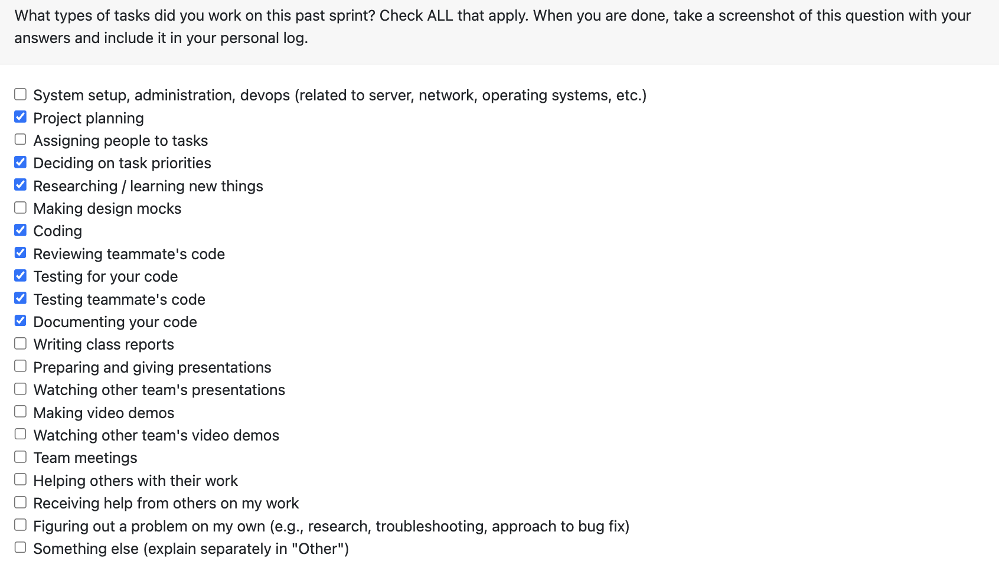

# Personal Log – Karim Jassani

---

## Week-9, Entry for Mar 2 → Mar 8, 2026

---

### Connection to Previous Week

Last week completed score override funcitonality, completed milestone 2 project - adding UI for score override as part of milestone 3
---

### Pull Requests Worked On

- **[PR #774 - Score Override UI (part 1)](https://github.com/COSC-499-W2025/capstone-project-team-3/pull/774)** 
- Added score override API support in desktop client (desktop/src/api/projects.ts):
  - getScoreBreakdown, previewScoreOverride, applyScoreOverride, clearScoreOverride
  - URL-encodes project IDs/signatures in endpoint paths
  - Improved request error handling to surface backend detail messages
- Added API regression tests: desktop/tests/projectsApi.test.ts
- Added functional Score Override page scaffold + basic styles:
  - includes project selection, metric toggling, preview, apply, clear, reset

---

### Associated Issues Completed
| Issue ID | Title | Status |
|----------|-------|--------|
| [#771](https://github.com/COSC-499-W2025/capstone-project-team-3/issues/771) | Desktop score-override API integration | ✅ Closed|
| [#773](https://github.com/COSC-499-W2025/capstone-project-team-3/issues/773) | Functional Score Override management page in desktop app | ✅ Closed|

---

## Pull Requests Reviewed

- **[PR #760 - Add end-to-end upload functionality for zipped files.](https://github.com/COSC-499-W2025/capstone-project-team-3/pull/760)** 

- **[PR #764 - consentPage Testing for UI](https://github.com/COSC-499-W2025/capstone-project-team-3/pull/764)** 

- **[PR #772 - Week9 vanshika](https://github.com/COSC-499-W2025/capstone-project-team-3/pull/772)** 

---

### Reflection

**What Went Well:**
- got started with score override
- successfull functioning page

**What Could Be Improved:**
- Could add more comprehensive tests for edge cases

---

### Plan for Next Week

- Continue working on refining the score override ui page further
- add visual graphs like pie chart