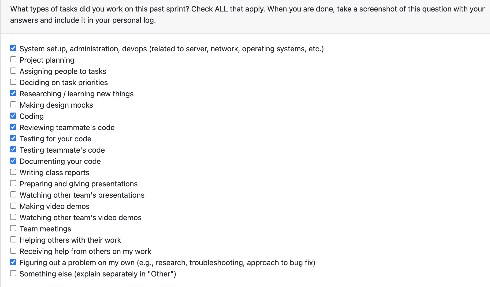

# Personal Log – Karim Khalil

---

## Week-9, Entry for Mar 2 → Mar 8, 2026

---

### Connection to Previous Week

Building on last week's score override and analysis runner work, I shifted focus this week entirely to the desktop frontend. The goal was to fully migrate the static portfolio dashboard (previously `portfolio.html/js`) into the React/TypeScript desktop app and then extend it with richer user profile information pulled from the backend.

---

### Pull Requests Worked On

- **[PR #767 - migrated portfolio to frontend](https://github.com/COSC-499-W2025/capstone-project-team-3/pull/767)** ✅ Merged
  - Fully migrated the static `portfolio.html` + `portfolio.js` dashboard into `desktop/src/pages/PortfolioPage.tsx` as a React/TypeScript component.
  - Rebuilt all four chart components (language breakdown, complexity, score distribution, activity over time) with `canvasId` props to support canvas ID-based lookup during HTML export.
  - Added inline field editing on project cards with real Save/Cancel buttons backed by API calls.
  - Added role tag chips and excluded-metric score chips to project cards.
  - Added a "Download Interactive HTML" export button.
  - Fixed thumbnail display: `thumbnail_url` is a relative path that needed the `API_BASE_URL` prefix to load correctly.
  - Fixed interactive HTML export: `cloneNode` does not copy canvas pixel data; resolved by giving each canvas a stable `id` and reinitialising charts in the exported HTML script.
  - Added conditional Electron plugin in `vite.config.ts` and a `dev:web` script in `package.json` so the frontend can be served in browser-only mode without Electron.
  - Added 22 Jest/React Testing Library tests covering loading/error states, project cards, project selection, charts, analysis section, and export.

- **[PR #777 - added user details to portfolio](https://github.com/COSC-499-W2025/capstone-project-team-3/pull/777)** ✅ Merged
  - Extended `load_user()` in `app/utils/generate_resume.py` to additionally fetch `industry` and `personal_summary` from user preferences, with a backwards-compatible fallback for rows that predate these columns.
  - Added null-row guard to `load_user()` to prevent a 500 error when no user preferences exist.
  - Added `UserInfo` interface and a `user` field to the `PortfolioData` type in `PortfolioPage.tsx`.
  - Built a `UserProfileCard` React component displaying: gradient avatar with initials, full name, job title, industry chip, education line, personal summary, and GitHub/email contact links.
  - Added the `.profile-hero` CSS block and all sub-classes including responsive mobile rules.
  - Added 10 Jest/RTL tests for the profile card (renders with full data, graceful fallback when optional fields are missing, contact links, industry chip visibility).

---

### Associated Issues Completed

| Issue ID | Title | Status |
|----------|-------|--------|
| [#767](https://github.com/COSC-499-W2025/capstone-project-team-3/pull/767) | Migrate portfolio dashboard to desktop frontend | ✅ Closed via PR #767 |
| [#777](https://github.com/COSC-499-W2025/capstone-project-team-3/pull/777) | Add user profile card to portfolio page | ✅ Closed via PR #777 |

---

## Work Breakdown

### Coding Tasks

- Migrated full portfolio dashboard (charts, project cards, sidebar, export) from static HTML/JS into a single `PortfolioPage.tsx` React component.
- Implemented four chart wrapper components with stable `canvasId` props.
- Built inline edit flow on project cards (edit/save/cancel, fields: title, description, role, dates, skills).
- Built `downloadPortfolioInteractiveHTML()` export utility that serialises current portfolio state into a self-contained HTML file with embedded chart reinitialisation.
- Extended backend `load_user()` to surface `industry` and `personal_summary`.
- Built `UserProfileCard` presentational component and `.profile-hero` CSS layout.
- Added conditional `isWebOnly` Vite plugin logic so the desktop build doesn't require Electron to run during web development.

### Testing & Debugging Tasks

- Wrote 22 Jest/RTL tests for the initial portfolio migration covering all major UI states.
- Wrote 10 additional Jest/RTL tests specifically for the `UserProfileCard` component (32 total, all passing).
- Debugged thumbnail 404s — identified that `thumbnail_url` from the API is root-relative and requires the `API_BASE_URL` prefix.
- Debugged blank charts in exported HTML — traced to `cloneNode` not copying canvas pixel data; resolved with stable canvas IDs and export-time chart re-render.
- Debugged `load_user()` 500 — traced to missing null guard on empty user preferences row.

### Collaboration & Review Tasks

- Responded to reviewer feedback from @6s-1 regarding the large file size of `PortfolioPage.tsx` (noted for future refactoring into subcomponents).
- Received approval from @PaintedW0lf noting test quality on PR #777.

### Additional Team/Class Activities

- Kept project board tasks up to date as PRs moved through review.
