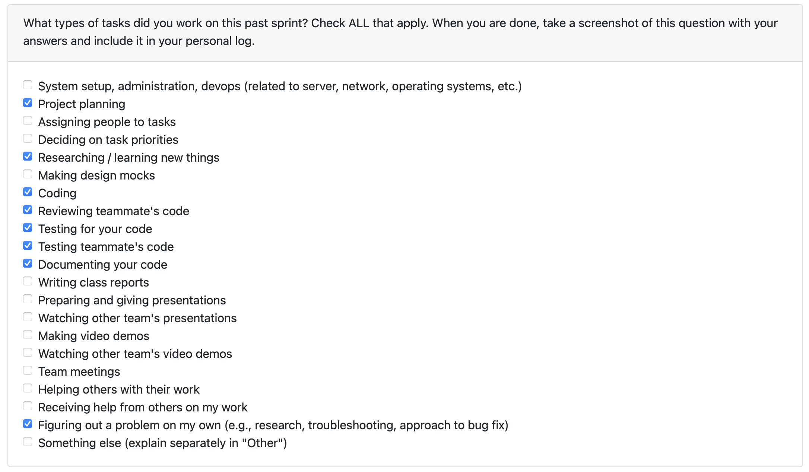

# Personal Log – Shreya Saxena

---

## Week-9, Entry for Mar 2 → Mar 8, 2026

### Pull Requests Worked On

- **[PR #760 - Add end-to-end upload functionality for zipped files](https://github.com/COSC-499-W2025/capstone-project-team-3/pull/760)** ✅ Merged
  - Implemented end-to-end upload flow connecting Upload page to backend
  - Auto-upload on file select and drag-and-drop
  - Added Remove button to clear selected ZIP file
  - Connected upload button to backend with user input storage
  - Added drag-and-drop functionality for Upload page
  - ZIP validation with consistent error messaging across file selection and drop
  - Loading state guards to prevent duplicate uploads during upload

- **[PR #763 - Added base UI and API module for data management UI. (Pt-1)](https://github.com/COSC-499-W2025/capstone-project-team-3/pull/763)** ✅ Merged
  - Created base UI for Data Management page with placeholder layout
  - Added complete API module for Data Management (chronological projects, skills, dates)
  - Set up foundation for chronological management in desktop app

---

### Associated Issues Completed

| Issue ID | Title | Status |
|----------|-------|--------|
| [#628](https://github.com/COSC-499-W2025/capstone-project-team-3/issues/628) | Connect upload button to backend, ensuring user input is stored | ✅ Closed |
| [#626](https://github.com/COSC-499-W2025/capstone-project-team-3/issues/626) | UI for Upload page | ✅ Closed |
| [#761](https://github.com/COSC-499-W2025/capstone-project-team-3/issues/761) | Add remove button on Upload page to remove selected zip file | ✅ Closed |
| [#762](https://github.com/COSC-499-W2025/capstone-project-team-3/issues/762) | Add drag and drop functionality for Upload Page | ✅ Closed |
| [#765](https://github.com/COSC-499-W2025/capstone-project-team-3/issues/765) | Base UI for Data Management page | ✅ Closed |
| [#766](https://github.com/COSC-499-W2025/capstone-project-team-3/issues/766) | Add all API module for Data Management | ✅ Closed |

---

## Work Breakdown

### Coding Tasks

#### End-to-End Upload Functionality (PR #760)
- Implemented `uploadZipFile` API client calling `POST /upload-file`
- Auto-upload on ZIP file selection or drag-and-drop
- Added Remove button to clear uploaded file state
- Connected Upload page to backend with proper error handling
- ZIP validation with normalized error messages (drag-and-drop and file selection)
- Loading state guards: disabled drop zone during upload, `pointer-events: none`, loading class
- Responsive design for Upload page

#### Data Management Base UI & API (PR #763)
- Created Data Management page with title and description placeholder
- Implemented chronological API module: `getChronologicalProjects`, `getChronologicalProject`, `updateProjectDates`, `getProjectSkills`, `addSkill`, `updateSkillDate`, `updateSkillName`, `deleteSkill`
- Set up styling with global CSS variables
- Added tests for Data Management page

---

### Testing & Debugging Tasks

- Updated UploadPage tests for auto-upload, Remove button, loading guards
- Added tests for ZIP validation error messaging
- Tested drag-and-drop and file selection flows
- Created DataManagementPage tests
- All test suites passing

---

### Collaboration & Review Tasks

- Created PR descriptions with testing instructions
- Responded to code review feedback promptly

---

### Reflection

**What Went Well:**
- Delivered complete end-to-end upload flow with drag-and-drop and Remove functionality
- Established Data Management foundation for chronological UI work
- Consistent UX with loading guards and normalized validation errors

**What Could Be Improved:**
- Could add more comprehensive tests for edge cases

---

### Plan for Next Week
- Continue implementation of Data Management UI (projects list, edit dates, skills management)
- Add projects list UI for chronological management
- Implement edit project dates UI
- Add skills list and edit skills UI

---
