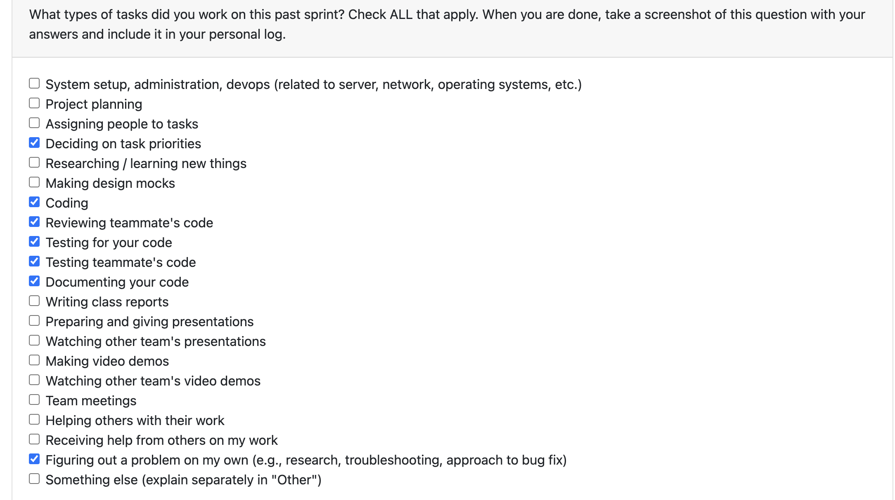

# Personal Log – Vanshika

---

## Week-9, Entry for Mar 2 → Mar 8, 2026

---

### Connection to Previous Week
Following the reading break, where I grinded through implementing my consent management and revoke UI in preparation for the demo, this week shifted focus to thoroughly testing the system. Since the UI implementation was completed and demonstrated during the demo, the priority was adding comprehensive unit tests and performing manual testing to ensure the consent manager and revoke system work reliably.

---

### Pull Requests Worked On
- **[PR #764 - consentPage Testing for UI](https://github.com/COSC-499-W2025/capstone-project-team-3/pull/764)** ✅ Merged
  - Added 20+ unit tests for the ConsentPage component in the desktop application
  - Covered component structure, DOM rendering, consent message display, and button rendering
  - Tested navigation flows (More → detailed info → Back), navigation to upload page after consent
  - Added negative/error-case test coverage (failed fetches, non-OK responses) based on PR review feedback
  - Self-contained tests following existing project test patterns (WelcomePage, UploadPage, etc.)

---

### Associated Issues Completed
| Issue ID | Title | Status | Related PRs |
|----------|-------|--------|-------------|
| [#735](https://github.com/COSC-499-W2025/capstone-project-team-3/issues/735) | Add testing for consent management in desktop/Test | ✅ Closed | PR #764 |
| [#769](https://github.com/COSC-499-W2025/capstone-project-team-3/issues/769) | Manual testing – consent manager and revoke system | ✅ Closed | PR #764 |
| [#770](https://github.com/COSC-499-W2025/capstone-project-team-3/issues/770) | Add positive and negative testing for revoke functionality in UI | ✅ Closed | PR #764 |

---

## Work Breakdown

### Coding Tasks

* **PR #764 – ConsentPage Testing for UI:** Wrote comprehensive unit test suite (20+ tests) for the ConsentPage component covering consent message display for new users, button rendering (Accept/Decline/More for new users, Continue/Revoke for existing consent), navigation flows, and button interactivity validation. Added negative test cases for failed fetches and non-OK responses after code review feedback.

---

### Testing & Debugging Tasks

* Wrote 20+ unit tests covering positive and negative scenarios for the ConsentPage component
* Tested both "no consent" and "has consent" states using mocked fetch API
* Added error-case coverage for failed fetches and non-OK responses based on reviewer feedback
* Performed extensive manual testing of the consent manager and revoke system (~20 manual test runs)
* Validated all tests pass locally with `npm test -- ConsentPage.test.tsx`
* Ensured tests follow existing project patterns (WelcomePage, UploadPage, etc.)

---

### Collaboration & Review Tasks

* Addressed code review feedback regarding negative/error-case test coverage
* Responded to reviewer comments and pushed additional commits to strengthen test suite coverage
* Requested reviews from multiple team members and recieved approvals

---

### Reflection

**What Went Well:**

* Successfully delivered a comprehensive test suite with both positive and negative coverage
* Thorough manual testing gave confidence in the implementation before writing automated tests
* Grinding during reading break paid off — had a solid implementation ready for the demo

**What Could Be Improved:**

* Including negative/error-case tests from the start rather than adding them after review

---

### Plan for Next Cycle

* Address any remaining feedback from Milestone 3 testing
* Continue working on additional UI features and testing
* Support team with PR reviews and integration testing
* Prepare for upcoming milestone deliverables
